# Kiến trúc Axiom Office

Tài liệu thiết kế của Axiom Office (sau đợt **Agent Core** giai đoạn 0–4 theo [New_arch.md](New_arch.md),
tháng 9/2026), chia hai phần:

- **Phần I: High Level Design (HLD)**: hệ thống nhìn từ ngoài vào: mục tiêu, bối cảnh, các khối
  lớn và cách chúng nói chuyện, kịch bản chính, triển khai, yêu cầu phi chức năng, quyết định kiến
  trúc.
- **Phần II: Low Level Design (LLD)**: từng module bên trong: class, luồng gọi, thread, schema dữ
  liệu, quy tắc xử lý, build và kiểm thử.

Cách cài và dùng xem [README.md](README.md); lịch sử thay đổi xem [CHANGELOG.md](CHANGELOG.md).

## Mục lục

**Phần I: High Level Design**

1. [Mục tiêu và phạm vi](#1-mục-tiêu-và-phạm-vi)
2. [Bối cảnh hệ thống](#2-bối-cảnh-hệ-thống)
3. [Kiến trúc tổng thể: các container](#3-kiến-trúc-tổng-thể-các-container)
4. [Các khối chức năng](#4-các-khối-chức-năng)
5. [Kịch bản chính](#5-kịch-bản-chính)
6. [Triển khai](#6-triển-khai)
7. [Yêu cầu phi chức năng](#7-yêu-cầu-phi-chức-năng)
8. [Quyết định kiến trúc](#8-quyết-định-kiến-trúc)
9. [Rủi ro và giới hạn](#9-rủi-ro-và-giới-hạn)

**Phần II: Low Level Design**

10. [Tổ chức mã nguồn](#10-tổ-chức-mã-nguồn)
11. [Add-in: vòng đời, nhận diện app, UI](#11-add-in-vòng-đời-nhận-diện-app-ui)
12. [Mô hình thread và ComGate](#12-mô-hình-thread-và-comgate)
13. [HTTP bridge](#13-http-bridge)
14. [Hệ lệnh: registry và dispatcher](#14-hệ-lệnh-registry-và-dispatcher)
15. [AI agent](#15-ai-agent)
16. [Session registry](#16-session-registry)
17. [Event stream (SSE)](#17-event-stream-sse)
18. [Host.exe: MCP server và companion](#18-hostexe-mcp-server-và-companion)
19. [Dữ liệu: cấu hình, đăng ký COM, file](#19-dữ-liệu-cấu-hình-đăng-ký-com-file)
20. [Build, cài đặt, đóng gói](#20-build-cài-đặt-đóng-gói)
21. [Thiết kế kiểm thử](#21-thiết-kế-kiểm-thử)
22. [Agent Core](#22-agent-core)

[Phụ lục: thuật ngữ](#phụ-lục-thuật-ngữ)

---

# Phần I: High Level Design

## 1. Mục tiêu và phạm vi

**Bài toán.** Người dùng văn phòng làm việc trên Microsoft Office hoặc WPS Office muốn AI thao tác
**ngay trên tài liệu đang mở**: thấy thay đổi trực tiếp trên màn hình và Undo được, thay vì copy
qua lại với chatbot. Đồng thời các AI agent bên ngoài (Claude Desktop, Claude Code, script) cần một
cách chuẩn để điều khiển app đang mở hoặc xử lý file Office.

**Mục tiêu**

| Mã | Mục tiêu |
|---|---|
| G1 | Một bản cài phục vụ cả **Microsoft Office** và **WPS Office**: Word/Writer, Excel/Spreadsheets, PowerPoint/Presentation |
| G2 | Ba cách dùng trên cùng một lõi: **Ask AI** trong app, **HTTP API** localhost, **MCP server** |
| G3 | Cài **không cần admin**, không cần Python hay runtime thêm (add-in: .NET Framework 4.8 có sẵn; Agent Core: exe tự chứa .NET 10) |
| G4 | **An toàn**: chỉ localhost, có token; AI không làm mất dữ liệu người dùng |
| G5 | **Dễ mở rộng**: thêm một lệnh chỉ sửa một chỗ |
| G6 | **Agent Core**: agent chạy ở process riêng, nhớ hội thoại theo tài liệu và **ghi nhớ dài hạn**, dùng **kỹ năng** theo chuẩn Agent Skills, **hỏi xác nhận** trước thao tác rủi ro, dùng thêm công cụ **MCP** |

**Ngoài phạm vi phiên bản này**: Office trên macOS/web/Linux; nhiều người dùng hay truy cập qua mạng;
transaction nhiều bước, timeline, tracked changes; chạy script trong skill.

**Tác nhân**

| Tác nhân | Dùng qua |
|---|---|
| Người dùng văn phòng | Tab *Axiom Office* trên ribbon → Ask AI pane |
| Developer / script tích hợp | HTTP API `127.0.0.1:478xx` |
| AI agent bên ngoài | MCP server `AxiomOffice.Host.exe mcp` |
| Người cài đặt | Gói zip → `install.cmd` |
| Quản trị / tổ chức | Thư mục skill dùng chung (`SkillDirs`), `mcp.json` |

## 2. Bối cảnh hệ thống

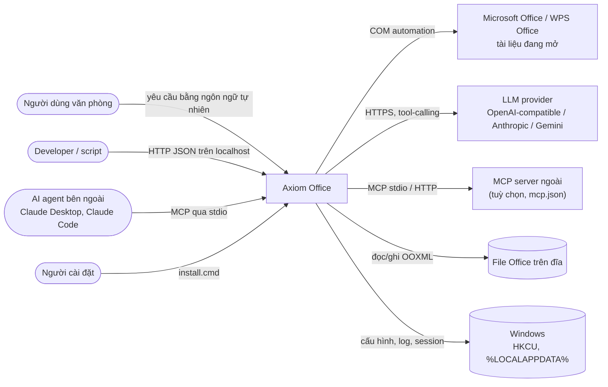
```mermaid
flowchart LR
    enduser(["Người dùng văn phòng"])
    dev(["Developer / script"])
    mcpc(["AI agent bên ngoài<br/>Claude Desktop, Claude Code"])
    installer(["Người cài đặt"])

    ax["Axiom Office"]

    office["Microsoft Office / WPS Office<br/>tài liệu đang mở"]
    llm["LLM provider<br/>OpenAI-compatible / Anthropic / Gemini"]
    mcpext["MCP server ngoài<br/>(tuỳ chọn, mcp.json)"]
    fs[("File Office trên đĩa")]
    win[("Windows<br/>HKCU, %LOCALAPPDATA%")]

    enduser -->|"yêu cầu bằng ngôn ngữ tự nhiên"| ax
    dev -->|"HTTP JSON trên localhost"| ax
    mcpc -->|"MCP qua stdio"| ax
    installer -->|"install.cmd"| ax
    ax -->|"COM automation"| office
    ax -->|"HTTPS, tool-calling"| llm
    ax -->|"MCP stdio / HTTP"| mcpext
    ax -->|"đọc/ghi OOXML"| fs
    ax -->|"cấu hình, log, session"| win
```

Axiom Office không có server riêng: mọi thứ chạy trên máy người dùng, trong phiên đăng nhập của họ;
dữ liệu của agent (hội thoại, ghi nhớ, audit) là một file SQLite trong `%LOCALAPPDATA%`. Kết nối ra
ngoài chỉ tới LLM provider do người dùng cấu hình (có thể là LLM chạy local như Ollama) và các MCP
server người dùng tự thêm.

## 3. Kiến trúc tổng thể: các container

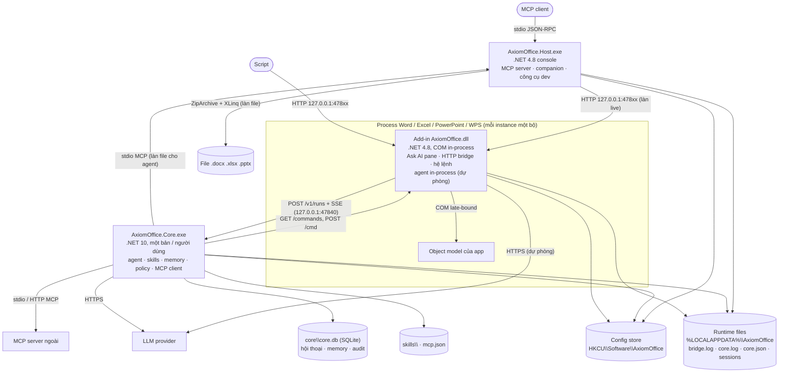
```mermaid
flowchart TB
    mcpc(["MCP client"])
    dev(["Script"])

    subgraph proc["Process Word / Excel / PowerPoint / WPS (mỗi instance một bộ)"]
        addin["Add-in AxiomOffice.dll<br/>.NET 4.8, COM in-process<br/>Ask AI pane · HTTP bridge · hệ lệnh<br/>agent in-process (dự phòng)"]
        om["Object model của app"]
        addin -->|"COM late-bound"| om
    end

    core["AxiomOffice.Core.exe<br/>.NET 10, một bản / người dùng<br/>agent · skills · memory · policy · MCP client"]
    hostexe["AxiomOffice.Host.exe<br/>.NET 4.8 console<br/>MCP server · companion · công cụ dev"]
    cfg[("Config store<br/>HKCU\\Software\\AxiomOffice")]
    rt[("Runtime files<br/>%LOCALAPPDATA%\\AxiomOffice<br/>bridge.log · core.log · core.json · sessions")]
    db[("core\\core.db (SQLite)<br/>hội thoại · memory · audit")]
    skills[("skills\\ · mcp.json")]
    files[("File .docx .xlsx .pptx")]
    llm["LLM provider"]
    mcpext["MCP server ngoài"]

    dev -->|"HTTP 127.0.0.1:478xx"| addin
    mcpc -->|"stdio JSON-RPC"| hostexe
    hostexe -->|"HTTP 127.0.0.1:478xx (làn live)"| addin
    hostexe -->|"ZipArchive + XLinq (làn file)"| files
    addin -->|"POST /v1/runs + SSE (127.0.0.1:47840)"| core
    core -->|"GET /commands, POST /cmd"| addin
    core -->|"stdio MCP (làn file cho agent)"| hostexe
    core -->|"stdio / HTTP MCP"| mcpext
    core -->|"HTTPS"| llm
    addin -->|"HTTPS (dự phòng)"| llm
    core --> db
    core --> skills
    addin & core & hostexe --> cfg
    addin & core & hostexe --> rt
```

| Container | Công nghệ | Trách nhiệm | Giao tiếp |
|---|---|---|---|
| **Add-in `AxiomOffice.dll`** | .NET 4.8, C# 7.3, COM in-process, WinForms | UI trong app (pane, cài đặt, quản lý ghi nhớ), HTTP bridge, thực thi lệnh trên tài liệu; agent in-process khi Core không dùng được | COM với app; HTTP server loopback; HTTP client tới Core; HTTPS tới LLM (dự phòng) |
| **`AxiomOffice.Core.exe`** | .NET 10, ASP.NET Minimal API (Kestrel), SQLite, single-file tự chứa | Agent cho mọi app: prompt, vòng tool-calling, hội thoại, skill, memory dài hạn, policy xác nhận, audit, MCP client, QA | HTTP loopback `127.0.0.1:47840` (+SSE); HTTP client tới bridge; HTTPS tới LLM; stdio/HTTP tới MCP server |
| **`AxiomOffice.Host.exe`** | .NET 4.8 console (biên dịch cùng source add-in) | MCP server (live + file), companion không cần add-in, công cụ dev | stdio với MCP client (và với Core: làn file); HTTP client tới bridge; COM (companion, đọc `.xls`) |
| **Config store** | Registry HKCU | Port, token, cấu hình LLM (API key mã hoá DPAPI), bật/tắt Core/memory/QA thị giác | Đọc/ghi trực tiếp; Core đọc lại mỗi lượt |
| **Runtime + dữ liệu** | File trong `%LOCALAPPDATA%\AxiomOffice` | Log, `core.json` (tìm Core), `sessions\` (bridge đang sống), `core\core.db`, `skills\`, `mcp.json` | Đọc/ghi trực tiếp |

## 4. Các khối chức năng

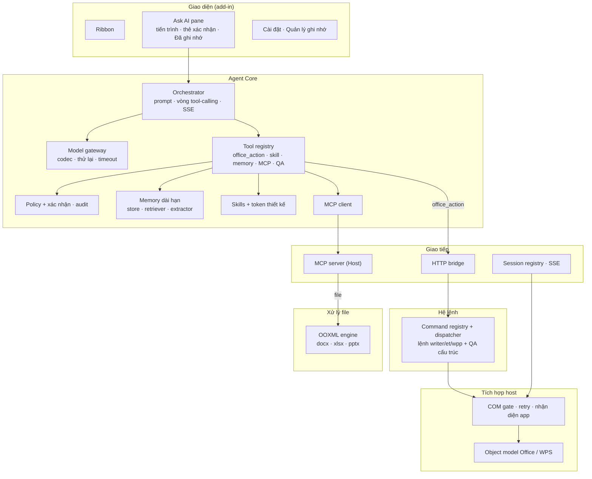
```mermaid
flowchart TB
    subgraph ui["Giao diện (add-in)"]
        ribbon["Ribbon"]
        pane["Ask AI pane<br/>tiến trình · thẻ xác nhận · Đã ghi nhớ"]
        settings["Cài đặt · Quản lý ghi nhớ"]
    end
    subgraph corebox["Agent Core"]
        orch["Orchestrator<br/>prompt · vòng tool-calling · SSE"]
        gw["Model gateway<br/>codec · thử lại · timeout"]
        tools["Tool registry<br/>office_action · skill · memory · MCP · QA"]
        policy["Policy + xác nhận · audit"]
        mem["Memory dài hạn<br/>store · retriever · extractor"]
        sk["Skills + token thiết kế"]
        mcpcl["MCP client"]
    end
    subgraph io["Giao tiếp"]
        http["HTTP bridge"]
        mcpserver["MCP server (Host)"]
        discovery["Session registry · SSE"]
    end
    subgraph cmd["Hệ lệnh"]
        registry["Command registry + dispatcher<br/>lệnh writer/et/wpp + QA cấu trúc"]
    end
    subgraph integ["Tích hợp host"]
        gate["COM gate · retry · nhận diện app"]
        om["Object model Office / WPS"]
    end
    subgraph filecore["Xử lý file"]
        ooxml["OOXML engine<br/>docx · xlsx · pptx"]
    end

    pane --> orch
    orch --> gw
    orch --> tools --> policy
    tools --> sk
    tools --> mem
    tools --> mcpcl --> mcpserver
    tools -->|"office_action"| http --> registry
    mcpserver -->|"file"| ooxml
    registry --> gate --> om
    discovery --> gate
```

| Khối | Trách nhiệm | Nằm ở |
|---|---|---|
| Giao diện | Ribbon, task pane chat (tiến trình, thẻ xác nhận, dòng "Đã ghi nhớ"), cài đặt, form quản lý ghi nhớ | Add-in |
| Orchestrator | Dựng prompt (quy tắc, chỉ mục skill, memory, ngữ cảnh tài liệu, hội thoại), chạy vòng tool-calling, phát sự kiện SSE, lưu hội thoại + audit | Core |
| Model gateway | Codec OpenAI-compatible / Anthropic, thử lại lỗi tạm thời, timeout, trần token, lọc `<thought>` | Core (bản in-process: `LlmClient`) |
| Tool registry | `office_action` (allowlist từ `/commands`), `load_skill`/`read_skill_file`, `remember`/`recall`, `mcp__*`, `look_at_document` | Core |
| Policy + xác nhận | Hỏi người dùng trước thao tác rủi ro; audit mọi tool call | Core (thẻ xác nhận ở pane) |
| Memory | Ghi nhớ dài hạn học từ mem0 2.2.1: chỉ-ADD, chống trùng, chấm điểm cộng dồn | Core |
| Skills | Kỹ năng theo chuẩn Agent Skills + tầng thiết kế (`_design/tokens.json`) | Core (+ thư mục `skills\`) |
| MCP client | Làn file `office` (Host.exe) + server ngoài trong `mcp.json` | Core |
| HTTP bridge | Cửa vào cho Core/agent/script: xác thực, định tuyến, trả JSON | Add-in (và companion) |
| Session registry · SSE | Cho bên ngoài biết bridge nào đang sống, tài liệu nào đang mở, vùng chọn thay đổi | Add-in |
| **Hệ lệnh** | Danh sách lệnh duy nhất (`writer.*`, `et.*`, `wpp.*`, chung, QA cấu trúc), kiểm tra tham số, thực thi | Add-in (Host dùng chung metadata) |
| Tích hợp host | Tuần tự hoá truy cập COM, thử lại khi app bận, nhận diện loại app | Add-in |
| MCP server + tools | 50 tool cho MCP client: làn live gọi bridge, làn file sửa file trực tiếp | Host.exe |
| OOXML engine | Đọc/ghi docx/xlsx/pptx không cần app, lưu atomic | Host.exe |

## 5. Kịch bản chính

### K1: Người dùng nhờ AI sửa tài liệu đang mở

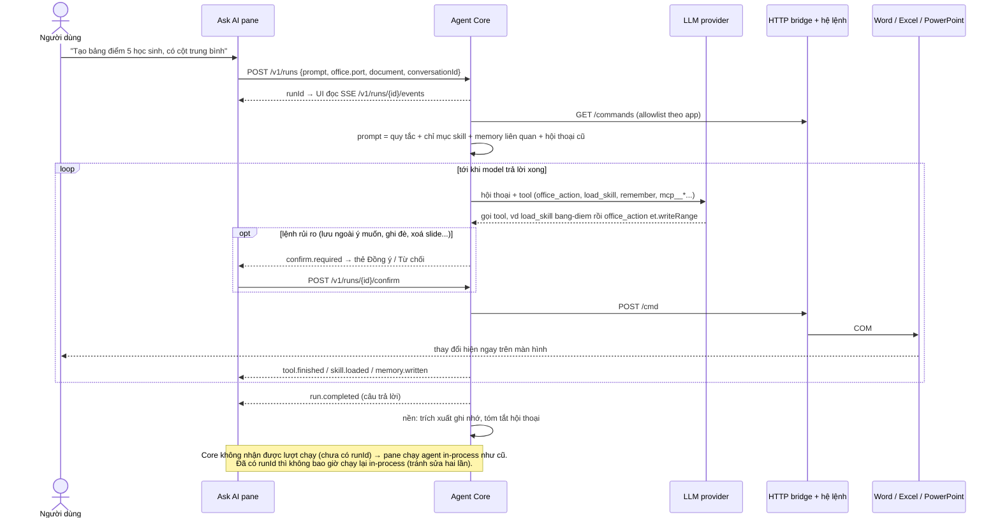
```mermaid
sequenceDiagram
    actor U as Người dùng
    participant UI as Ask AI pane
    participant CO as Agent Core
    participant LLM as LLM provider
    participant BR as HTTP bridge + hệ lệnh
    participant APP as Word / Excel / PowerPoint

    U->>UI: "Tạo bảng điểm 5 học sinh, có cột trung bình"
    UI->>CO: POST /v1/runs {prompt, office.port, document, conversationId}
    CO-->>UI: runId → UI đọc SSE /v1/runs/{id}/events
    CO->>BR: GET /commands (allowlist theo app)
    CO->>CO: prompt = quy tắc + chỉ mục skill + memory liên quan + hội thoại cũ
    loop tới khi model trả lời xong
        CO->>LLM: hội thoại + tool (office_action, load_skill, remember, mcp__*...)
        LLM-->>CO: gọi tool, vd load_skill bang-diem rồi office_action et.writeRange
        opt lệnh rủi ro (lưu ngoài ý muốn, ghi đè, xoá slide...)
            CO-->>UI: confirm.required → thẻ Đồng ý / Từ chối
            UI->>CO: POST /v1/runs/{id}/confirm
        end
        CO->>BR: POST /cmd
        BR->>APP: COM
        APP-->>U: thay đổi hiện ngay trên màn hình
        CO-->>UI: tool.finished / skill.loaded / memory.written
    end
    CO-->>UI: run.completed (câu trả lời)
    CO->>CO: nền: trích xuất ghi nhớ, tóm tắt hội thoại
    Note over UI,CO: Core không nhận được lượt chạy (chưa có runId) → pane chạy agent in-process như cũ.<br/>Đã có runId thì không bao giờ chạy lại in-process (tránh sửa hai lần).
```

### K6: Ghi nhớ qua các phiên

Phiên 1 người dùng nói "Tôi là trưởng phòng Kế toán, công văn ký tên Nguyễn Văn A" → sau lượt, bộ
trích xuất (một lệnh gọi LLM ở nền, chỉ thêm mới) ghi hai memory `user`. Phiên sau (kể cả sau khi Core
khởi động lại) "Soạn công văn…" → retriever đưa người ký vào prompt. "Tôi đã lên phó giám đốc" → memory
**mới** ghi rõ chuyển đổi và liên kết bản cũ; bản cũ giữ nguyên, ngữ cảnh đặt bản mới trước.

### K7: Xác nhận trước thao tác rủi ro

Model gọi `et.saveAs` dù người dùng không nhắc tới lưu → Core phát `confirm.required`, chờ tối đa
120 giây; Từ chối / hết giờ → model nhận `{"ok":false,"error":"user declined: …"}` và lượt chạy vẫn kết
thúc bình thường. `ai.ask` (agent bên ngoài, không ai bấm) chạy ở chế độ không tương tác: từ chối ngay.

### K2–K4: Agent bên ngoài

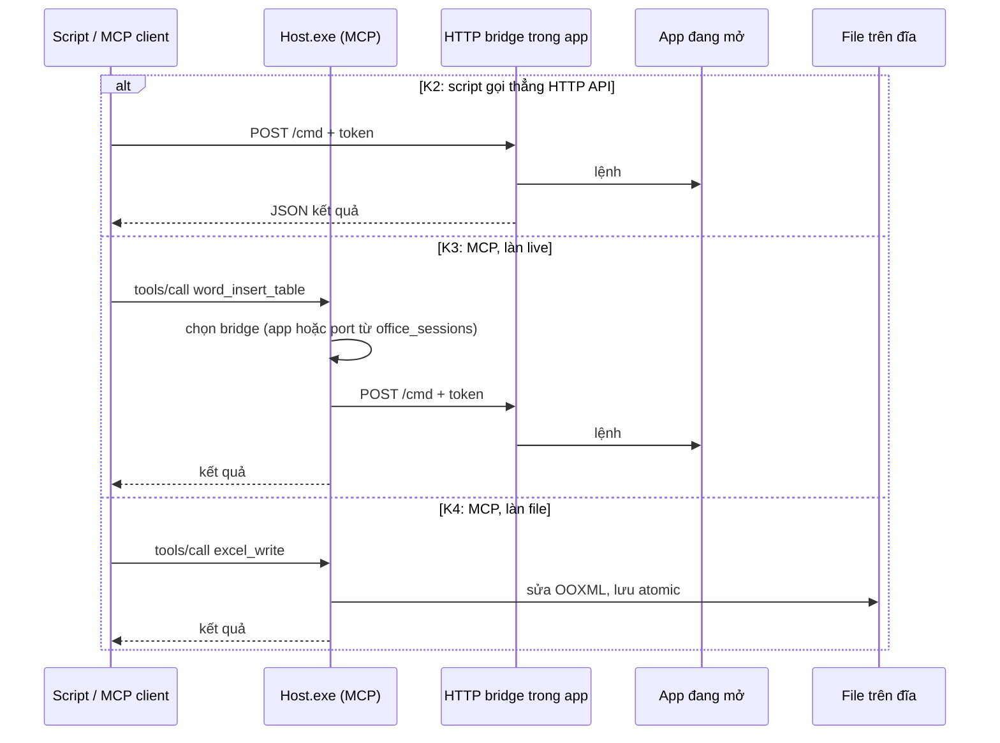
```mermaid
sequenceDiagram
    participant EXT as Script / MCP client
    participant HX as Host.exe (MCP)
    participant BR as HTTP bridge trong app
    participant APP as App đang mở
    participant F as File trên đĩa

    alt K2: script gọi thẳng HTTP API
        EXT->>BR: POST /cmd + token
        BR->>APP: lệnh
        BR-->>EXT: JSON kết quả
    else K3: MCP, làn live
        EXT->>HX: tools/call word_insert_table
        HX->>HX: chọn bridge (app hoặc port từ office_sessions)
        HX->>BR: POST /cmd + token
        BR->>APP: lệnh
        HX-->>EXT: kết quả
    else K4: MCP, làn file
        EXT->>HX: tools/call excel_write
        HX->>F: sửa OOXML, lưu atomic
        HX-->>EXT: kết quả
    end
```

### K5: Tìm các app đang mở

Mỗi bridge ghi một file session (app, port, tài liệu đang mở) và cập nhật định kỳ. MCP tool
`office_sessions` đọc các file này, hỏi `/health` từng bridge, dọn file của process đã chết, trả
danh sách để agent chọn đúng instance (vd khi mở cả Word và WPS Writer).

## 6. Triển khai

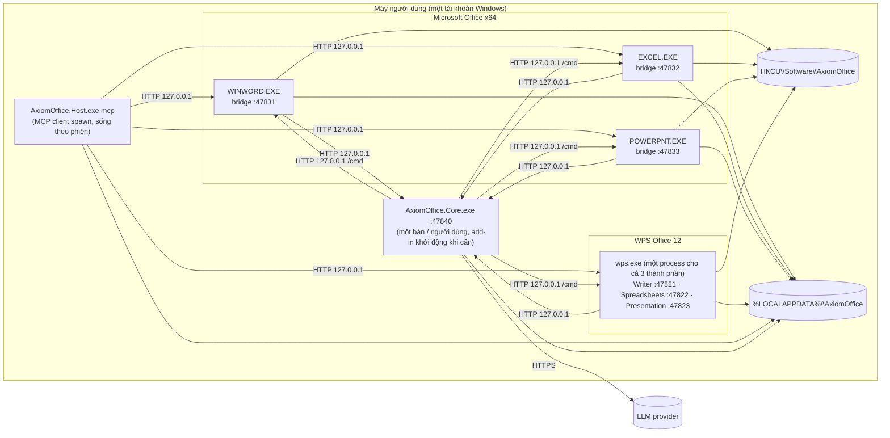
```mermaid
flowchart LR
    subgraph machine["Máy người dùng (một tài khoản Windows)"]
        direction LR
        subgraph office["Microsoft Office x64"]
            word["WINWORD.EXE<br/>bridge :47831"]
            excel["EXCEL.EXE<br/>bridge :47832"]
            ppt["POWERPNT.EXE<br/>bridge :47833"]
        end
        subgraph wps["WPS Office 12"]
            wpsexe["wps.exe (một process cho cả 3 thành phần)<br/>Writer :47821 · Spreadsheets :47822 · Presentation :47823"]
        end
        mcphost["AxiomOffice.Host.exe mcp<br/>(MCP client spawn, sống theo phiên)"]
        core["AxiomOffice.Core.exe :47840<br/>(một bản / người dùng, add-in khởi động khi cần)"]
        reg[("HKCU\\Software\\AxiomOffice")]
        local[("%LOCALAPPDATA%\\AxiomOffice")]
    end
    cloud[("LLM provider")]

    word & excel & ppt & wpsexe --> reg
    word & excel & ppt & wpsexe --> local
    mcphost -->|"HTTP 127.0.0.1"| word & excel & ppt & wpsexe
    mcphost --> local
    word & excel & ppt & wpsexe -->|"HTTP 127.0.0.1"| core
    core -->|"HTTP 127.0.0.1 /cmd"| word & excel & ppt & wpsexe
    core --> local
    core -->|"HTTPS"| cloud
```

- **Một instance app = một bridge = một port.** Port = port gốc của họ app (WPS 47821, Office
  47831) + 0/1/2 theo loại app (Word, Excel, PowerPoint).
- **Cài đặt**: giải nén zip → `install.cmd` → đăng ký COM và add-in trong HKCU, sinh token. Office
  nạp add-in qua khóa `Addins`, WPS qua whitelist `AddinsWL`. DLL chạy thẳng từ thư mục giải nén.
- **Nâng cấp**: build/giải nén bản mới đè lên, mở lại app. Bản tên cũ `WpsAiBridge` được tự gỡ và
  chuyển cấu hình khi cài.
- **Agent Core**: một process cho mỗi người dùng Windows (mutex `Local\AxiomOffice.Core`), chỉ nghe
  `127.0.0.1`, ghi `core.json` (port, pid, version, protocol) khi sẵn sàng. Pane đọc `core.json`, hỏi
  `/health`, chưa có thì khởi động `AxiomOffice.Core.exe` cạnh DLL; build/gỡ cài đặt tắt Core qua
  `/v1/admin/shutdown`.

## 7. Yêu cầu phi chức năng

| Thuộc tính | Yêu cầu | Cách đáp ứng |
|---|---|---|
| **Bảo mật** | Trang web, máy khác hay process lạ không điều khiển được app; không lộ API key | Chỉ nghe loopback; token 128-bit; chặn request có `Origin`; `/cmd` bắt buộc JSON; API key mã hoá DPAPI, `/config` chỉ trả key đã che |
| **An toàn dữ liệu** | AI không làm mất dữ liệu | Agent chỉ gọi lệnh trong allowlist (không `closeAll`, không tạo sổ Excel mới); không tự lưu/xuất file, **policy xác nhận** khi model vẫn gọi lưu/xuất, ghi đè file, xoá slide, `replaceAll` tài liệu dài, tool MCP ngoài; mỗi thao tác Word = 1 bước Undo; làn file lưu atomic; MCP làn file chỉ mở tool file (tool live đi vòng allowlist bị lọc) |
| **Ổn định host** | Add-in không được làm crash/treo Office | Mọi truy cập COM đi qua một cổng tuần tự; COM call bọc try/catch; thử lại khi app bận; heartbeat/poller bỏ lượt khi app bận; interface host gọi đều là dispinterface |
| **Tương thích** | Office x64 và WPS 12 với cùng một DLL | Late-bound `dynamic`; lệnh viết theo loại app logic; fallback khi API khác nhau (`SaveAs2` → `SaveAs`...). Đã kiểm chứng Office 2024 x64, WPS 12.1 (Writer) |
| **Phản hồi** | UI không đơ; một lượt AI có giới hạn | Agent chạy ở Core, tiến trình qua SSE; 120s mỗi request LLM (chỉnh được), 5 phút và 200k token mỗi lượt; nút Dừng hủy request ngay; trích xuất ghi nhớ và tóm tắt chạy nền |
| **Bền với LLM** | Lỗi tạm thời của provider không làm hỏng lượt | Thử lại 429/5xx/rớt mạng tối đa 3 lần (1s→2s→4s, theo `Retry-After`); nhắc một lần khi model trả lời rỗng; sửa tên lệnh viết sai nhẹ; gỡ dữ liệu bọc `{"item":…}` |
| **Riêng tư** | Dữ liệu ở lại máy người dùng | Memory/hội thoại/audit trong `core.db` cục bộ; không lưu mật khẩu, số thẻ/CCCD, API key vào memory; model chỉ thêm memory, sửa/xoá chỉ người dùng; `uninstall -Purge` xoá sạch |
| **Quan sát** | Chẩn đoán được lỗi ngay trên máy người dùng | `bridge.log` (pid từng dòng, transcript agent, trạng thái tài liệu khi nạp và ở lệnh đầu tiên); `/health`, `/session`, `office_sessions` |
| **Cài đặt, vận hành** | Không admin, không runtime thêm, gỡ sạch | Toàn bộ đăng ký trong HKCU; chỉ cần .NET 4.8; `uninstall -Purge` xoá cả cấu hình và log |
| **Bảo trì** | Thêm lệnh không phải sửa nhiều nơi | Registry lệnh là nguồn duy nhất; dispatcher, agent, MCP, README sinh từ đó |
| **Kiểm thử được** | Refactor không đổi hành vi | Test live trên app thật có so golden; test MCP so với bản Python; test đồng bộ registry–README |

## 8. Quyết định kiến trúc

| # | Quyết định | Lý do | Đánh đổi |
|---|---|---|---|
| AD-1 | COM add-in .NET Framework 4.8, C# 7.3, không NuGet | Có sẵn trên mọi Windows 10/11; Office và WPS đều nạp được qua mscoree | Không dùng được .NET hiện đại, thư viện ngoài |
| AD-2 | Late-bound `dynamic`, không dùng PIA | Một DLL cho cả Office và WPS, không phụ thuộc phiên bản Office | Không kiểm tra kiểu lúc biên dịch |
| AD-3 | Dispinterface cho mọi interface host gọi | Office/WPS gọi qua IDispatch; khai báo IUnknown làm host crash | Phải khai báo `DispId` thủ công |
| AD-4 | HTTP loopback làm cửa vào chung | Ngôn ngữ nào cũng gọi được, debug bằng curl | Tự lo token, chặn Origin |
| AD-5 | Một cổng COM toàn cục (`ComGate`) | Object model Office không an toàn đa luồng (từng crash Word) | Lệnh chạy tuần tự |
| AD-6 | SSE bằng poll-diff 500ms | Chạy giống nhau trên Office và WPS, không cần COM event sink | Trễ tới 500ms |
| AD-7 | Agent chỉ có một tool `office_action` | Prompt gọn, thêm lệnh không đổi schema tool | Model phải đọc danh sách lệnh trong mô tả |
| AD-8 | Registry lệnh khai báo cạnh handler | Một chỗ sửa; dispatcher, agent, MCP, README không lệch nhau | Mô tả tiếng Việt và gợi ý tiếng Anh nằm cùng dòng |
| AD-9 | MCP server C# trong cùng exe | Người dùng không cần Python; dùng chung cấu hình và registry | Tự viết JSON-RPC và engine OOXML. **Cập nhật 01/10/2026**: Windows giữ nguyên bản C# trong `Host.exe`; Linux chuyển sang subcommand `mcp` của Agent Core Go (cùng hợp đồng tool, bỏ hẳn .NET trên máy Linux) |
| AD-10 | Mọi đăng ký trong HKCU | Không cần admin | Chỉ cài cho từng người dùng |
| AD-11 | Agent Core là process riêng .NET 10 (single-file tự chứa) | Dùng được thư viện hiện đại (Kestrel, SQLite), một agent cho mọi app, không làm nặng process Office | Exe ~50MB; thêm một process và giao thức HTTP nội bộ |
| AD-12 | Core chỉ thao tác tài liệu qua bridge (`/cmd`), không gọi COM | Một đường thực thi lệnh duy nhất (allowlist, ComGate, Undo); Core không phụ thuộc Office | Mỗi lệnh thêm một vòng HTTP loopback |
| AD-13 | Pane thử Core trước, dự phòng agent in-process; đã có runId thì không chạy lại | Pane không bao giờ bị khoá vì Core; không sửa tài liệu hai lần | Hai bản agent (C# 7.3 và .NET 10) phải giữ hành vi gần nhau |
| AD-14 | Skill theo chuẩn Agent Skills (thư mục + `SKILL.md`), nạp 3 tầng | Hệ sinh thái sẵn có; prompt gọn (chỉ mục ~100 token/skill) | Không chạy script trong skill |
| AD-15 | Memory tự làm bằng C# theo ý tưởng mem0 2.2.1 (chỉ-ADD) | Dữ liệu ở lại máy, không Python/Docker, model không tự sửa/xoá memory | Tự bảo trì thuật toán chấm điểm; embedding tuỳ chọn |
| AD-16 | Policy xác nhận trong Core, trả lời qua pane | Người dùng quyết định thao tác rủi ro; audit đầy đủ | Lượt chạy có thể dừng chờ tới 120s |
| AD-17 | QA hai mức: cấu trúc bằng số (mặc định) + thị giác (tuỳ chọn) | Agent "mù" vẫn soát được tràn chữ/chồng shape/dữ liệu lạc ô với chi phí thấp | QA thị giác tốn token, cần model đọc ảnh |

## 9. Rủi ro và giới hạn

| Rủi ro / giới hạn | Ảnh hưởng | Hướng xử lý |
|---|---|---|
| DLL chưa ký số | Máy có chính sách chỉ nạp add-in đã ký sẽ không nạp | Ký bằng certificate của tổ chức |
| Lệnh WPS Spreadsheets/Presentation chưa chạy test live | Có thể có khác biệt object model chưa phát hiện | Chạy `test_live_commands.py --wps` |
| Bridge xử lý HTTP tuần tự | Request tới cùng app chờ nhau (trừ `ai.ask` và SSE chạy trên thread riêng) | Lệnh COM vẫn tuần tự qua ComGate; `ai.ask` tách thread để Core gọi ngược `/cmd` không kẹt |
| Model free/chậm | Lượt dài, có lúc > 60s một request | Timeout request 120s (chỉnh `LlmRequestTimeoutSeconds`), thử lại, nhắc khi trả lời rỗng |
| Exe Core ~50MB chưa ký số | Diệt virus có thể chặn | Ký số khi có certificate; framework-dependent/NativeAOT về sau |
| WPS có thể đăng ký đè ProgID `Word/Excel/PowerPoint.Application` | Companion `word|excel|ppt` tạo ra WPS | Mở app Office trực tiếp (add-in tự nạp) |
| Token và key đọc được bởi mọi process cùng tài khoản | Mô hình tin cậy là tài khoản Windows | Chấp nhận (giống mọi app desktop) |
| Excel: `#N/A` đọc ra `null`; `.xls` chỉ đọc; `et.undo` không hoàn tác thay đổi qua COM | Giới hạn của COM/Excel | Ghi rõ trong tài liệu |

---

# Phần II: Low Level Design

## 10. Tổ chức mã nguồn

`AxiomOffice.Host.exe` biên dịch từ **toàn bộ** `src/AxiomOffice/**/*.cs` cộng `src/AxiomOffice.Host/**/*.cs`,
nên Host dùng trực tiếp `CommandDispatcher.Commands`, `Config`, `Logger`, `HttpBridge` (companion).

```
src/AxiomOffice/                         → AxiomOffice.dll
  Connect.cs                    360      Điểm vào COM: IDTExtensibility2, Ribbon, CTP, IAppHost, nhận diện app
  Interop/                               IDTExtensibility2, IRibbonExtensibility, ICustomTaskPaneConsumer (dispinterface)
  Ribbon/RibbonUi.cs            101      Ribbon XML + xử lý nút
  Ai/
    AskAiPane.cs                657      Pane chat: vòng đời một lượt chạy, hủy, lỗi, chèn trả lời
    PaneControls.cs            1357      Control vẽ bằng GDI+, design token PaneTheme
    AiAgent.cs                   49      System prompt + tool office_action
    LlmClient.cs                659      OpenAI-compatible / Anthropic, vòng tool-calling, timeout, hủy
    OfficeActionTool.cs          94      Định nghĩa tool (từ registry), allowlist, gọi dispatcher
    SettingsForm.cs             160      Cấu hình LLM, nút Test
  Bridge/
    HttpBridge.cs               264      HttpListener, kiểm tra Origin/token/Content-Type, định tuyến
    CommandDispatcher.cs        329      Execute, retry, lệnh chung, builder Command/Req/Opt
    CommandDispatcher.Writer.cs 457      21 lệnh writer.*
    CommandDispatcher.Spreadsheet.cs 246 11 lệnh et.*
    CommandDispatcher.Presentation.cs 352 12 lệnh wpp.*
    CommandDispatcher.Params.cs 453      Tham số, values, chuyển giá trị COM, Undo, Save
    CommandCatalog.cs           137      CommandInfo/CommandParam, sinh chữ ký/markdown/JSON
    ComGate.cs                   41      Tuần tự hoá COM
    HostProbe.cs                126      Tài liệu active, mô tả trạng thái, mã COM retryable
    SessionRegistry.cs          238      sessions\{pid}.json, heartbeat
    EventStream.cs              513      SSE /events
    Config.cs                   172      HKCU, port, DPAPI
    Logger.cs                    57      bridge.log
    IAppHost.cs                   9      Trừu tượng host (add-in / companion)

src/AxiomOffice.Host/                    → AxiomOffice.Host.exe (+ toàn bộ source ở trên)
  HostProgram.cs                216      Chọn chế độ: mcp, companion, commands, llm-test
  Mcp/
    McpHost.cs                  115      Nhóm tool, template nhúng
    McpServer.cs                490      JSON-RPC stdio, schema tham số, ToolArgs
    LiveTools.cs                216      30 tool live
    BridgeClient.cs             240      Gọi bridge, tìm session, prune
    WordFiles.cs / PptFiles.cs  570/466  Tool file Word / PowerPoint
    ExcelFiles.cs               826      Tool file Excel, đọc .xls qua COM
    XlsxBook.cs / XlsxStyles.cs / Cells.cs   Mô hình workbook, style, ô / CSV
    OoxmlPackage.cs             523      Zip + XLinq, lưu atomic
    Templates/                           default.docx, default.pptx (MIT)

src/AxiomOffice.Core/                    → AxiomOffice.Core.exe (.NET 10, mục 22)
  Program.cs                             Khởi tạo: config, SQLite, skill, memory, MCP, API
  Api/                                   /health, /v1/runs (+SSE, confirm), /v1/conversations, /v1/skills, /v1/memory, /v1/audit
  Agent/                                 Orchestrator, RunManager, PromptBuilder, ContextAssembler, PolicyEngine
  Models/                                ModelClient (vòng tool-calling), codec OpenAI/Anthropic, ModelSource, ModelText
  Tools/                                 office_action, load_skill/read_skill_file, remember/recall, look_at_document
  Skills/  Memory/  Mcp/                 SkillLoader/Index · CoreDb, store, retriever, extractor · MCP client
skills/                                  Skill dựng sẵn + _design/tokens.json (chép cạnh exe khi build)
scripts/                                 build, install, uninstall, legacy, package, core.ps1; dist/ (install.cmd, hướng dẫn)
tests/live/                              test lệnh bridge trên app thật
tests/core/                              xUnit của Core, e2e (fake_llm.py, mcp_sample_server.py, test_core_e2e.py)
tests/mcp-host/                          test MCP server, round-trip Office
tools/*-mcp/                             MCP server Python cũ (đối chiếu)
```

## 11. Add-in: vòng đời, nhận diện app, UI

### 11.1 Vòng đời

Office/WPS tạo `AxiomOffice.Connect` qua COM (`mscoree.dll` + `CodeBase` trong HKCU). `Connect`
implement `IDTExtensibility2`, `IRibbonExtensibility`, `ICustomTaskPaneConsumer` (đều là
dispinterface) và `IAppHost`.

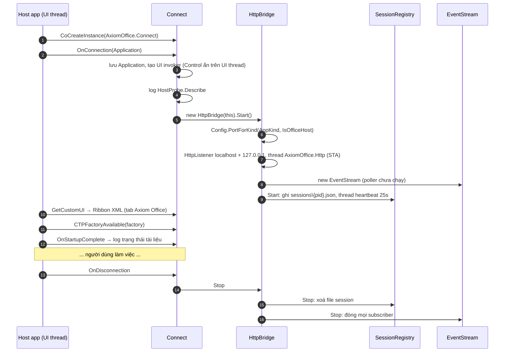
```mermaid
sequenceDiagram
    autonumber
    participant H as Host app (UI thread)
    participant C as Connect
    participant B as HttpBridge
    participant S as SessionRegistry
    participant E as EventStream

    H->>C: CoCreateInstance(AxiomOffice.Connect)
    H->>C: OnConnection(Application)
    C->>C: lưu Application, tạo UI invoker (Control ẩn trên UI thread)
    C->>C: log HostProbe.Describe
    C->>B: new HttpBridge(this).Start()
    B->>B: Config.PortForKind(AppKind, IsOfficeHost)
    B->>B: HttpListener localhost + 127.0.0.1, thread AxiomOffice.Http (STA)
    B->>E: new EventStream (poller chưa chạy)
    B->>S: Start: ghi sessions\{pid}.json, thread heartbeat 25s
    H->>C: GetCustomUI → Ribbon XML (tab Axiom Office)
    H->>C: CTPFactoryAvailable(factory)
    H->>C: OnStartupComplete → log trạng thái tài liệu
    Note over H,C: ... người dùng làm việc ...
    H->>C: OnDisconnection
    C->>B: Stop
    B->>S: Stop: xoá file session
    B->>E: Stop: đóng mọi subscriber
```

Mọi hàm host gọi vào đều bọc try/catch và log: lỗi trong add-in không được lan ra host.

### 11.2 Nhận diện app và port

`Connect.AppKind` dò bằng COM chứ không bằng tên process (WPS 12 chạy mọi thành phần trong cùng
`wps.exe`): có `Documents` → `wps`, có `Workbooks` → `et`, có `Presentations` → `wpp`; thất bại mới
đoán theo tên process. `IsOfficeHost` = process là `winword` / `excel` / `powerpnt`.

| App | `AppKind` | `family` | Port (`Config.PortForKind`) |
|---|---|---|---|
| WPS Writer | `wps` | `wps` | `Port` = 47821 |
| WPS Spreadsheets | `et` | `wps` | `Port` + 1 = 47822 |
| WPS Presentation | `wpp` | `wps` | `Port` + 2 = 47823 |
| Microsoft Word | `wps` | `office` | `PortOffice` = 47831 |
| Microsoft Excel | `et` | `office` | `PortOffice` + 1 = 47832 |
| Microsoft PowerPoint | `wpp` | `office` | `PortOffice` + 2 = 47833 |

### 11.3 Ribbon và task pane

- **Ribbon** (tab *Axiom Office*): nhóm *Local bridge* gồm **Status**, **Copy API URL**, **Open Log**;
  nhóm *AI* gồm **Ask AI...**, **Settings**. Nút gọi `Connect.OnButtonAction(control)` → `RibbonUi.HandleButton(tag)`.
- **Task pane**: factory nhận ở `CTPFactoryAvailable`; `CreateCTP("AxiomOffice.AskAiPane", "Axiom Office")`
  luôn chạy trên UI thread qua `Connect.OnUiThread` (lệnh `ui.askpane` đến từ thread HTTP: tạo CTP ở
  đó thì RCW của pane thuộc apartment của thread HTTP). Host không hỗ trợ CTP → cửa sổ nổi
  `AskAiHostForm`.
- **Độ rộng pane**: WPS 12 mở pane hẹp (~250px) và áp độ rộng trễ; `AskAiPane.ScheduleWidthCheck`
  đo lại tối đa 3 lần và gọi `Connect.AdjustTaskPaneWidth` để nới về 360px (quy đổi point/pixel
  theo tỉ lệ đo được).

## 12. Mô hình thread và ComGate

Word từng crash (AV trong `wwlib.dll`) khi heartbeat đọc `ActiveDocument` đúng lúc `ai.ask` đang
ghi: cuộc gọi thứ hai được dispatch reentrant trong vòng message của Word. Vì vậy **mọi thread của
add-in gọi COM qua `ComGate`** (một `lock` toàn cục).

| Thread | Tạo bởi | Việc | Cách vào COM |
|---|---|---|---|
| UI thread của host | Office/WPS | Ribbon, task pane, tạo CTP | Trực tiếp |
| `AxiomOffice.Http` (STA) | `HttpBridge` | Nhận và xử lý **tuần tự** mọi request | `ComGate.Run` (chờ tới lượt) |
| ThreadPool worker | `AskAiPane.StartRun` | Một lượt agent của pane | Mỗi tool qua `ComGate.Run` |
| `AxiomOffice.Session` | `SessionRegistry` | Heartbeat 25s | `ComGate.TryRun(0)` trên threadpool, chờ tối đa 2s |
| `AxiomOffice.EventPoll` | `EventStream` | Poll 500ms khi có subscriber | `ComGate.TryRun(0)`: bận thì bỏ lượt |
| `AxiomOffice.Events#n` | `EventStream` | Ghi SSE cho từng subscriber | Không gọi COM |

```csharp
internal static class ComGate
{
    public static T Run<T>(Func<T> action);             // lock: chờ tới lượt (lệnh, tool của agent)
    public static bool TryRun(int timeoutMs, Action a); // Monitor.TryEnter: bận thì trả false
}
```

Hai lệnh không đi qua cổng ở mức dispatcher (`CommandInfo.Gated = false`): `ai.ask` (giữ lệnh hàng
chục giây, từng tool tự qua cổng) và `ui.askpane` (chuyển sang UI thread; giữ cổng có thể deadlock
với UI thread đang chờ cổng).

## 13. HTTP bridge

`HttpBridge` dùng `HttpListener` với prefix `http://localhost:{port}/` và `http://127.0.0.1:{port}/`.
Thread pump xử lý từng request một; `/events` giao cho thread riêng để pump quay lại ngay.

### 13.1 Endpoint

| Endpoint | Token | Trả về |
|---|---|---|
| `GET /health` | Không | `{"ok":true,"result":{"app","pid","port","version","log"}}` |
| `GET /config` | Có | `provider`, `endpoint`, `model`, `apiKey` đã che (`abcd...wxyz`) |
| `GET /session` | Có | Snapshot session (mục 16) + `sessionFile`; đọc tài liệu live, chờ cổng tối đa 2s |
| `GET /events` | Có | Server-Sent Events (mục 17) |
| `POST /cmd` | Có | `{"action","params"}` → `{"ok":true,"result":...}` / `{"ok":false,"error":...}` |

### 13.2 Pipeline xử lý request

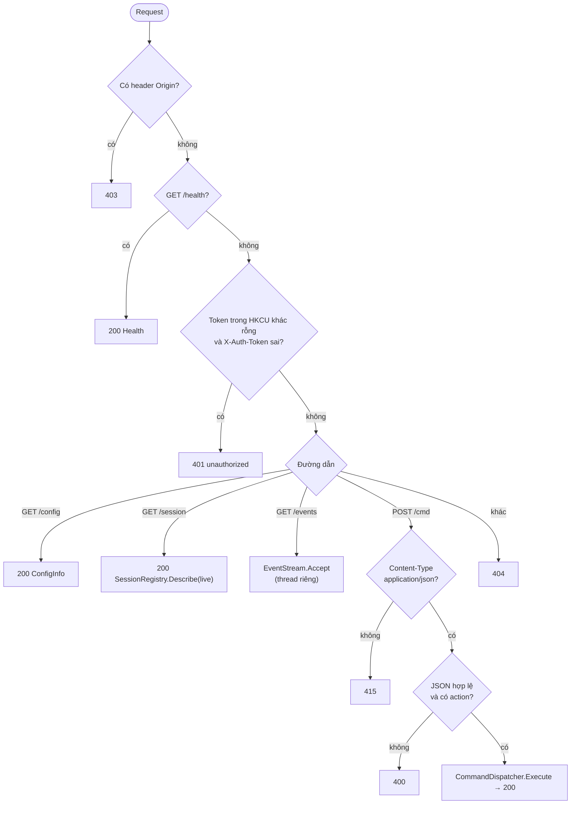
```mermaid
flowchart TD
    req(["Request"]) --> origin{"Có header Origin?"}
    origin -->|"có"| r403["403"]
    origin -->|"không"| health{"GET /health?"}
    health -->|"có"| ok200h["200 Health"]
    health -->|"không"| tok{"Token trong HKCU khác rỗng<br/>và X-Auth-Token sai?"}
    tok -->|"có"| r401["401 unauthorized"]
    tok -->|"không"| route{"Đường dẫn"}
    route -->|"GET /config"| cfg["200 ConfigInfo"]
    route -->|"GET /session"| ses["200 SessionRegistry.Describe(live)"]
    route -->|"GET /events"| sse["EventStream.Accept<br/>(thread riêng)"]
    route -->|"POST /cmd"| ct{"Content-Type<br/>application/json?"}
    route -->|"khác"| r404["404"]
    ct -->|"không"| r415["415"]
    ct -->|"có"| parse{"JSON hợp lệ<br/>và có action?"}
    parse -->|"không"| r400["400"]
    parse -->|"có"| exec["CommandDispatcher.Execute → 200"]
```

### 13.3 Mô hình lỗi

| Tình huống | HTTP | Body |
|---|---|---|
| Lệnh chạy xong | 200 | `{"ok":true,"result":{...}}` |
| Lỗi nghiệp vụ (tham số sai, không có tài liệu, sai loại app, lệnh không tồn tại, COM lỗi) | 200 | `{"ok":false,"error":"KiểuLỗi: message"}` |
| Có `Origin` / thiếu token / sai Content-Type / JSON hỏng / thiếu `action` | 403 / 401 / 415 / 400 / 400 | `{"ok":false,"error":...}` |
| Session registry / event stream chưa chạy | 503 | `{"ok":false,"error":...}` |
| Exception không lường trước trong pump | 500 | `{"ok":false,"error":"internal error: ..."}` |

Nếu giá trị `Token` trong HKCU rỗng thì bỏ qua kiểm tra token (install luôn sinh token).

## 14. Hệ lệnh: registry và dispatcher

### 14.1 Mô hình

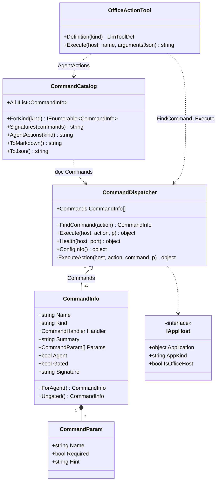
```mermaid
classDiagram
    class CommandInfo {
        +string Name
        +string Kind
        +CommandHandler Handler
        +string Summary
        +CommandParam[] Params
        +bool Agent
        +bool Gated
        +string Signature
        +ForAgent() CommandInfo
        +Ungated() CommandInfo
    }
    class CommandParam {
        +string Name
        +bool Required
        +string Hint
    }
    class CommandCatalog {
        +All IList~CommandInfo~
        +ForKind(kind) IEnumerable~CommandInfo~
        +Signatures(commands) string
        +AgentActions(kind) string
        +ToMarkdown() string
        +ToJson() string
    }
    class CommandDispatcher {
        +Commands CommandInfo[]
        +FindCommand(action) CommandInfo
        +Execute(host, action, p) object
        +Health(host, port) object
        +ConfigInfo() object
        -ExecuteAction(host, action, command, p) object
    }
    class OfficeActionTool {
        +Definition(kind) LlmToolDef
        +Execute(host, name, argumentsJson) string
    }
    class IAppHost {
        <<interface>>
        +object Application
        +string AppKind
        +bool IsOfficeHost
    }
    CommandInfo "1" *-- "*" CommandParam
    CommandDispatcher "1" o-- "47" CommandInfo : Commands
    CommandCatalog ..> CommandDispatcher : đọc Commands
    OfficeActionTool ..> CommandCatalog : AgentActions
    OfficeActionTool ..> CommandDispatcher : FindCommand, Execute
    CommandDispatcher ..> IAppHost
```

- `CommandHandler` = `delegate object (IAppHost host, Dictionary<string, object> p)`.
- `Kind`: `null` (mọi app), `wps`, `et`, `wpp`. `Agent`: có trong tool `office_action`. `Gated`: chạy
  trong `ComGate`.
- `Signature`: `et.readRange {range,sheet}`; tham số có hint: `values (2D array of rows)`.

Khai báo đặt cạnh handler, mỗi lệnh một dòng:

```csharp
Command("et.writeRange", "et", EtWriteRange, "Ghi vùng bắt đầu từ ô trên-trái `range`",
    Req("range", "top-left cell e.g. 'A1'"), Req("values", "2D array of rows e.g. ..."), Opt("sheet")).ForAgent(),
```

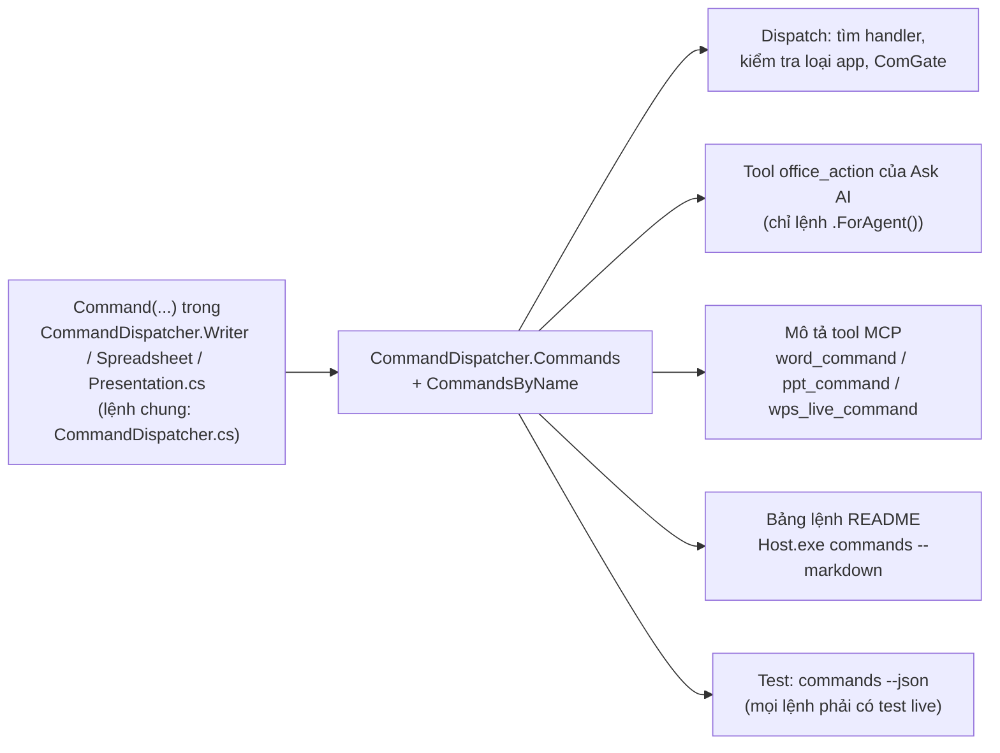
```mermaid
flowchart LR
    decl["Command(...) trong<br/>CommandDispatcher.Writer / Spreadsheet / Presentation.cs<br/>(lệnh chung: CommandDispatcher.cs)"]
    reg["CommandDispatcher.Commands<br/>+ CommandsByName"]
    decl --> reg
    reg --> d1["Dispatch: tìm handler,<br/>kiểm tra loại app, ComGate"]
    reg --> d2["Tool office_action của Ask AI<br/>(chỉ lệnh .ForAgent())"]
    reg --> d3["Mô tả tool MCP<br/>word_command / ppt_command / wps_live_command"]
    reg --> d4["Bảng lệnh README<br/>Host.exe commands --markdown"]
    reg --> d5["Test: commands --json<br/>(mọi lệnh phải có test live)"]
```

| File | Nội dung |
|---|---|
| `CommandDispatcher.cs` | `Execute`, retry, `EnsureVisibleWordDocument`, `Health`, `ConfigInfo`, builder `Command`/`Req`/`Opt`, lệnh chung |
| `CommandDispatcher.Writer.cs` | Lệnh `writer.*` |
| `CommandDispatcher.Spreadsheet.cs` | Lệnh `et.*` |
| `CommandDispatcher.Presentation.cs` | Lệnh `wpp.*` |
| `CommandDispatcher.Params.cs` | Đọc tham số, giải mã `values`, chuyển giá trị COM, `UndoRecordScope`, `SaveDocument` |
| `CommandCatalog.cs` | `CommandInfo`, `CommandParam`, sinh chữ ký / markdown / JSON |

| Nhóm | Số lệnh | Cho agent (`ForAgent`) | Không cho agent |
|---|---|---|---|
| Chung | 3 | 0 | `app.info`, `ai.ask`, `ui.askpane` |
| `writer.*` | 21 | 18 | `newDocument`, `open`, `closeAll` |
| `et.*` | 11 | 10 | `open` |
| `wpp.*` | 12 | 9 | `newPresentation`, `open`, `addTextBox` |
| **Tổng** | **47** | **37** | |

Danh sách đầy đủ kèm tham số: bảng *Danh sách lệnh* trong README (sinh bằng `commands --markdown`).

### 14.2 Luồng thực thi

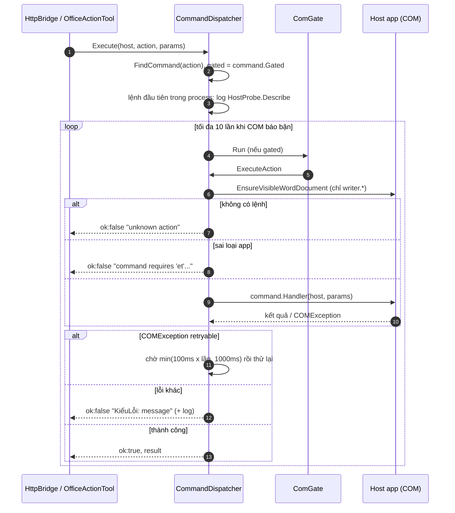
```mermaid
sequenceDiagram
    autonumber
    participant Caller as HttpBridge / OfficeActionTool
    participant D as CommandDispatcher
    participant G as ComGate
    participant A as Host app (COM)

    Caller->>D: Execute(host, action, params)
    D->>D: FindCommand(action), gated = command.Gated
    D->>D: lệnh đầu tiên trong process: log HostProbe.Describe
    loop tối đa 10 lần khi COM báo bận
        D->>G: Run (nếu gated)
        G->>D: ExecuteAction
        D->>A: EnsureVisibleWordDocument (chỉ writer.*)
        alt không có lệnh
            D-->>Caller: ok:false "unknown action"
        else sai loại app
            D-->>Caller: ok:false "command requires 'et'..."
        else
            D->>A: command.Handler(host, params)
            A-->>D: kết quả / COMException
        end
        alt COMException retryable
            D->>D: chờ min(100ms x lần, 1000ms) rồi thử lại
        else lỗi khác
            D-->>Caller: ok:false "KiểuLỗi: message" (+ log)
        else thành công
            D-->>Caller: ok:true, result
        end
    end
```

- **COM bận** (thử lại, tổng chờ tối đa ~5,5s): `0x80010001` RPC_E_CALL_REJECTED, `0x8001010A`
  RPC_E_SERVERCALL_RETRYLATER, `0x80010002` RPC_E_CALL_CANCELED, `0x800AC472` (Excel đang sửa ô).
- **`EnsureVisibleWordDocument`**: với `writer.*` (trừ `newDocument`, `open`, `closeAll`), nếu
  `ActiveDocument` không có cửa sổ hiển thị mà có tài liệu khác đang hiển thị thì kích hoạt tài liệu
  đó trước (Word luôn có một cửa sổ ẩn lúc khởi động).
- **`RequireKind`** làm một lần ở dispatcher theo `CommandInfo.Kind`.
- **`CommandRejectedException`**: lỗi trả nguyên văn, không kèm tên kiểu, không log (vd `ui.askpane`
  gọi từ companion).
- **Undo**: handler sửa tài liệu Word bọc trong `UndoRecordScope`
  (`Application.UndoRecord.StartCustomRecord/EndCustomRecord`) nên mỗi thao tác = 1 bước Ctrl+Z;
  host không có `UndoRecord` thì bỏ qua.
- **Lưu**: `SaveDocument` dùng `SaveAs2(path)`, lỗi thì `SaveAs(path)`; `wpp.exportPdf` dùng
  `ExportAsFixedFormat(path, 2)`, lỗi thì `SaveAs(path, 32)`.

### 14.3 Đọc tham số

| Hàm | Quy tắc |
|---|---|
| `ParamString` | `Convert.ToString`, thiếu thì dùng mặc định |
| `ParamInt` | Nhận số và chuỗi số (`"44"`, `"12.0"`, invariant culture). Sai kiểu → `'layout' must be a whole number, got 'Title Only'` |
| `ParamBool` | Nhận `true/false` và chuỗi tương ứng. Sai kiểu → `'bold' must be true or false, got 'có'` |
| `ParamMatrix` | Mảng 2 chiều `values` (`et.writeRange`, `writer.insertTable`, `wpp.addTable`) |

`ParamMatrix`:

1. Chuỗi bắt đầu bằng `[` hoặc `{` → parse JSON.
2. `DecodeArrays`: mỗi lớp `{"item"|"items"|"row"|"rows"|"values": x}` là **một cấp mảng**; `x` là
   danh sách phần tử, hoặc phần tử duy nhất khi `x` không phải mảng. Ví dụ
   `{"item":{"item":["Tổng","=SUM(B2:B3)"]}}` = `[["Tổng","=SUM(B2:B3)"]]` (một dòng).
3. Bỏ lớp bọc thừa ngoài cùng: `[[["a","b"],["c","d"]]]` → `[["a","b"],["c","d"]]`.
4. Mảng 1 chiều = một cột (mỗi phần tử một dòng).
5. Ô bị bọc thành mảng một phần tử được gỡ; ô là mảng/object thật → lỗi.
6. Sai dạng → `ArgumentException` kèm ví dụ đúng để model tự sửa ở vòng sau; không bao giờ trả
   `ok:true` mà không ghi gì.

Chiều ra, `ToPlain` / `ToMatrix` chuyển giá trị COM sang JSON: `object[,]` 1-based của
`Range.Value2` thành list dòng, `DateTime` thành ISO 8601, mã lỗi Excel thành tên (`#DIV/0!`,
`#REF!`...); `#N/A` thành `null` (COM trả cùng mã với ô trống).

### 14.4 Thêm một lệnh

1. Viết handler `private static Dictionary<string, object> XxxYyy(IAppHost host, Dictionary<string, object> p)`
   trong file partial của app.
2. Thêm một dòng `Command("xxx.yyy", kind, XxxYyy, "mô tả tiếng Việt", Req(...), Opt(...))`, gắn
   `.ForAgent()` nếu agent của pane được dùng.
3. `AxiomOffice.Host.exe commands --markdown` → chép đè bảng lệnh trong README (test MCP báo lỗi nếu
   lệch).
4. Thêm lệnh vào `tests/live/test_live_commands.py` (test báo lỗi nếu có lệnh chưa được gọi).

## 15. AI agent

### 15.1 Thành phần

| Class | Vai trò |
|---|---|
| `AskAiPane` | UI chat: gửi prompt, hiện từng thao tác, Dừng, Thử lại, Chèn trả lời (`writer.insertStyledText`) |
| `PaneControls` | `PaneTheme` (design token, scale DPI), `ChatBubble`, `ToolLine`, `TypingBubble`, `PromptBox`, `ComposerPanel`, `ErrorCard`, `ChatList`... |
| `AiAgent` | Dựng system prompt theo loại app, gắn tool `office_action`, gọi `LlmClient.RunAgent` |
| `LlmClient` | Vòng tool-calling; `Chat` cho nút Test và `llm-test` |
| `OfficeActionTool` | Định nghĩa tool (mô tả sinh từ registry), allowlist, thực thi → `CommandDispatcher` |
| `SettingsForm` | Provider (OpenAI-compatible / Anthropic / Google Gemini), endpoint, model, API key (lưu DPAPI), nút Test; bật/tắt Agent Core, ghi nhớ, tự ghi nhớ, QA thị giác; mở Quản lý ghi nhớ |
| `CoreClient` | Tìm/khởi động Agent Core, `POST /v1/runs` + đọc SSE, hủy, trả lời xác nhận, API memory (mục 22.11) |
| `MemoryForm` | Xem, thêm, sửa, ghim, hạn dùng, xoá/khôi phục, lịch sử, xoá toàn bộ ghi nhớ |

Từ giai đoạn 1 pane chạy qua **Agent Core** (mục 22); `AiAgent`/`LlmClient` là **dự phòng in-process**
khi Core không nhận được lượt chạy, và là đường chạy của companion (`Host.exe word|excel|ppt`).

### 15.2 Một lượt chạy

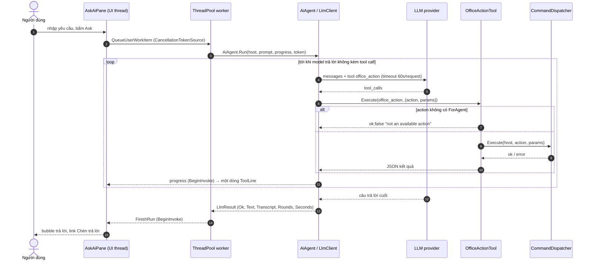
```mermaid
sequenceDiagram
    autonumber
    actor U as Người dùng
    participant P as AskAiPane (UI thread)
    participant W as ThreadPool worker
    participant AG as AiAgent / LlmClient
    participant L as LLM provider
    participant T as OfficeActionTool
    participant D as CommandDispatcher

    U->>P: nhập yêu cầu, bấm Ask
    P->>W: QueueUserWorkItem (CancellationTokenSource)
    W->>AG: AiAgent.Run(host, prompt, progress, token)
    loop tới khi model trả lời không kèm tool call
        AG->>L: messages + tool office_action (timeout 60s/request)
        L-->>AG: tool_calls
        AG->>T: Execute(office_action, {action, params})
        alt action không có ForAgent
            T-->>AG: ok:false "not an available action"
        else
            T->>D: Execute(host, action, params)
            D-->>T: ok / error
            T-->>AG: JSON kết quả
        end
        AG-->>P: progress (BeginInvoke) → một dòng ToolLine
    end
    L-->>AG: câu trả lời cuối
    AG-->>W: LlmResult (Ok, Text, Transcript, Rounds, Seconds)
    W-->>P: FinishRun (BeginInvoke)
    P-->>U: bubble trả lời, link Chèn trả lời
```

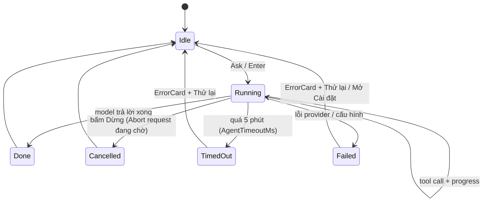
```mermaid
stateDiagram-v2
    [*] --> Idle
    Idle --> Running: Ask / Enter
    Running --> Running: tool call + progress
    Running --> Done: model trả lời xong
    Running --> Cancelled: bấm Dừng (Abort request đang chờ)
    Running --> TimedOut: quá 5 phút (AgentTimeoutMs)
    Running --> Failed: lỗi provider / cấu hình
    Done --> Idle
    Cancelled --> Idle
    TimedOut --> Idle: ErrorCard + Thử lại
    Failed --> Idle: ErrorCard + Thử lại / Mở Cài đặt
```

### 15.3 Giao thức với LLM

| Provider | Endpoint | Header | Tool format |
|---|---|---|---|
| `openai` (OpenAI-compatible, cả Ollama, LM Studio...) | `{endpoint}/chat/completions` | `Authorization: Bearer <key>` | `tools` + `tool_calls` / role `tool` |
| `anthropic` | `{endpoint}/messages` | `x-api-key`, `anthropic-version: 2023-06-01` | `tools` + `tool_use` / `tool_result` |

- `LlmResult`: `Ok`, `Text`, `Error`, `Seconds`, `Rounds`, `Transcript`, `Cancelled`, `TimedOut`,
  `StepLimitReached`.
- **Thời gian**: `TimeoutMs` = 60s mỗi request; `AgentTimeoutMs` = 300s cả lượt (linked
  `CancellationTokenSource`); hủy gọi `HttpWebRequest.Abort()` nên dừng ngay.
- **Số vòng**: không giới hạn (`maxIterations` = 0). `StepLimitReached` chỉ xảy ra khi bên gọi tự đặt
  giới hạn.
- **Provider không hỗ trợ tools**: lỗi có chữ "tool" → tắt tools, chạy tiếp như chat thường.

### 15.4 Quy tắc của agent

- **Một tool** `office_action {action, params}`; mô tả liệt kê chữ ký các lệnh `ForAgent()` của loại
  app đang mở (`CommandCatalog.AgentActions`), vd `et.writeRange {range (top-left cell e.g. 'A1'),values (...),sheet}`.
- **Allowlist**: `OfficeActionTool` từ chối lệnh không có `ForAgent` (vd `writer.closeAll`, `ai.ask`
  lồng nhau), log `office_action refused: <action>`. HTTP API và MCP không bị giới hạn này.
- **System prompt**: dùng `office_action` cho mọi thay đổi để người dùng thấy trực tiếp; đọc tài
  liệu khi cần; viết nội dung bằng ngôn ngữ của người dùng; **không `save` / `saveAs` / `exportPdf`
  nếu người dùng không yêu cầu**; không bịa kết quả tool; trả lời tóm tắt 1–2 câu.
- **Mỗi lần Ask là một phiên mới**.
- **Nhật ký** trong `bridge.log`: `AskAiPane: prompt=`, `AskAiPane progress:` (từng tool call + kết
  quả), `AskAiPane: ok ... N tool calls, M rounds`; ghi ngay trên worker kể cả khi pane đã đóng.
- **`ai.ask`** (lệnh bridge) chạy cùng `AiAgent` trên thread HTTP, trả `reply`, `transcript`,
  `seconds`, `rounds`, và log `ai.ask progress:`.

## 16. Session registry

File `%LOCALAPPDATA%\AxiomOffice\sessions\{pid}.json`:

| Trường | Ý nghĩa |
|---|---|
| `pid`, `host` | Process của app (`WINWORD.EXE`, `wps.exe`...) |
| `app`, `family` | `wps`/`et`/`wpp`; `office`/`wps` |
| `port`, `version` | Port bridge, version DLL |
| `started`, `lastSeen`, `lastSeenEpoch` | ISO UTC và epoch giây của lần heartbeat gần nhất |
| `document`, `documentPath` | Tài liệu đang active (cache) |

```json
{"pid":5128,"app":"wps","family":"office","port":47831,"host":"WINWORD.EXE","version":"1.0.0",
 "started":"2026-09-28T21:25:42.965Z","lastSeen":"...","lastSeenEpoch":1790630759.1,
 "document":"bao-cao.docx","documentPath":"C:\\...\\bao-cao.docx"}
```

- Ghi atomic (`.tmp` + `File.Replace`), heartbeat 25s. Đọc tài liệu trên threadpool qua
  `ComGate.TryRun(0)`, chờ tối đa 2s: host bận thì giữ tên đã cache nhưng `lastSeen` vẫn ghi đúng hạn.
- `GET /session` đọc live (chờ cổng tối đa 2s) rồi ghi lại file ngay.
- `OnDisconnection` xoá file. File mồ côi (process chết bất thường) bị `BridgeClient.Sessions` xoá
  khi process không còn, hoặc `lastSeen` quá 90s mà `/health` không trả đúng pid. Kết quả thêm
  `healthy`, `ageSeconds`, `file`, sắp theo `family` rồi `port`.

## 17. Event stream (SSE)

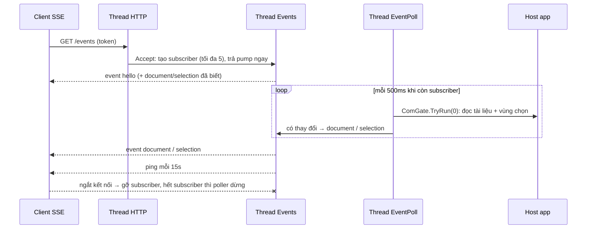
```mermaid
sequenceDiagram
    participant Cl as Client SSE
    participant Pump as Thread HTTP
    participant Wr as Thread Events#n
    participant Po as Thread EventPoll
    participant A as Host app

    Cl->>Pump: GET /events (token)
    Pump->>Wr: Accept: tạo subscriber (tối đa 5), trả pump ngay
    Wr-->>Cl: event hello (+ document/selection đã biết)
    loop mỗi 500ms khi còn subscriber
        Po->>A: ComGate.TryRun(0): đọc tài liệu + vùng chọn
        Po->>Wr: có thay đổi → document / selection
    end
    Wr-->>Cl: event document / selection
    Wr-->>Cl: ping mỗi 15s
    Cl--xWr: ngắt kết nối → gỡ subscriber, hết subscriber thì poller dừng
```

| Event | Dữ liệu |
|---|---|
| `hello` | `app`, `family`, `port`, `pid`, `subscribers` |
| `document` | `app`, `name`, `fullName` |
| `selection` (Writer) | `app`, `text`, `start`, `end` |
| `selection` (Spreadsheets) | `app`, `sheet`, `address`, `text` |
| `selection` (Presentation) | `app`, `slide`, `type`, `shape`, `text`, `start`, `end` |
| `ping` | `time`, `subscribers` |

`text` cắt 200 ký tự; vùng chọn Word dài hơn 5000 ký tự chỉ đọc phần đầu. Lỗi poll log tối đa 1
dòng/phút cho mỗi loại. Response đặt `Cache-Control: no-cache`, `X-Accel-Buffering: no`, chunked.

## 18. Host.exe: MCP server và companion

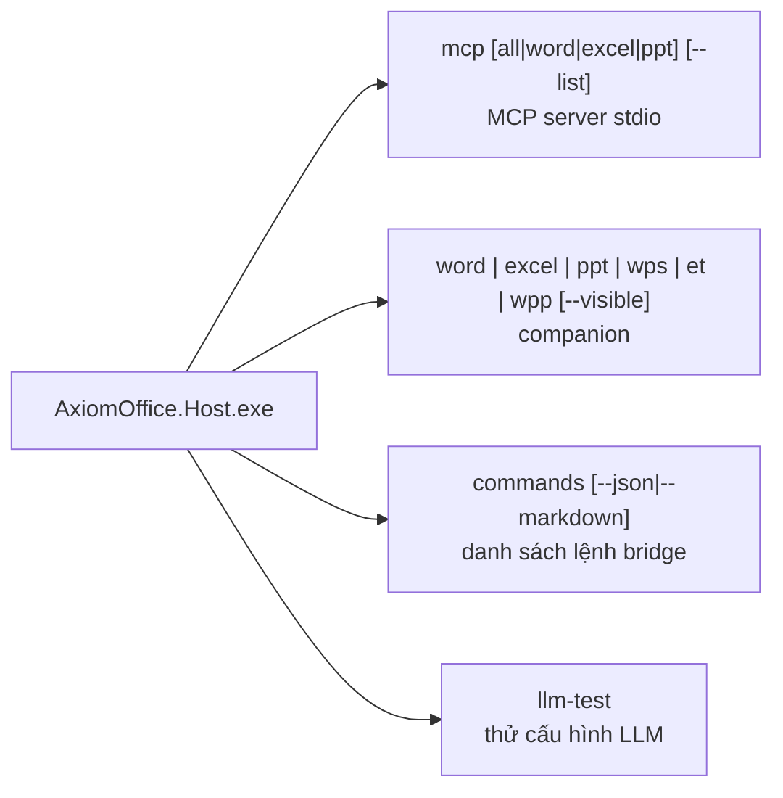
```mermaid
flowchart LR
    exe["AxiomOffice.Host.exe"] --> m1["mcp [all|word|excel|ppt] [--list]<br/>MCP server stdio"]
    exe --> m2["word | excel | ppt | wps | et | wpp [--visible]<br/>companion"]
    exe --> m3["commands [--json|--markdown]<br/>danh sách lệnh bridge"]
    exe --> m4["llm-test<br/>thử cấu hình LLM"]
```

### 18.1 MCP server

- JSON-RPC 2.0 qua stdio, mỗi message một dòng, hỗ trợ batch; tự viết, không dùng SDK. `stdout`
  chỉ dành cho JSON-RPC (`Console.SetOut(stderr)`), log vào `bridge.log`.
- Phương thức: `initialize` (protocol `2025-11-25`, `2025-06-18`, `2025-03-26`, `2024-11-05`; client
  xin version lạ thì trả bản mới nhất), `ping`, `tools/list`, `tools/call`; notification bỏ qua,
  method lạ → `-32601`.
- `tools/call` trả `content: [{type:"text", text}]`; exception trong tool → `isError: true` với
  `{"ok":false,"error":...}`.
- Nhóm: `all` (50 tool, server `office-tools`), `word` (20), `excel` (16), `ppt` (16); nhóm nào cũng
  có `office_sessions`.

| Nhóm | Làn file (không cần app) | Làn live (qua bridge) |
|---|---|---|
| Word | `doc_profile`, `doc_get_text`, `doc_find_text`, `doc_extract_table`, `doc_create` (5) | `word_health`, `word_command`, `word_read_text`, `word_type_text`, `word_insert_styled_text`, `word_format_selection`, `word_heading`, `word_insert_table`, `word_insert_image`, `word_insert_hyperlink`, `word_replace_all`, `word_export_pdf`, `word_undo`, `word_save` (14) |
| Excel | `excel_profile`, `excel_read`, `excel_write`, `excel_create`, `excel_convert`, `excel_format_range`, `excel_create_table`, `excel_create_sheet`, `excel_copy_sheet`, `excel_rename_sheet`, `excel_delete_sheet` (11) | `wps_health`, `wps_live_command`, `wps_live_read_range`, `wps_live_write_range` (4) |
| PowerPoint | `ppt_profile`, `ppt_get_text`, `ppt_create`, `ppt_add_slide_file` (4) | `ppt_health`, `ppt_command`, `ppt_list_slides`, `ppt_add_slide`, `ppt_add_text`, `ppt_add_image`, `ppt_add_table`, `ppt_set_notes`, `ppt_delete_slide`, `ppt_export_pdf`, `ppt_save` (11) |
| Chung | | `office_sessions` (1) |

Tên và tham số của 50 tool là hợp đồng với client (tương thích bản Python cũ); chỉ mô tả của
`*_command` sinh từ registry lệnh.

### 18.2 Làn live

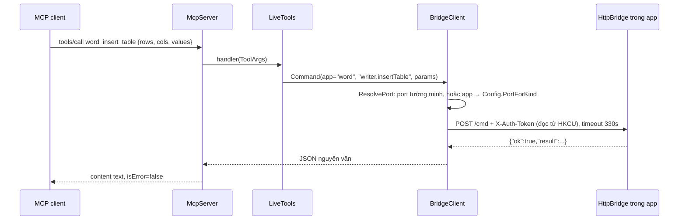
```mermaid
sequenceDiagram
    participant C as MCP client
    participant M as McpServer
    participant LT as LiveTools
    participant BC as BridgeClient
    participant B as HttpBridge trong app

    C->>M: tools/call word_insert_table {rows, cols, values}
    M->>LT: handler(ToolArgs)
    LT->>BC: Command(app="word", "writer.insertTable", params)
    BC->>BC: ResolvePort: port tường minh, hoặc app → Config.PortForKind
    BC->>B: POST /cmd + X-Auth-Token (đọc từ HKCU), timeout 330s
    B-->>BC: {"ok":true,"result":...}
    BC-->>M: JSON nguyên văn
    M-->>C: content text, isError=false
```

- `app`: `word`/`excel`/`ppt` (Office) hoặc `wps`/`et`/`wpp` (WPS); `port` tường minh ưu tiên hơn.
- Timeout 330s vì `ai.ask` có trần 5 phút.
- Lỗi kết nối (app chưa mở, add-in chưa nạp) trả `{"ok":false,"error":...}` như kết quả bình thường
  để model đọc được, không phải lỗi giao thức MCP.

### 18.3 Làn file

- **`OoxmlPackage`**: đọc/ghi `.docx` / `.xlsx` / `.pptx` bằng `ZipArchive` + XLinq; relationships,
  content types, tên part mới. Chỉ part đã sửa được ghi lại nên chart, ảnh, pivot, macro giữ
  nguyên. Lưu **atomic** qua `FileSafety`: ghi bản sao tạm `.~<tên>.<id>.tmp` cạnh file gốc rồi
  `File.Replace`.
- **Word** (`WordFiles`), **PowerPoint** (`PptFiles`): tạo file mới từ template `default.docx` /
  `default.pptx` nhúng trong exe (lấy từ python-docx / python-pptx, MIT).
- **Excel** (`ExcelFiles`, `XlsxBook`, `XlsxStyles`, `Cells`, `CsvTable`): `.xlsx`/`.xlsm` sửa trực
  tiếp (dịch công thức khi chép sheet, style, bảng); `.csv`/`.tsv` đọc/ghi text; `.xls` (BIFF)
  **chỉ đọc** qua COM (`Excel.Application` → `KET.Application` → `ET.Application`). Không có truy
  vấn SQL (`excel_query` của bản Python cũ), không xuất parquet.

### 18.4 Companion

`AxiomOffice.Host.exe word|excel|ppt|wps|et|wpp [--visible]` tạo app qua ProgID
(`Word.Application`, `KWPS.Application`...), đặt `DisplayAlerts = false`, bọc bằng
`AutomationAppHost` (`IAppHost`) và chạy cùng `HttpBridge` trên cùng port. Bind port lỗi (add-in đã
giữ port) → idle. Ctrl+C dừng bridge và `Quit` app.

## 19. Dữ liệu: cấu hình, đăng ký COM, file

### 19.1 `HKCU\Software\AxiomOffice`

| Giá trị | Kiểu | Mặc định | Ý nghĩa |
|---|---|---|---|
| `Port` | DWORD | 47821 | Port gốc cho WPS |
| `PortOffice` | DWORD | 47831 | Port gốc cho Microsoft Office |
| `Enabled` | DWORD | 1 | 0 = không mở bridge |
| `Token` | String | 32 hex ngẫu nhiên, sinh khi cài | Header `X-Auth-Token` |
| `LlmProvider` | String | `openai` | `openai` hoặc `anthropic` |
| `LlmEndpoint` | String | rỗng | Base URL (tự nối `/chat/completions` hoặc `/messages`) |
| `LlmModel` | String | rỗng | Tên model |
| `LlmApiKey` | String | rỗng | `dpapi:<base64>` (DPAPI `CurrentUser`, không entropy) |
| `CorePort` | DWORD | 47840 | Port Agent Core (bận thì thử 47840–47849) |
| `CoreEnabled` | DWORD | 1 | 0 = pane luôn chạy agent in-process |
| `MemoryEnabled` / `MemoryAutoExtract` | DWORD | 1 / 1 | Ghi nhớ dài hạn / tự trích xuất sau lượt |
| `MemoryModel` | String | = `LlmModel` | Model cho trích xuất memory |
| `EmbeddingModel` / `EmbeddingEndpoint` | String | rỗng | Tìm memory theo ngữ nghĩa (tuỳ chọn) |
| `SkillDirs` | String | rỗng | Thư mục skill của tổ chức, phân cách `;` |
| `LlmRequestTimeoutSeconds` | DWORD | 120 | Hết giờ mỗi request tới model (Core) |
| `ConfirmTimeoutSeconds` | DWORD | 120 | Chờ người dùng xác nhận; hết giờ = từ chối |
| `VisualQaEnabled` | DWORD | 0 | Cho model xem ảnh chụp cửa sổ (tốn token) |

Core đọc lại cấu hình mỗi lượt chạy (đổi model/bật tắt trong Cài đặt có hiệu lực ngay). Biến môi
trường `AXIOM_*` ghi đè cho test (`AXIOM_CORE_DATA_DIR`, `AXIOM_LLM_*`, `AXIOM_SKILL_DIRS`,
`AXIOM_MEMORY_*`, `AXIOM_CONFIRM_TIMEOUT`, `AXIOM_VISUAL_QA`...).

### 19.2 Đăng ký COM và add-in (do `install.ps1` ghi)

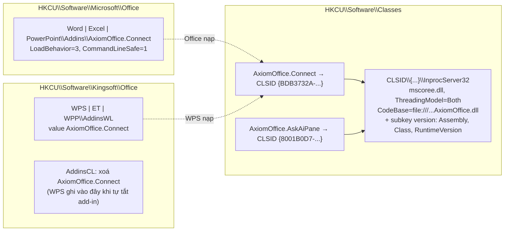
```mermaid
flowchart LR
    subgraph classes["HKCU\\Software\\Classes"]
        p1["AxiomOffice.Connect → CLSID {BDB3732A-...}"]
        p2["AxiomOffice.AskAiPane → CLSID {8001B0D7-...}"]
        clsid["CLSID\\{...}\\InprocServer32<br/>mscoree.dll, ThreadingModel=Both<br/>CodeBase=file:///...AxiomOffice.dll<br/>+ subkey version: Assembly, Class, RuntimeVersion"]
    end
    subgraph officekeys["HKCU\\Software\\Microsoft\\Office"]
        o1["Word | Excel | PowerPoint\\Addins\\AxiomOffice.Connect<br/>LoadBehavior=3, CommandLineSafe=1"]
    end
    subgraph wpskeys["HKCU\\Software\\Kingsoft\\Office"]
        w1["WPS | ET | WPP\\AddinsWL<br/>value AxiomOffice.Connect"]
        w2["AddinsCL: xoá AxiomOffice.Connect<br/>(WPS ghi vào đây khi tự tắt add-in)"]
    end
    p1 --> clsid
    p2 --> clsid
    o1 -.->|"Office nạp"| p1
    w1 -.->|"WPS nạp"| p1
```

| Định danh | Giá trị |
|---|---|
| `AxiomOffice.Connect` | CLSID `{BDB3732A-A479-4A24-AD64-D35952035BBA}` |
| `AxiomOffice.AskAiPane` | CLSID `{8001B0D7-F189-443A-B3CB-6EB98038C72E}` |
| Assembly GUID | `5A8E1ED9-10D7-4231-9E7A-01D732C81467` |

`scripts/legacy.ps1` gỡ ProgID/CLSID/Addins/whitelist của tên cũ `WpsAiBridge` và chuyển cấu hình từ
`HKCU\Software\WpsAiBridge`, chỉ xoá khóa cũ sau khi đọc lại thấy khớp từng giá trị.

### 19.3 File runtime

| Đường dẫn | Nội dung |
|---|---|
| `%LOCALAPPDATA%\AxiomOffice\bridge.log` | Log chung add-in và Host, có `[pid N]` từng dòng |
| `%LOCALAPPDATA%\AxiomOffice\sessions\{pid}.json` | Session registry (mục 16) |
| `%LOCALAPPDATA%\AxiomOffice\core.json` | Core đang chạy: `pid`, `port`, `version`, `protocol` (xoá khi Core thoát) |
| `%LOCALAPPDATA%\AxiomOffice\core.log` | Log của Core (xoay 10MB × 3) |
| `%LOCALAPPDATA%\AxiomOffice\core\core.db` | SQLite (WAL): hội thoại, lượt chạy, audit, memory (mục 22.7) |
| `%LOCALAPPDATA%\AxiomOffice\skills\`, `mcp.json` | Skill của người dùng; cấu hình MCP server ngoài |

## 20. Build, cài đặt, đóng gói

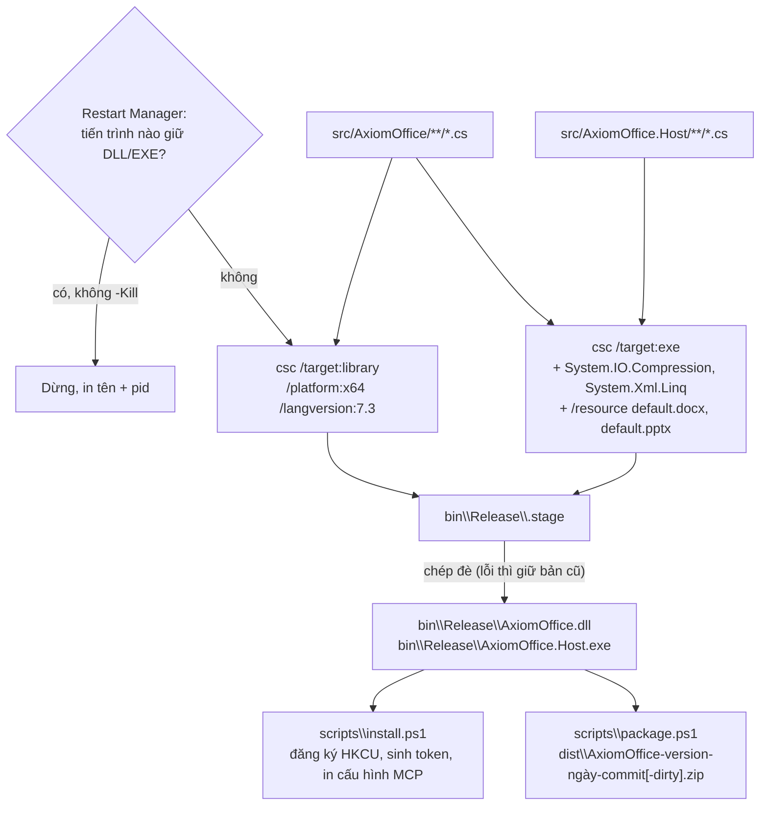
```mermaid
flowchart TD
    rm{"Restart Manager:<br/>tiến trình nào giữ DLL/EXE?"} -->|"có, không -Kill"| stop["Dừng, in tên + pid"]
    rm -->|"không"| csc1
    src1["src/AxiomOffice/**/*.cs"] --> csc1["csc /target:library<br/>/platform:x64 /langversion:7.3"]
    src1 --> csc2
    src2["src/AxiomOffice.Host/**/*.cs"] --> csc2["csc /target:exe<br/>+ System.IO.Compression, System.Xml.Linq<br/>+ /resource default.docx, default.pptx"]
    csc1 --> stage["bin\\Release\\.stage"]
    csc2 --> stage
    stage -->|"chép đè (lỗi thì giữ bản cũ)"| out["bin\\Release\\AxiomOffice.dll<br/>bin\\Release\\AxiomOffice.Host.exe"]
    out --> install["scripts\\install.ps1<br/>đăng ký HKCU, sinh token, in cấu hình MCP"]
    out --> package["scripts\\package.ps1<br/>dist\\AxiomOffice-version-ngày-commit[-dirty].zip"]
```

- **Build** (`scripts\build.ps1`): `csc` của VS 2022 Build Tools (hoặc csc của .NET Framework),
  `/codepage:65001`, chỉ tham chiếu assembly của framework. Hỏi Windows Restart Manager xem tiến
  trình nào đang giữ DLL/EXE (assembly .NET không hiện trong `Process.Modules`); `-Kill` tắt chúng.
  `AxiomOffice.csproj` gom `**\*.cs` giống script, chỉ để mở bằng IDE.
- **Cài** (`install.ps1` / `install.cmd`): gỡ Zone.Identifier, gỡ đăng ký cũ, ghi đăng ký (19.2),
  tạo `Port`/`PortOffice`/`Enabled`/`Token` nếu chưa có, in đoạn cấu hình MCP.
- **Gỡ** (`uninstall.ps1 [-Purge]`): gỡ mọi đăng ký (cả tên cũ); `-Purge` xoá cả cấu hình và log.
- **Gói** (`package.ps1 [-NoBuild] [-Kill] [-OutDir]`): DLL, EXE, script cài/gỡ, `legacy.ps1`,
  `install.cmd`/`uninstall.cmd`, `HUONG-DAN-CAI-DAT.txt`, `THIRD-PARTY-NOTICES.md`; entry zip dùng
  `/`; hậu tố `-dirty` khi code chưa commit.
- **Agent Core**: `build.ps1` tắt Core đang chạy (`/v1/admin/shutdown`), `dotnet publish` single-file tự
  chứa (`EnableCompressionInSingleFile`, `IncludeNativeLibrariesForSelfExtract` cho `e_sqlite3.dll`) với
  version khớp DLL, chép `skills\` cạnh exe; thiếu .NET SDK thì bỏ qua Core (pane chạy in-process).
- Script `.ps1` giữ ASCII không BOM (PowerShell 5.1 đọc sai UTF-8 không BOM).

## 21. Thiết kế kiểm thử

| Bộ test | Chạy trên | Kiểm tra |
|---|---|---|
| `tests/live/test_live_commands.py` | Word/Excel/PowerPoint thật (`--wps`: WPS) | Mọi lệnh bridge và lỗi tham số; bảo mật HTTP (401/403/415); `--ai`: `ai.ask` thật trên 3 app, không tự lưu/xuất; offline: `office_action` từ chối lệnh ngoài danh sách (reflection vào DLL); `--record` / `--compare`: so kết quả từng lệnh với bản ghi golden |
| `tests/mcp-host/test_mcp_host.py` | Offline | Giao thức MCP qua client chính thức; so kết quả 50 tool với bản Python cũ trên cùng file; mở lại file C# ghi bằng python-docx / openpyxl / python-pptx; README khớp `commands --markdown`; mô tả `*_command` đủ lệnh |
| `tests/mcp-host/office_roundtrip.ps1` | Office thật | File do Office tạo đọc được bằng C# và ngược lại |
| `tools/*-mcp/tests` | Offline | Unit test của 3 MCP server Python cũ |
| `tests/core/AxiomOffice.Core.Tests` (xUnit, chạy invariant globalization như Core) | Offline | Config, vòng đời, codec, thử lại, SSE, SQLite, skill (frontmatter, nguồn, chặn `..`), memory (FTS bỏ dấu, hash, link, chấm điểm, extractor, lọc nhạy cảm), policy + xác nhận, MCP config, QA thị giác |
| `tests/core/test_core_e2e.py` | Core thật + LLM giả + bridge giả (`--office`: Excel thật) | SSE, hội thoại, allowlist, hủy, trần token, skill, memory 3 phiên + khởi động lại Core, xác nhận (đồng ý/từ chối/hết giờ), MCP server mẫu, QA thị giác, audit |
| `test_core_e2e.py --real-llm` | LLM thật trong HKCU (thủ công) | Model tự chọn đúng skill cho yêu cầu mẫu, không nạp skill cho sửa nhỏ |
| `tests/core/CoreClientHarness.cs` | Excel + Core + LLM thật | Đường pane → Core bằng code C# của add-in |

- **Cách ly**: test live chỉ chạy trên app do chính nó mở; port đã có bridge của app người dùng
  thì dừng (test gọi `writer.closeAll`); chạy xong đóng app bằng WM_CLOSE, quá 20s mới kill.
- **Golden**: `--record` lưu kết quả từng lần gọi (đã bỏ pid, thời gian, thư mục tạm);
  `--compare` so các khóa có trong golden, khóa mới chỉ liệt kê. Dùng để chứng minh refactor không
  đổi hành vi.
- **Độ phủ**: test đọc `commands --json`; lệnh nào trong registry chưa được gọi thì báo lỗi.

## 22. Agent Core

Đặc tả đầy đủ và lý do từng lựa chọn: [New_arch.md](New_arch.md). Mục này mô tả bản đã làm.

### 22.1 Process, tìm Core, bảo mật

- `Program.cs` đọc cấu hình (HKCU + `AXIOM_*`), giữ mutex một bản mỗi người dùng, mở Kestrel trên
  `127.0.0.1:47840` (bận thì 47840–47849), ghi `core.json` khi sẵn sàng.
- `CoreApiGuard`: chặn request có `Origin` (403), thiếu/sai `X-Auth-Token` (401, dùng chung token với
  bridge), body không phải JSON (415). `/health` không cần token.
- Log `core.log`: khởi động/thoát, mỗi lượt (vòng, tool call, token, thời gian), lỗi provider, memory, MCP.

### 22.2 API (v1)

| Method | Path | Mô tả |
|---|---|---|
| `GET` | `/health` | `pid`, `port`, `version`, `protocol`, `memory` (`on`/`off`/`unavailable`) |
| `POST` | `/v1/runs` | Bắt đầu lượt chạy → `runId`, `conversationId`; `options.interactive=false` cho `ai.ask` |
| `GET` | `/v1/runs/{id}` · `/events` | Kết quả · SSE (kết nối lại được với `?after=`) |
| `POST` | `/v1/runs/{id}/cancel` · `/confirm` | Hủy · trả lời xác nhận `{confirmationId, approved}` |
| `GET/DELETE` | `/v1/conversations[/{id}]` | Hội thoại theo tài liệu (`?documentKey=`) |
| `GET/POST` | `/v1/skills` · `/v1/skills/reload` | Skill theo app + lỗi nạp · quét lại |
| `GET/POST/PATCH/DELETE` | `/v1/memory[/{id}]`, `/restore`, `/history` | Ghi nhớ (người dùng) |
| `GET` | `/v1/audit?runId=&limit=` | Nhật ký tool call |
| `GET` | `/v1/mcp` | MCP server: tool, tin cậy, lỗi khởi động |
| `POST` | `/v1/admin/shutdown` | Thoát êm |

Sự kiện SSE: `run.started`, `skill.loaded`, `tool.started`, `tool.finished`, `confirm.required`,
`confirm.resolved`, `memory.written`, `run.completed` / `failed` / `cancelled` / `timedout` / `stopped`, `ping`.

### 22.3 Một lượt chạy (Orchestrator)

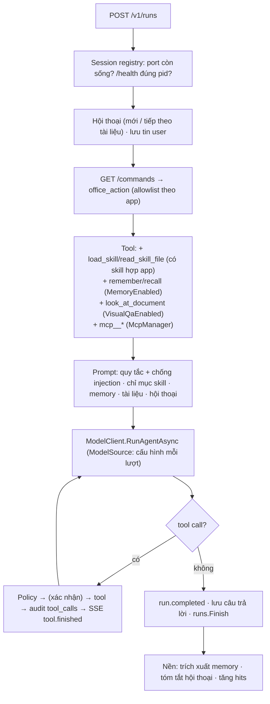
```mermaid
flowchart TD
    a["POST /v1/runs"] --> b["Session registry: port còn sống? /health đúng pid?"]
    b --> c["Hội thoại (mới / tiếp theo tài liệu) · lưu tin user"]
    c --> d["GET /commands → office_action (allowlist theo app)"]
    d --> e["Tool: + load_skill/read_skill_file (có skill hợp app)<br/>+ remember/recall (MemoryEnabled)<br/>+ look_at_document (VisualQaEnabled)<br/>+ mcp__* (McpManager)"]
    e --> f["Prompt: quy tắc + chống injection · chỉ mục skill · memory · tài liệu · hội thoại"]
    f --> g["ModelClient.RunAgentAsync (ModelSource: cấu hình mỗi lượt)"]
    g --> h{"tool call?"}
    h -->|"có"| i["Policy → (xác nhận) → tool → audit tool_calls → SSE tool.finished"]
    i --> g
    h -->|"không"| j["run.completed · lưu câu trả lời · runs.Finish"]
    j --> k["Nền: trích xuất memory · tóm tắt hội thoại · tăng hits"]
```

- Một lượt đang chạy cho mỗi port; trần 300s và 200k token (`run.stopped`).
- `ContextAssembler`: các lượt gần nhất trong ~8.000 token, vượt thì dùng tóm tắt (cập nhật mỗi 20 tin).

### 22.4 Model gateway

- `IProviderCodec`: `OpenAiCodec` (`/chat/completions`, tool `function`, kết quả `role=tool`, ảnh gửi bằng
  tin `user` `image_url`) và `AnthropicCodec` (`/messages`, `tool_use`/`tool_result`, ảnh là khối `image`).
  Tin assistant gửi lại nguyên văn (giữ `extra_content` như thought signature của Gemini 3).
- Provider không hỗ trợ tools → tắt tools, chạy chat thường. 429/500/502/503/504/rớt mạng → thử lại 3
  lần (1s→2s→4s, `Retry-After` ≤ 10s); hết giờ request (120s, chỉnh được) và hủy thì không thử lại.
- Trả lời rỗng giữa chừng → nhắc một lần; `<thought>`/`<think>` bị lọc khỏi câu trả lời cuối.
- `ModelSource`: đọc lại cấu hình LLM mỗi lượt, cache client khi không đổi.

### 22.5 Tool registry

| Tool | Nguồn | Ghi chú |
|---|---|---|
| `office_action` | `/commands` của bridge | Allowlist `agent=true` theo app; sửa tên lệnh viết sai nhẹ; params chuỗi JSON → object; policy trước khi gọi |
| `load_skill` / `read_skill_file` | `SkillIndex` | Tầng 2/3 của Agent Skills; chặn `..`, symlink, phần mở rộng lạ; ≤ 64KB |
| `remember` / `recall` | `MemoryService` | Chỉ ADD qua bộ chống trùng; phát `memory.written` |
| `look_at_document` | bridge `app.screenshot` | Chỉ khi `VisualQaEnabled`; ảnh gửi cho model, không vào audit |
| `mcp__<server>__<tool>` | `McpManager` | Server ngoài cần xác nhận trừ khi `trusted`; làn file `office` hỏi khi ghi vào file đã có |

### 22.6 Skills

- Nguồn (sau thắng trước khi trùng tên): `skills\` cạnh exe → `SkillDirs` → `%LOCALAPPDATA%\AxiomOffice\skills`;
  thư mục `_*` là gói tài nguyên dùng chung (vd `_design/tokens.json`). `FileSystemWatcher` debounce 2s.
- `SkillLoader` validate frontmatter theo chuẩn (tên ≤ 64 `a-z0-9-`, không `anthropic`/`claude`; mô tả
  ≤ 1024, không thẻ XML; field lạ bỏ qua; `apps` tuỳ chọn). Lỗi → bỏ skill đó, hiện ở `/v1/skills`.
- Skill dựng sẵn: tầng thiết kế (`thiet-ke-van-phong`, `trinh-bay-chuyen-nghiep`, `the-thuc-van-ban`,
  `bao-cao-du-lieu`) và tầng triển khai (`bao-cao-thang`, `bang-diem`, `van-ban-hanh-chinh`); checklist
  kết thúc bằng lệnh QA cấu trúc `wpp.checkLayout` / `et.checkRange` / `writer.checkTables`.

### 22.7 Memory dài hạn

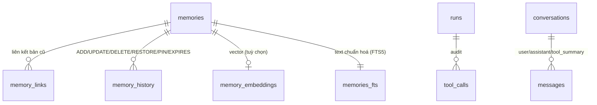
```mermaid
erDiagram
    memories ||--o{ memory_links : "liên kết bản cũ"
    memories ||--o{ memory_history : "ADD/UPDATE/DELETE/RESTORE/PIN/EXPIRES"
    memories ||--o| memory_embeddings : "vector (tuỳ chọn)"
    memories ||--|| memories_fts : "text chuẩn hoá (FTS5)"
    runs ||--o{ tool_calls : "audit"
    conversations ||--o{ messages : "user/assistant/tool_summary"
```

- Schema 2 (`PRAGMA user_version`); migration lỗi → memory `unavailable`, Core vẫn chạy agent.
- Phạm vi `user` (mọi tài liệu) và `document` (một file đã lưu). Chuẩn hoá bỏ dấu bằng bảng tiếng Việt
  tường minh (Core chạy invariant globalization), hash SHA-256 chống trùng trong lô và với memory cũ.
- **Ghi**: người dùng (API/form), tool `remember`, trích xuất nền sau lượt `completed` (bỏ qua lệnh thao
  tác thuần; id tạm chống bịa id; lọc confidence < 0,6, > 300 ký tự, thông tin nhạy cảm). Model chỉ ADD.
- **Đọc**: keyword (FTS5 + số từ khớp, sigmoid theo độ dài truy vấn) + thực thể (0,5 giảm theo độ phổ
  biến) + semantic nếu có embedding; ngưỡng 0,1 chặn tín hiệu chính; ngữ cảnh = ghim + ≤ 20 memory tài
  liệu + ≤ 8 memory user, ≤ ~1.500 token, bản mới trước khi bằng điểm.

### 22.8 Policy và xác nhận

`PolicyEngine` cho `office_action`: lưu/xuất khi prompt không có ý lưu/xuất; `saveAs`/`exportPdf` ghi
đè file đã có; `wpp.deleteSlide`; `writer.replaceAll` khi tài liệu > 20.000 ký tự. `McpTool`: server không
tin cậy, hoặc làn file ghi vào file đã có. `ConfirmationBroker` (mỗi run) phát `confirm.required`, chờ
`/confirm` tối đa `ConfirmTimeoutSeconds`; hết giờ/hủy = từ chối; lượt `interactive=false` từ chối ngay.

### 22.9 MCP client

- `McpManager` đọc `mcp.json` (`{"mcpServers": {name: {command, args, env | url, headers, trusted, disabled}}}`)
  cộng server built-in `office` = `AxiomOffice.Host.exe mcp` (tin cậy, **chỉ tool làn file**; tool live
  bị lọc vì đi vòng allowlist/policy). Khởi động lười ở lượt đầu, timeout 20s, lỗi → ẩn tool + log;
  `mcp.json` đổi → nạp lại ở lượt sau.
- Transport: stdio (JSON-RPC mỗi dòng) và Streamable HTTP (JSON hoặc SSE, giữ `Mcp-Session-Id`).

### 22.10 QA hai mức

- **Cấu trúc** (luôn có, lệnh bridge chỉ đọc): `wpp.checkLayout` (tràn khung, ra ngoài slide, chồng
  shape, chữ < 12pt, slide quá nhiều chữ), `et.checkRange` (tiêu đề trống, kiểu lẫn lộn, số dạng chữ,
  thiếu number format, ô lỗi, dữ liệu lạc ngoài bảng), `writer.checkTables` (ô trống, ô tiêu đề lẫn
  đoạn văn).
- **Thị giác** (tuỳ chọn): `app.screenshot` (`PrintWindow`, thu nhỏ ≤ 1280px) → `look_at_document`.

### 22.11 Tích hợp add-in

- `CoreClient.Run`: `EnsureBaseUrl` (đọc `core.json`, `/health`, khởi động exe nếu cần) → `POST /v1/runs`
  (gửi pid của bridge theo session file) → đọc SSE tới sự kiện kết thúc. **Chỉ trả null (dự phòng
  in-process) khi Core chưa nhận lượt chạy**; mọi lý do dự phòng ghi `bridge.log`.
- Pane hiện dòng tiến trình (`{"action": …}` như chế độ in-process), "Dùng kỹ năng", thẻ xác nhận, dòng
  "Đã ghi nhớ" + Xoá (kể cả memory trích xuất nền: hỏi lại `/v1/memory?runId=` sau 8s và 25s).
- `ai.ask` (lệnh bridge) chạy qua Core ở chế độ không tương tác, trên thread riêng của bridge; response
  giữ hình dạng cũ, thêm `viaCore`.

---

## Phụ lục: thuật ngữ

| Thuật ngữ | Nghĩa |
|---|---|
| **Bridge** | HTTP server loopback trong mỗi instance app (hoặc companion) |
| **`AppKind`** | Loại app logic: `wps` (Word/Writer), `et` (Excel/Spreadsheets), `wpp` (PowerPoint/Presentation) |
| **`family`** | `office` (Microsoft Office) hoặc `wps` (WPS Office) |
| **Lệnh (command / action)** | Một thao tác `POST /cmd`, vd `et.writeRange`; khai báo trong registry |
| **Registry lệnh** | `CommandDispatcher.Commands`: nguồn duy nhất về tên, loại app, tham số, handler của lệnh |
| **`ForAgent`** | Cờ cho phép agent của Ask AI gọi lệnh |
| **Làn live / làn file** | MCP tool thao tác app đang mở qua bridge / sửa file trên đĩa không cần app |
| **Companion** | `AxiomOffice.Host.exe word|excel|...`: tự mở app qua COM và chạy bridge, không cần add-in |
| **CTP** | Custom Task Pane: pane dock của Office/WPS |
| **`ComGate`** | Cổng tuần tự hoá mọi truy cập COM của add-in |
| **Golden** | Bản ghi kết quả từng lệnh dùng để so trước/sau refactor |
| **Agent Core** | `AxiomOffice.Core.exe`: process riêng chạy agent cho mọi app (mục 22) |
| **Run / lượt chạy** | Một yêu cầu của người dùng tới lúc có câu trả lời; có `runId`, SSE, audit |
| **Skill** | Thư mục theo chuẩn Agent Skills (`SKILL.md` + tài nguyên), nạp khi yêu cầu khớp |
| **Memory** | Ghi nhớ dài hạn (`user` / `document`), model chỉ thêm, người dùng sửa/xoá |
| **Xác nhận (policy)** | Thẻ Đồng ý / Từ chối trước thao tác rủi ro; hết giờ = từ chối |
| **QA cấu trúc / thị giác** | Soát lỗi trình bày bằng số liệu đọc lại / bằng ảnh chụp cửa sổ |
