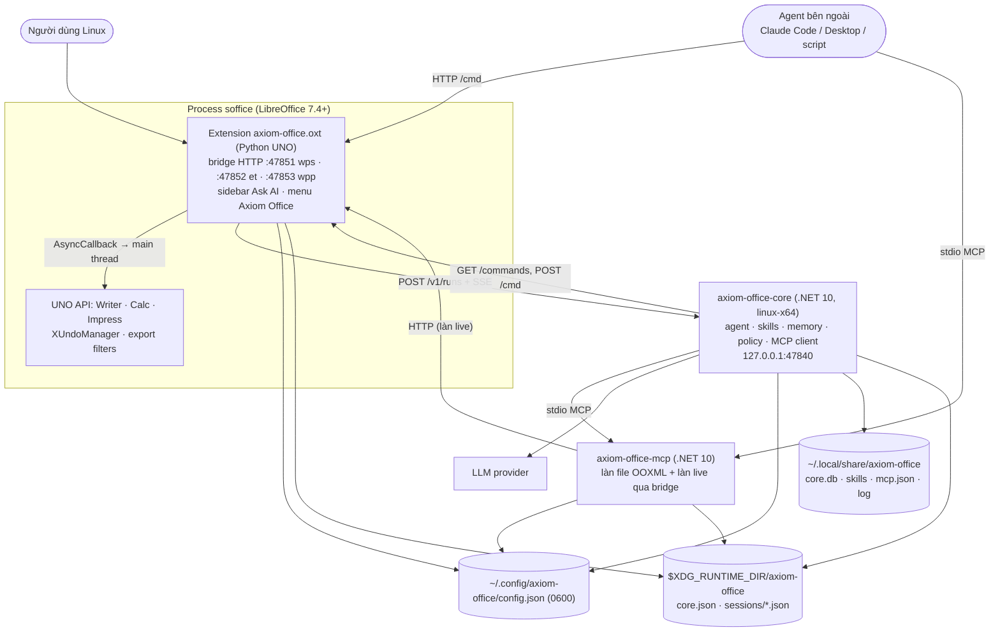
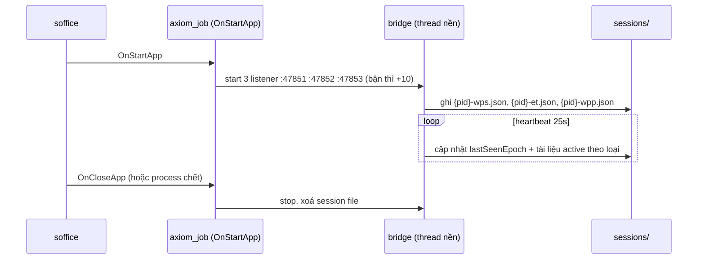
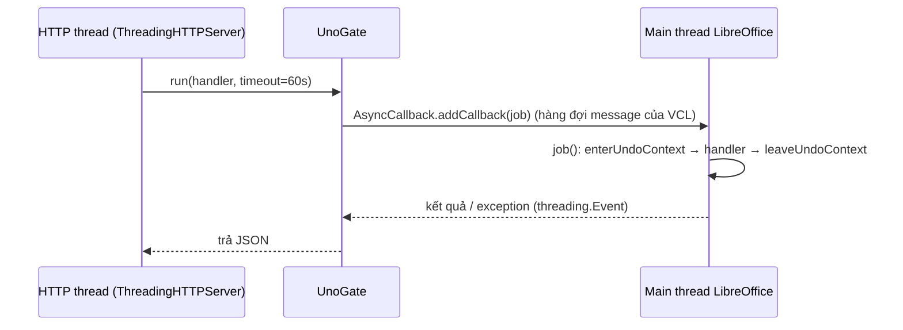

# LibreOffice_arch.md: Thiết kế tích hợp LibreOffice trên Linux

Tài liệu thiết kế để đưa Axiom Office sang **LibreOffice trên Linux** (Writer, Calc, Impress), dùng lại
Agent Core, skill và memory đã có. Viết theo khuôn [New_arch.md](New_arch.md): bối cảnh → mục tiêu →
kiến trúc đích → thiết kế từng module → giai đoạn triển khai có tiêu chí "xong khi". Kiến trúc hiện
tại (Windows) xem [ARCHITECTURE.MD](ARCHITECTURE.MD).

## Mục lục

1. [Bối cảnh](#1-bối-cảnh)
2. [Mục tiêu và phạm vi](#2-mục-tiêu-và-phạm-vi)
3. [Quyết định chính](#3-quyết-định-chính)
4. [Kiến trúc đích](#4-kiến-trúc-đích)
5. [Extension `axiom-office.oxt`](#5-extension-axiom-officeoxt)
6. [Bridge: giao thức giữ nguyên](#6-bridge-giao-thức-giữ-nguyên)
7. [Bảng ánh xạ lệnh sang UNO](#7-bảng-ánh-xạ-lệnh-sang-uno)
8. [Luồng và "ComGate" trên UNO](#8-luồng-và-comgate-trên-uno)
9. [Agent Core trên Linux](#9-agent-core-trên-linux)
10. [Pane Ask AI trong LibreOffice](#10-pane-ask-ai-trong-libreoffice)
11. [Làn file (MCP) trên Linux](#11-làn-file-mcp-trên-linux)
12. [Cài đặt, đóng gói, gỡ](#12-cài-đặt-đóng-gói-gỡ)
13. [Kiểm thử](#13-kiểm-thử)
14. [Giai đoạn triển khai](#14-giai-đoạn-triển-khai)
15. [Rủi ro và giới hạn](#15-rủi-ro-và-giới-hạn)
16. [Câu hỏi mở](#16-câu-hỏi-mở)

---

## 1. Bối cảnh

Hiện tại Axiom Office gồm ba phần, gắn với Windows ở mức khác nhau:

| Thành phần | Chạy được trên Linux? | Vì sao |
|---|---|---|
| Add-in `AxiomOffice.dll` (.NET 4.8, COM) | **Không** | COM add-in cho Microsoft Office / WPS; Office không có bản Linux |
| `AxiomOffice.Core.exe` (.NET 10) | **Gần được** | Chỉ gắn Windows ở: target `net10.0-windows`, cấu hình đọc HKCU, key mã hoá DPAPI, đường dẫn `%LOCALAPPDATA%` |
| `AxiomOffice.Host.exe` (.NET 4.8) | **Không** (hiện tại) | Biên dịch chung với add-in (COM, WinForms); engine OOXML của làn file thì độc lập, port được |

Điểm then chốt làm việc chuyển sang LibreOffice khả thi: **Core chỉ nói chuyện với ứng dụng văn phòng
qua bridge HTTP** (`/health`, `GET /commands`, `POST /cmd`, session file), không gọi COM
([ARCHITECTURE.MD](ARCHITECTURE.MD) AD-12). Vậy chỉ cần viết **một bridge mới cho LibreOffice** nói đúng
giao thức đó; Core, skill, memory, policy, MCP client dùng lại gần như nguyên.

LibreOffice cung cấp **UNO API** (Python qua `pyuno`, Java, C++, Basic). Extension `.oxt` viết bằng
Python chạy **bên trong** process `soffice`, được nạp khi LibreOffice khởi động, có sidebar, menu, và
có thể mở HTTP server trên thread nền (đã có tiền lệ: các extension AI/MCP cho LibreOffice dùng đúng
cách này).

## 2. Mục tiêu và phạm vi

| Mã | Mục tiêu |
|---|---|
| L1 | Người dùng LibreOffice trên Linux có **Ask AI** ngay trong Writer/Calc/Impress: AI sửa tài liệu đang mở, thấy ngay, **Ctrl+Z được** |
| L2 | **Cùng một Agent Core** (hội thoại, skill, memory, xác nhận, MCP) chạy native trên Linux |
| L3 | **Giữ nguyên giao thức bridge và tên lệnh** (`writer.*`, `et.*`, `wpp.*`) để Core, skill, test và agent bên ngoài không phải biết đang nói với LibreOffice |
| L4 | Cài **không cần root** (extension người dùng + binary trong `$HOME`) trên Ubuntu 22.04/24.04, Debian 12, Fedora 40 |
| L5 | Agent bên ngoài (Claude Desktop/Code, script) điều khiển LibreOffice qua HTTP API và MCP như trên Windows |

**Ngoài phạm vi đợt này**: LibreOffice trên macOS; LibreOffice Online/Collabora; WPS Office for Linux
(khác API, để đợt sau); chạy macro/script trong skill.

**Bonus không tốn thêm công**: extension Python chạy được cả **LibreOffice trên Windows** (cùng `.oxt`).

## 3. Quyết định chính

| # | Quyết định | Lý do | Đánh đổi |
|---|---|---|---|
| LD-1 | Bridge là **extension Python UNO chạy trong `soffice`** | Nạp tự động khi mở LibreOffice, biết tài liệu/khung đang active, có sidebar; không cần người dùng chạy `soffice --accept` | Phải chạy mọi lệnh UNO trên main thread (mục 8); Python của LibreOffice trên distro có thể thiếu gói `python3-uno` |
| LD-2 | **Giữ nguyên giao thức bridge** (`/health`, `/commands`, `/cmd`, `/session`, `/events`) và **tên lệnh** | Core, skill, `test_live_commands.py`, MCP làn live dùng lại; agent bên ngoài không phải học API mới | Một số lệnh ánh xạ UNO không 1-1 (mục 7) |
| LD-3 | Mỗi process `soffice` đăng ký **ba session** như WPS: `wps` (Writer), `et` (Calc), `wpp` (Impress) trên **ba port** `47851/47852/47853` | Core chọn catalog lệnh theo `session.App`; mô hình này đã chạy với WPS (một process, ba port) | Mỗi port nhắm tới tài liệu **cùng loại** được kích hoạt gần nhất |
| LD-4 | **Core build `net10.0` đa nền tảng**, trừu tượng hoá cấu hình/khoá/đường dẫn | Một codebase Core cho Windows và Linux | Thêm lớp `IConfigSource`, `ISecretStore` |
| LD-5 | Hoàn tác bằng **`XUndoManager.enterUndoContext`** | Mỗi thao tác AI = 1 bước Ctrl+Z, giống `UndoRecordScope` của Word | Calc/Impress cũng hoàn tác được (hơn bản Office) |
| LD-6 | Ảnh chụp cho QA thị giác bằng **filter xuất PNG** của LibreOffice | Không phụ thuộc X11/Wayland, chạy được cả headless | Là ảnh "trang/slide" chứ không phải ảnh cửa sổ |
| LD-7 | Pane Ask AI là **sidebar deck Python** tối giản; UI giàu tính năng để sau | Sidebar là chỗ tự nhiên trong LibreOffice; awt đủ cho chat + thẻ xác nhận | awt kém linh hoạt hơn GDI+; không có webview |
| LD-8 | Làn file: **tách engine OOXML của Host.exe thành thư viện `net10.0`** + `axiom-office-mcp` cho Linux | Dùng lại 20 tool file đã có test; không cần LibreOffice để đọc/ghi file | Phải gỡ phụ thuộc .NET Framework (JavaScriptSerializer) khỏi phần file |

## 4. Kiến trúc đích



So với Windows: `AxiomOffice.dll` → **`axiom-office.oxt`**; `AxiomOffice.Core.exe` → **`axiom-office-core`**
(cùng mã nguồn); `AxiomOffice.Host.exe mcp` → **`axiom-office-mcp`**. Registry HKCU → **`config.json`**.

### Vị trí file trên Linux (theo XDG)

| Windows | Linux | Nội dung |
|---|---|---|
| `HKCU\Software\AxiomOffice` | `$XDG_CONFIG_HOME/axiom-office/config.json` (mặc định `~/.config/…`), quyền `0600` | Token, LLM, bật/tắt Core/memory/QA |
| DPAPI `dpapi:<base64>` | libsecret (`secret-tool`, nếu có) → không có thì lưu trong `config.json` `0600` | API key |
| `%LOCALAPPDATA%\AxiomOffice\core\core.db`, `skills\`, `mcp.json`, log | `$XDG_DATA_HOME/axiom-office/` (mặc định `~/.local/share/…`) | Dữ liệu bền |
| `%LOCALAPPDATA%\AxiomOffice\core.json`, `sessions\` | `$XDG_RUNTIME_DIR/axiom-office/` (không có thì `~/.cache/axiom-office/run`) | Trạng thái sống, xoá khi đăng xuất |

## 5. Extension `axiom-office.oxt`

### 5.1 Cấu trúc gói

```
axiom-office.oxt  (zip)
  META-INF/manifest.xml          khai báo component Python + các file .xcu
  description.xml                id org.axiomoffice.bridge, version, LibreOffice tối thiểu 7.4
  Jobs.xcu                       job chạy ở sự kiện OnStartApp → khởi động bridge
  Addons.xcu                     menu "Axiom Office" (Ask AI, Cài đặt, Quản lý ghi nhớ)
  Sidebar.xcu + Factories.xcu    deck "Axiom Office" + panel Ask AI (XUIElementFactory)
  python/
    axiom_job.py                 XJob: start bridge (một lần mỗi process)
    axiom_sidebar.py             XUIElementFactory → panel chat
  pythonpath/axiom/              (tự thêm vào sys.path)
    bridge.py                    HTTP server (http.server, ThreadingHTTPServer), auth, route
    commands.py                  registry lệnh: tên, kind, tham số, ForAgent, handler (giống CommandCatalog)
    writer.py / calc.py / impress.py   handler theo ứng dụng
    checks.py                    QA cấu trúc (checkTables / checkRange / checkLayout)
    gate.py                      UnoGate: chạy hàm trên main thread (mục 8)
    sessions.py                  ghi $XDG_RUNTIME_DIR/axiom-office/sessions/{pid}-{kind}.json + heartbeat
    events.py                    SSE /events (poll-diff như bản Windows)
    config.py                    đọc/ghi config.json, token
    core_client.py               POST /v1/runs + SSE, khởi động core
    pane.py                      logic chat (tách khỏi awt để test được)
```

Chỉ dùng **thư viện chuẩn Python** (không pip) để không phụ thuộc môi trường người dùng.

### 5.2 Vòng đời



- Nếu LibreOffice chạy **nhiều process** (profile khác nhau), mỗi process tự dò port trống kế tiếp;
  session file ghi đúng port → Core và MCP tìm qua registry như trên Windows.
- **Tài liệu đích** của port `et`: tài liệu Calc có frame được kích hoạt gần nhất
  (`XFrameActionListener` / `XDesktop.getCurrentComponent()` lọc theo `supportsService`). Không có tài
  liệu loại đó → lệnh trả lỗi `no active spreadsheet` (giống `no active document` hiện tại).

## 6. Bridge: giao thức giữ nguyên

| Endpoint | Hành vi (giống Windows) |
|---|---|
| `GET /health` | Không token: `app`, `family: "libreoffice"`, `pid`, `port`, `version` |
| `GET /commands` | Catalog lệnh (`name`, `kind`, `agent`, `summary`, `params[]`) — Core lập allowlist từ đây |
| `POST /cmd` | `{action, params}` → `{"ok": true, "result": …}` / `{"ok": false, "error": …}`; bắt buộc JSON, token, chặn `Origin` |
| `GET /session` | Tài liệu active, vùng chọn |
| `GET /events` | SSE: đổi tài liệu, đổi vùng chọn (poll-diff 500ms) |

`family` mới là `"libreoffice"`; Core đã coi `family` là thông tin hiển thị nên không cần đổi logic.
`ai.ask` trong bridge **luôn chuyển sang Core** (không có agent in-process trên Linux).

## 7. Bảng ánh xạ lệnh sang UNO

Mỗi handler chạy trong `UnoGate` và trong một undo context:
`doc.getUndoManager().enterUndoContext("AI: <lệnh>")` … `leaveUndoContext()` (kể cả khi lỗi).

### 7.1 Writer (`kind = "wps"`)

| Lệnh | UNO | Ghi chú |
|---|---|---|
| `writer.getText` | `doc.getText().getString()` | `totalChars`, cắt `maxChars` |
| `writer.selection` | `controller.getSelection()` → `XTextRange.getString()` | Vị trí: `XTextViewCursor` |
| `writer.typeText` / `insertStyledText` | `viewCursor.getText().insertString(cursor, text, False)`; định dạng qua `CharWeight`, `CharPosture`, `CharUnderline`, `CharHeight`, `CharColor`, `CharFontName` | `\n` → `insertControlCharacter(PARAGRAPH_BREAK)` |
| `writer.appendText` | `text.getEnd()` + `insertString` | |
| `writer.heading` | đặt `ParaStyleName = "Heading N"` (tên style **nội bộ tiếng Anh**, không phụ thuộc ngôn ngữ UI) | |
| `writer.formatSelection` / `setParagraphAlignment` | thuộc tính ký tự / `ParaAdjust` (`LEFT`, `CENTER`, `RIGHT`, `BLOCK`) | |
| `writer.insertTable` | `doc.createInstance("com.sun.star.text.TextTable")`, `initialize(rows, cols)`, `insertTextContent`; ô: `getCellByName("A1").setString` hoặc `setDataArray` | Chèn đoạn ngăn cách khi sát bảng khác (LibreOffice cũng gộp? — kiểm chứng ở L1); con trỏ ra sau bảng |
| `writer.formatTable` | `TableStyle` hoặc thuộc tính ô `BackColor`, `CharColor`, `TableBorder2`; `setPropertyValue` theo hàng | `style` Word (vd "Grid Table 4 - Accent 1") → ánh xạ sang style LibreOffice gần nhất, không có thì bỏ qua + `skipped` |
| `writer.replaceAll` | `doc.createReplaceDescriptor()`, `SearchString`, `ReplaceString`, `replaceAll` | `\n` trong `find` → bật `SearchRegularExpression` và dùng `$` cuối đoạn; thoát ký tự regex còn lại |
| `writer.insertPageBreak` | `BreakType = PAGE_BEFORE` trên đoạn mới | |
| `writer.insertImage` | `GraphicObject` + `GraphicURL`/`Graphic` từ `GraphicProvider` | |
| `writer.insertHyperlink` | `HyperLinkURL` trên range | |
| `writer.undo` | `undoManager.undo()` × `count` | |
| `writer.save` / `saveAs` / `exportPdf` | `store()` / `storeAsURL(url, FilterName="MS Word 2007 XML" hoặc "writer8")` / `storeToURL(FilterName="writer_pdf_Export")` | Giữ định dạng file gốc khi `save` |
| `writer.checkTables` | duyệt `getTextTables()`, ô trống, ô tiêu đề dài | Cùng quy tắc với bản Windows |

### 7.2 Calc (`kind = "et"`)

| Lệnh | UNO | Ghi chú |
|---|---|---|
| `et.listSheets` / `activateSheet` | `doc.getSheets().getElementNames()` / `controller.setActiveSheet` | Calc trống: tạo sheet như `EnsureWorkbook` |
| `et.readRange` | `sheet.getCellRangeByName(addr).getDataArray()` | Ô trống → `null`, số → số |
| `et.writeRange` | `getCellRangeByPosition(...)`; chuỗi bắt đầu `=` dùng `setFormulaArray`, còn lại `setDataArray` | Giá trị bọc `{"item":…}` gỡ bằng **cùng thuật toán** với `CommandDispatcher.Params` (port sang Python, có test bảng giá trị chung) |
| `et.formatRange` | `CharWeight`, `CharColor`, `CellBackColor`, `HoriJustify`, `IsTextWrapped`; `NumberFormat` qua `doc.getNumberFormats().queryKey/addNew(fmt, Locale("en","US",""), False)` | Format code theo locale en-US để `"#,##0.00"` hiểu như Excel |
| `et.undo` | `undoManager.undo()` | **Hoàn tác được** (Excel qua COM thì không) |
| `et.save` / `saveAs` / `exportPdf` | `"Calc MS Excel 2007 XML"` / `"calc8"` / `"calc_pdf_Export"` | |
| `et.checkRange` | vùng dùng: `sheet.createCursor().gotoStartOfUsedArea/gotoEndOfUsedArea`; vùng liền kề: `createCursorByRange(A1).collapseToCurrentRegion()` | `outside-table` = vùng dùng > vùng liền kề |

Công thức: `setFormula` nhận **tên hàm tiếng Anh và dấu phẩy** (`=AVERAGE(B2:D2)`) bất kể ngôn ngữ UI —
khớp với cách model và skill đang viết.

### 7.3 Impress (`kind = "wpp"`)

| Lệnh | UNO | Ghi chú |
|---|---|---|
| `wpp.listSlides` | `doc.getDrawPages()`; text của từng shape có `XText` | |
| `wpp.addSlide` | `insertNewByIndex`; `layout` (1 tiêu đề, 2 tiêu đề + nội dung, 11 chỉ tiêu đề, 12 trống) → thuộc tính `Layout` (`AUTOLAYOUT_*`) | Bảng ánh xạ số layout Office ↔ AutoLayout |
| `wpp.addText` | `createInstance("com.sun.star.drawing.TextShape")`, `Position`/`Size` (đơn vị **1/100 mm**: đổi từ point ×35,28) | Tắt `TextAutoGrowHeight` để phát hiện tràn giống PowerPoint |
| `wpp.addImage` / `addTable` | `GraphicObjectShape` / `TableShape` (model `XTable`) | |
| `wpp.setNotes` | `page.getNotesPage()` → shape ghi chú | |
| `wpp.deleteSlide` | `getDrawPages().remove(page)` | Vẫn qua policy xác nhận của Core |
| `wpp.save` / `saveAs` / `exportPdf` | `"Impress MS PowerPoint 2007 XML"` / `"impress8"` / `"impress_pdf_Export"` | |
| `wpp.checkLayout` | `Position`/`Size` của shape; tràn chữ: so chiều cao text cần thiết (bật `TextAutoGrowHeight` tạm để đo rồi trả lại) với `Size.Height` | Kích thước slide: `doc.getDrawPages()[0].Width/Height` |

### 7.4 Lệnh chung

| Lệnh | UNO |
|---|---|
| `app.info` | `ProductName`/`ooSetupVersion` từ cấu hình `org.openoffice.Setup`, tài liệu đang mở |
| `ui.askpane` | Mở sidebar deck Axiom Office (`.uno:SidebarDeck.AxiomOfficeDeck`) |
| `app.screenshot` | Xuất trang/slide hiện tại ra PNG: `storeToURL` với filter `writer_png_Export` / `calc_png_Export` / `impress_png_Export` (`PixelWidth` theo `maxWidth`) vào file tạm → base64 → xoá file |
| `ai.ask` | Chuyển sang Core (`interactive=false`) |

## 8. Luồng và "ComGate" trên UNO

UNO không an toàn khi gọi từ nhiều thread cùng lúc, và thao tác UI/document từ thread nền của Python
dễ làm treo hoặc crash `soffice`. Thiết kế giống `ComGate`:



- `UnoGate.run` giữ một `threading.Lock` để **tuần tự** hoá lệnh (như `ComGate`), đặt `com.sun.star.awt.AsyncCallback`
  lên main thread, chờ `threading.Event` tối đa 60s; hết giờ → lỗi `libreoffice is busy` (Core có thể thử lại).
- Chế độ **headless** (test, máy chủ): không có vòng lặp VCL cho AsyncCallback ở một số bản → `UnoGate`
  chuyển sang gọi trực tiếp dưới khoá (kiểm chứng ở L0).
- `ai.ask` và SSE chạy trên thread riêng (bài học từ bản Windows: Core gọi ngược `/cmd` không được kẹt).

## 9. Agent Core trên Linux

Thay đổi trong `src/AxiomOffice.Core` (một codebase cho cả hai nền tảng):

| Việc | Cách làm |
|---|---|
| Target | `net10.0` (bỏ `-windows`); publish `-r linux-x64` và `-r win-x64`, single-file tự chứa |
| Cấu hình | `IConfigSource`: `RegistryConfigSource` (Windows) / `JsonConfigSource` (`config.json`, Linux); ưu tiên vẫn là biến môi trường `AXIOM_*` → nguồn nền tảng |
| Khoá API | `ISecretStore`: DPAPI (Windows) / libsecret qua `secret-tool` nếu có, không thì giá trị trong `config.json` quyền `0600` (Linux) |
| Đường dẫn | `CorePaths` theo XDG (mục 4) |
| Một bản mỗi người dùng | Named mutex của .NET trên Unix dựa trên file và không đảm bảo giữa các bản build → thay bằng **file lock** (`FileStream` `FileShare.None`) trên `$XDG_RUNTIME_DIR/axiom-office/core.lock` |
| Session registry | `SessionDirectory` đọc thêm thư mục Linux; tên file `{pid}-{kind}.json` (một process ba session) |
| Khởi động Core | Pane/extension chạy `~/.local/lib/axiom-office/axiom-office-core` (tách khỏi process soffice, `setsid`); tuỳ chọn `systemd --user` unit |
| MCP built-in | `office` = `axiom-office-mcp` cạnh binary Core (mục 11) |
| QA thị giác | Không đổi: gọi bridge `app.screenshot` |
| Kiểm tra `InvariantGlobalization` | Đã xử lý (bỏ dấu bằng bảng tường minh) — chạy giống nhau trên Linux |

Skill, memory, policy, prompt **không đổi**. Mô tả skill dùng lệnh chung nên dùng được cho LibreOffice;
riêng chỗ nói "Word"/"Excel" trong prompt (`PromptBuilder.AppName`) thêm nhánh `family = libreoffice`
→ "LibreOffice Writer / Calc / Impress".

## 10. Pane Ask AI trong LibreOffice

> **Đã làm (giai đoạn L2, 30/09/2026)** - xem kết quả và các khác biệt API ở mục 14.2. Pane dùng chung
> một giao diện cho hai chỗ hiển thị: deck sidebar (đăng ký đúng chuẩn) và **cửa sổ con neo bên phải cửa
> sổ tài liệu** (bản LibreOffice không có sidebar dùng được - vd 26.8 trên máy này). Mở bằng menu
> **Axiom Office -> Ask AI** (Addons.xcu + ProtocolHandler.xcu) hoặc lệnh `ui.askpane`.

Sidebar deck **"Axiom Office"** (hiện với Writer, Calc, Impress), panel dựng bằng `awt` trong Python:

```
┌ Axiom Office ─────────── [Trò chuyện mới] [Cài đặt] ┐
│ Writer · muse-spark-1.3                              │
│ ┌──────────────────────────────────────────────────┐ │
│ │ Bạn: Soạn công văn đề nghị nộp báo cáo quý III   │ │
│ │ ✓ Dùng kỹ năng: van-ban-hanh-chinh               │ │
│ │ ✓ Chèn bảng                                      │ │
│ │ ✓ Đã ghi nhớ: Người ký: Nguyễn Văn A   [Xoá]     │ │
│ │ AI: Đã soạn xong công văn…                        │ │
│ └──────────────────────────────────────────────────┘ │
│ ┌──────────────────────────────────────┐ [Gửi]       │
│ │ Nhập yêu cầu…                        │ [Dừng]      │
│ └──────────────────────────────────────┘             │
│ Xong trong 18s · 5 thao tác   [Hoàn tác lượt này]    │
└──────────────────────────────────────────────────────┘
```

- Hội thoại hiển thị bằng `UnoControlEdit` nhiều dòng chỉ đọc (hoặc `UnoControlListBox` cho từng dòng
  thao tác); cập nhật UI **luôn qua `UnoGate`** (thread đọc SSE không chạm awt trực tiếp).
- **Thẻ xác nhận**: hộp thoại `MessageBox` Có/Không (không chặn thread SSE — mở trên main thread qua
  AsyncCallback, trả lời bằng `POST /v1/runs/{id}/confirm`).
- **Hoàn tác lượt này**: có cho cả Writer, **Calc và Impress** (UNO hoàn tác được) — `*.undo {count: N}`.
- **Cài đặt** và **Quản lý ghi nhớ**: dialog `awt` (provider/endpoint/model/key, Core, ghi nhớ, QA thị
  giác; danh sách memory gọi `/v1/memory`).
- Logic chat nằm trong `pane.py` thuần Python (không phụ thuộc awt) để test đơn vị được.
- **Dự phòng**: Core không chạy được → pane báo lỗi rõ + nút "Khởi động lại Agent Core" (không có agent
  in-process trên Linux; tránh duy trì bản agent thứ ba).

## 11. Làn file (MCP) trên Linux

- Tách phần file của `AxiomOffice.Host` (`OoxmlPackage`, `WordFiles`, `ExcelFiles`, `PptFiles`,
  `XlsxBook`, `Cells`, template docx/pptx) thành thư viện **`AxiomOffice.Files` (`net10.0`)**; thay
  `JavaScriptSerializer` bằng `System.Text.Json`.
- `axiom-office-mcp` (`net10.0`, linux-x64 + win-x64): MCP stdio gồm **20 tool file** + tool live gọi bridge
  qua HTTP (như `LiveTools` hiện tại, chọn bridge bằng session registry).
- `.xls` (đọc qua COM Excel ở bản Windows) trên Linux: chuyển bằng `soffice --headless --convert-to xlsx`
  nếu có LibreOffice, không thì báo không hỗ trợ.
- `tests/mcp-host/test_mcp_host.py` chạy cho cả hai bản (so kết quả 20 tool file với bản Python cũ).

## 12. Cài đặt, đóng gói, gỡ

Gói `axiom-office-linux-x64-<version>.tar.gz`:

```
axiom-office/
  axiom-office.oxt
  bin/axiom-office-core        (single-file tự chứa, chmod +x)
  bin/axiom-office-mcp
  skills/                      (skill dựng sẵn + _design/tokens.json)
  install.sh  uninstall.sh  HUONG-DAN-CAI-DAT.txt
```

`install.sh` (không cần root):

1. Kiểm tra `soffice` (≥ 7.4) và Python UNO (`soffice --headless` chạy thử một macro Python in ra phiên
   bản); thiếu `python3-uno` / `libreoffice-script-provider-python` thì in lệnh cài theo distro
   (`apt`/`dnf`, **cần root — người dùng tự chạy**).
2. Chép `bin/` và `skills/` vào `~/.local/lib/axiom-office/`.
3. `unopkg add --force axiom-office.oxt` (extension của người dùng; LibreOffice phải đóng).
4. Tạo `~/.config/axiom-office/config.json` (`0600`) với token ngẫu nhiên nếu chưa có; giữ cấu hình cũ khi nâng cấp.
5. In đoạn cấu hình MCP cho Claude Desktop/Code (`axiom-office-mcp`).

`uninstall.sh [--purge]`: tắt Core (`/v1/admin/shutdown`), `unopkg remove org.axiomoffice.bridge`, xoá
`~/.local/lib/axiom-office`; `--purge` xoá cả `~/.config/axiom-office` và `~/.local/share/axiom-office`.

Flatpak/Snap LibreOffice chạy trong sandbox: extension vẫn cài được qua `unopkg` của bản đó, nhưng
kết nối `127.0.0.1` tới Core ngoài sandbox và quyền chạy binary có thể bị chặn → **đợt này chỉ hỗ trợ
LibreOffice cài từ gói distro hoặc bản .deb/.rpm của The Document Foundation** (ghi rõ trong hướng dẫn).

## 13. Kiểm thử

| Bộ test | Chạy trên | Nội dung |
|---|---|---|
| `tests/libreoffice/unit/` (pytest, không cần LibreOffice) | Linux/Windows | `pane.py`, gỡ `{"item":…}`, ánh xạ tham số, ánh xạ layout/đơn vị, bảng giá trị chung với bản C# |
| `test_live_commands.py --libreoffice` | LibreOffice thật, **headless** với profile tạm (`-env:UserInstallation=file:///tmp/axiom-lo-profile`) + extension cài bằng `unopkg` vào profile đó | Mọi lệnh bridge như Office/WPS, lỗi tham số, bảo mật HTTP, hoàn tác cả lượt ở Writer/Calc/Impress, QA cấu trúc với ca dựng sẵn, `app.screenshot` trả PNG |
| `test_core_e2e.py` trên Linux | Core linux-x64 + LLM giả + bridge giả | Toàn bộ 76 kiểm tra hiện có (Core không phụ thuộc nền tảng) + đường dẫn XDG, file lock một bản |
| `test_core_e2e.py --libreoffice` | Core + LibreOffice headless + LLM giả | Agent sửa tài liệu thật qua bridge Python |
| `test_mcp_host.py` | `axiom-office-mcp` | 20 tool file so với bản Python cũ |
| CI | GitHub Actions `ubuntu-24.04` (cài `libreoffice-writer libreoffice-calc libreoffice-impress python3-uno`) | Chạy tất cả trừ LLM thật |

Cách ly như bản Windows: test chỉ dùng LibreOffice do nó khởi động (profile tạm, port riêng), không đụng
LibreOffice người dùng đang mở.

## 14. Giai đoạn triển khai

Mỗi giai đoạn: branch riêng (`feat/lo-phase-N-...`), test thật, báo cáo số pass/fail, hỏi trước khi merge.

### Giai đoạn L0: Spike và khung (1 tuần)

- [x] Extension tối thiểu: `OnStartApp` job mở HTTP `/health` + `POST /cmd writer.getText` — **đã chạy trên
      Windows (LibreOffice 26.8)**; Ubuntu 24.04 / Fedora 40 còn phải làm ở L2 cùng Core `linux-x64`.
- [x] Kiểm chứng `AsyncCallback` từ thread nền (headless **và** có cửa sổ), `XUndoManager` gom nhiều thao
      tác thành một bước, filter PNG xuất trang hiện tại.
- [ ] Core build `net10.0` chạy trên Linux với `JsonConfigSource`, XDG, file lock.
- **Xong khi**: script chứng minh 4 điểm trên chạy trên cả hai distro; ghi kết quả vào mục 15 (rủi ro nào
  được xác nhận/loại bỏ). → **trên Windows đã xong 2/3, kết quả ghi ở mục 14.1**

### Giai đoạn L1: Bridge Writer + Calc + Impress

- [x] `commands.py` + handler đủ lệnh mục 7 (kể cả QA cấu trúc), `UnoGate`, undo context, session ×3.
- [x] `tests\live\test_live_libreoffice.py` (bản Windows của `test_live_commands.py --libreoffice`) chạy
      headless và có cửa sổ: **158 kiểm tra pass** cả ba app.
- [ ] SSE `/events` (mục 13) — chưa làm; Core hiện dùng SSE của chính nó, bridge chưa cần.
- **Xong khi**: mọi lệnh `agent=true` của bản Windows có bản LibreOffice pass test live; Core e2e
  `--libreoffice` sửa được tài liệu thật cả ba app. → **phần Windows đã xong; `--libreoffice` cho Core
  e2e sẽ làm cùng L2 (khi Core chạy Linux, không cần `/health` khác).**

### 14.1 Kết quả triển khai trên Windows (30/09/2026)

Đã làm ở branch `feat/lo-l1-bridge` (LibreOffice 26.8.0.3, Windows 10 x64, profile người dùng thật):
extension `.oxt` + `scripts\libreoffice.ps1`, đủ 52 lệnh của bản C# (thêm `et.closeAll`/`wpp.closeAll`
cho test), `ai.ask` chạy qua Agent Core đã kiểm chứng end-to-end trên tài liệu thật.

Những điểm **khác thiết kế ban đầu**, phát hiện khi chạy thật (đã sửa trong code, ghi lại để Linux
không vấp lại):

| Vấn đề | Thực tế API | Cách xử lý |
|---|---|---|
| `setDataArray` với ô rỗng | Phần tử `None` bị LibreOffice ghi thành **lỗi `#N/A`** vào ô | Ghi từng ô (`setFormula("")` để xoá, `setValue`/`setString`/`setFormula` theo kiểu) |
| `queryKey`/`addNew` của number format | Cần **struct `com.sun.star.lang.Locale`**, truyền chuỗi `"en-US"` → lỗi pyuno khó đọc ("Couldn't convert … traceback object") | Tạo `Locale{Language:"en", Country:"US"}` |
| Placeholder trống của layout | Placeholder của template **không** mang tên service `TitleTextShape`/`OutlinerShape` (chỉ có `drawing.TextShape`) → lọc theo service bị sót | Đọc `IsEmptyPresentationObject` (tương đương `Shape.Type == msoPlaceholder`) |
| `replaceAll` xuyên đoạn | LibreOffice không tìm xuyên đoạn văn | Chỉ nhận `\n` ở **cuối** chuỗi `find` (thành `$`); `\n` giữa chuỗi trả lỗi nêu cách sửa |
| `writer.open` file **đang mở** | `loadComponentFromURL` hiện hộp thoại "đã mở" → chặn main thread, mọi lệnh sau `Busy` (headless thì mở bản read-only) | Tìm component cùng `getURL()` trước, nếu có thì `frame.activate()` và trả `alreadyOpen: true` |
| `wpp.addSlide` sai `layout` | Chèn slide trước rồi mới báo lỗi → để lại slide rác (test bắt được: 6 slide thay vì 5) | Kiểm tra `layout` trước, và gỡ slide nếu `page.Layout` lỗi |
| `autoFit: content` | UNO không có API tương đương | Báo trong `skipped` của `writer.formatTable`; `window` dùng `HoriOrient = FULL` |
| Style bảng Word | Không có style cùng tên | Bảng ánh xạ sang autoformat có sẵn (`"Grid Table 4 - Accent 1"` → `Box List Blue`), không khớp thì trả `styleError` |
| `app.screenshot` | `PixelWidth` của filter chỉ là gợi ý, có thể rộng hơn `maxWidth` vài pixel; ảnh là **trang/slide** chứ không phải cửa sổ | Giữ nguyên (đúng tinh thần mục 15, Wayland) |
| Layout slide | `AUTOLAYOUT_NONE=0/TITLE=1/TITLE_CONTENT=2` (`uno.getConstantByName`); Office 1/2/11/12 → 1/2/1/0 | Bảng `LAYOUTS` trong `impress.py`; LibreOffice không có layout "title + subtitle" như Office |
| Hộp thoại đang mở | Mọi lệnh đều hết giờ chờ main thread (60s) và trả `Busy` | `/health` trả `stuck: true`; thông báo lỗi nêu rõ phải đóng hộp thoại |

Việc còn lại trước L2: gọi UNO từ nhiều client đồng thời (test tải), SSE `/events` của bridge, ô
"Đã ghi nhớ"/sidebar (L2), và các câu hỏi mở mục 16 (đặc biệt: pane `awt` hay web UI).

### 14.2 Pane Ask AI: kết quả và khác biệt API (30/09/2026)

Đã làm (`feat/lo-l1-bridge`): `axiom/core.py` (client Agent Core + SSE), `axiom/chat.py` (logic hội thoại,
thuần Python nên test được), `axiom/awt.py` (host điều khiển), `axiom/panel.py` (pane + factory sidebar),
`axiom/dialogs.py` (Cài đặt/Ghi nhớ), `axiom/dispatch.py` (URL menu), `Sidebar.xcu`/`Factory.xcu`/
`Addons.xcu`/`ProtocolHandler.xcu`, component `python/axiom_panel.py` + `python/axiom_dispatch.py`.

Đã chạy thật trên LibreOffice 26.8 (Writer/Impress): gửi yêu cầu -> Core chạy agent -> tài liệu được sửa ->
phản hồi hiện trong pane; "Hoàn tác lượt này" trả tài liệu về nguyên trạng; "Dừng" hủy giữa lượt; thẻ xác
nhận của policy (`wpp.deleteSlide`) hiện đúng và đồng ý thì Core mới thực thi; dialog Cài đặt đọc đúng
HKCU và ghi lại bằng DPAPI; dialog Ghi nhớ liệt kê `/v1/memory`.

Những điểm **khác thiết kế**, phát hiện khi làm:

| Vấn đề | Thực tế API | Cách xử lý |
|---|---|---|
| Toạ độ điều khiển awt | Model điều khiển **không** nhận `PositionX/PositionY/Width/Height` (chỉ có thuộc tính riêng như `Text`, `Label`, `State`); `setPropertyValue` báo ok nhưng giá trị không có tác dụng, `getPropertyValue` lỗi | Đặt vị trí/kích thước lên chính *view* (`XControl.setPosSize`) sau khi tạo peer, lưu hình học theo tên trong `awt._Host` |
| `UnoControlDialog` (cửa sổ rời) | Tạo được peer, `isVisible()` true, hình học đúng, nhưng cửa sổ **không hiện trên màn hình** (kể cả `toFront`/`setFocus`, `DesktopAsParent=False`) | Pane và dialog dùng **cửa sổ con** (`UnoControlContainer` nhúng vào cửa sổ tài liệu) - luôn hiện, không bị che |
| Sidebar của LibreOffice 26.8 | Config Sidebar/Factories nhận deck + panel + factory của mình, nhưng `XLayoutManager.getElement("private:resource/uielement/sidebar")` = None, `XSidebarProvider` không có, `.uno:Sidebar` không tạo phần tử => không có chỗ nhúng panel | Vẫn đăng ký deck đúng chuẩn (bản LibreOffice khác sẽ dùng), `ui.askpane` kiểm tra sidebar trước rồi mới rơi về cửa sổ con |
| `DispatchHelper.executeDispatch` | Lỗi pyuno "Type 17 is not supported!" khi truyền struct `URL` | Dùng `XDispatchProvider.queryDispatch` + `XDispatch.dispatch` |
| Menu Addons | URL phải có protocol handler: tên node trong `ProtocolHandler/HandlerSet` là **implementation name** (không phải tên protocol), và component phải implement `com.sun.star.lang.XInitialization` (không phải `com.sun.star.frame.XInitialization`) | `ProtocolHandler.xcu` + `axiom_dispatch.py` chỉ implement `XDispatchProvider` (implement cả `XDispatchProviderInterceptor` bị lỗi MRO vì nó kế thừa `XDispatchProvider`) |
| Một file XCU nhiều `component-data` | Chỉ khối đầu được merge (khối `Factories` trong `Sidebar.xcu` bị bỏ) | Mỗi file `.xcu` một `component-data` |

Chi tiết khác: `PanelElement.Type` = `UIElementType.TOOLPANEL` (= 7 ở bản này); `createAccessible` trả None
(không có accessibility riêng); cập nhật UI từ thread SSE qua `UnoGate`, nhưng khi đã ở main thread thì gọi
thẳng (`UnoGate.on_main_thread`) vì gọi lại gate sẽ tự treo; nút "Hoàn tác lượt này" dùng tiền tố lệnh theo
kind (`wps` -> `writer.undo`), không phải `wps.undo`.

### 14.3 Làm lại giao diện pane theo pane Office (30/09/2026)

awt của LibreOffice không vẽ được hình bo góc, không có control tự vẽ, và `Button` dùng giao diện hệ điều
hành (không đổi được màu). Pane mới dựng từ control có sẵn: `FixedText` (màu nền/chữ/font), `ImageControl`
(PNG góc bo và icon trạng thái, sinh bằng zlib trong `theme.py`, cache ở `%LOCALAPPDATA%\AxiomOffice\ui-cache`)
và container lồng nhau (tự cắt khi cuộn) + `ScrollBar`. Những điều rút ra khi thử trên 26.8:

| Hiện tượng | Xử lý |
|---|---|
| Control thêm **trước** nằm **trên** control thêm sau | Mỗi nhóm thêm góc/chữ trước, nền sau cùng; khung chat không phủ lên cột thanh cuộn |
| Nền vẽ lại (đổi màu hover) đè mất viền/góc chồng lên nó | Nền hình chữ thập (2 hình chữ nhật) không chồng lên góc/viền |
| Tên thuộc tính font là `FontName/FontHeight/FontWeight` (không phải `Char*` — đặt sai bị bỏ qua lặng lẽ) | Sửa ở `awt.py`/`widgets.py` |
| Chiều cao chữ: `XLayoutConstrains.calcAdjustedSize(Size(width, 0))` của chính `FixedText` | Đo khi dựng bong bóng/thẻ |
| Sidebar gọi `createUIElement` với `PropertyValue` có tên, cần `XSidebarPanel` để có chiều cao | Sửa factory + panel; `TitleBarIsOptional` |
| Panel trong sidebar không nhận `mouseReleased` | Bấm = `mousePressed` (chuột trái) |
| Không có sự kiện con lăn chuột cho control tự vẽ; `ScrollBar` tự tạo cũng không nhận wheel | Thanh cuộn bấm/kéo + PageUp/PageDown; tự cuộn xuống cuối |
| `XSidebarProvider` không có; trạng thái sidebar | `XDispatch.addStatusListener(listener, url)` của `.uno:Sidebar` (đồng bộ) |
| Writer 26.8 trên máy này không bật được sidebar (`.uno:Sidebar` không đổi trạng thái) | Pane neo: co `frame.ComponentWindow`, nghe resize để co lại sau mỗi lần LibreOffice xếp lại |
| Tạo lại container thứ hai ở cùng chỗ có lúc không vẽ | Pane neo đóng = ẩn, mở lại = hiện (không huỷ/tạo lại) |
| Edit nhiều dòng chèn "\n" trước khi `keyPressed` tới listener | Bỏ đúng ký tự xuống dòng tại vị trí con trỏ (`getSelection().Min`) trước khi gửi |

### Giai đoạn L2: Core đa nền tảng + pane

- [ ] `IConfigSource`/`ISecretStore`, publish linux-x64, khởi động Core từ extension.
- [ ] Sidebar Ask AI (chat, tiến trình, "Dùng kỹ năng", thẻ xác nhận, "Đã ghi nhớ" + Xoá, Dừng, Hoàn tác
      lượt, Trò chuyện mới), dialog Cài đặt + Quản lý ghi nhớ.
- **Xong khi**: trên LibreOffice thật (có UI) chạy 3 yêu cầu mẫu (công văn, bảng điểm, slide báo cáo)
  qua pane; "làm tiếp" dùng ngữ cảnh lượt trước; xác nhận/hoàn tác chạy; Core Windows vẫn pass toàn bộ test.

### Giai đoạn L3: Làn file + MCP + đóng gói

- [ ] `AxiomOffice.Files` (`net10.0`), `axiom-office-mcp` (linux-x64, win-x64), test so với bản Python.
- [ ] `install.sh` / `uninstall.sh`, tarball, hướng dẫn; CI Ubuntu.
- **Xong khi**: cài từ tarball trên máy sạch Ubuntu/Fedora không cần root (trừ gói `python3-uno` nếu
  thiếu); Claude Code dùng được `axiom-office-mcp` với LibreOffice đang mở; CI xanh.

### Giai đoạn L4 (tuỳ chọn): LibreOffice trên Windows

- [ ] Cài `.oxt` lên LibreOffice Windows, Core Windows dùng chung; ghi chú khác biệt.

## 15. Rủi ro và giới hạn

| Rủi ro | Cách giảm |
|---|---|
| Distro thiếu Python UNO (`python3-uno`) → extension Python không nạp | `install.sh` kiểm tra trước và in lệnh cài; bản LibreOffice của TDF có sẵn Python |
| Gọi UNO từ thread nền làm treo/crash `soffice` | Mọi lệnh qua `UnoGate` trên main thread; test tải (100 lệnh liên tiếp, lệnh đồng thời từ 2 client) ở L1 |
| Object model khác Office: style bảng Word, layout slide, đơn vị 1/100 mm, phát hiện tràn chữ | Bảng ánh xạ + trả `skipped` thay vì lỗi; QA cấu trúc đo lại bằng thuộc tính LibreOffice; skill dùng giá trị chung |
| Tên style/hàm phụ thuộc ngôn ngữ UI | Dùng tên style nội bộ (`Heading 1`) và `setFormula` (tên hàm tiếng Anh) |
| Flatpak/Snap sandbox | Không hỗ trợ đợt này, phát hiện và báo trong `install.sh` |
| Wayland: không chụp được cửa sổ | QA thị giác dùng filter xuất PNG (không chụp màn hình) |
| Nhiều process LibreOffice / nhiều người dùng cùng máy | Port dò tự động, session theo `pid`, token và dữ liệu theo người dùng (`$HOME`, `$XDG_RUNTIME_DIR` `0700`) |
| awt hạn chế cho chat đẹp | Đợt này ưu tiên chức năng; cân nhắc web UI do Core phục vụ ở đợt sau (mục 16) |

## 16. Câu hỏi mở

Hỏi người dùng trước khi vào giai đoạn liên quan (đề xuất mặc định trong ngoặc):

1. Phiên bản LibreOffice tối thiểu? (**7.4** — có trong Debian 12; Ubuntu 22.04 có 7.3 → cần PPA hoặc bản TDF.)
2. Distro ưu tiên? (**Ubuntu 24.04 + Fedora 40**, Debian 12 làm thêm.)
3. Pane: sidebar `awt` (đề xuất) hay **web UI do Core phục vụ** (`http://127.0.0.1:47840/ui`, mở trong
   trình duyệt, dùng chung cho mọi nền tảng, đẹp hơn nhưng tách khỏi cửa sổ LibreOffice)?
4. Có cần hỗ trợ **WPS Office for Linux** không? (Để đợt sau — API khác cả COM lẫn UNO.)
5. Có làm L4 (LibreOffice trên Windows) ngay sau L3 không? (Có, chi phí thấp.)
6. Phân phối: tarball (đề xuất) hay thêm `.deb`/`.rpm`/AppImage?
