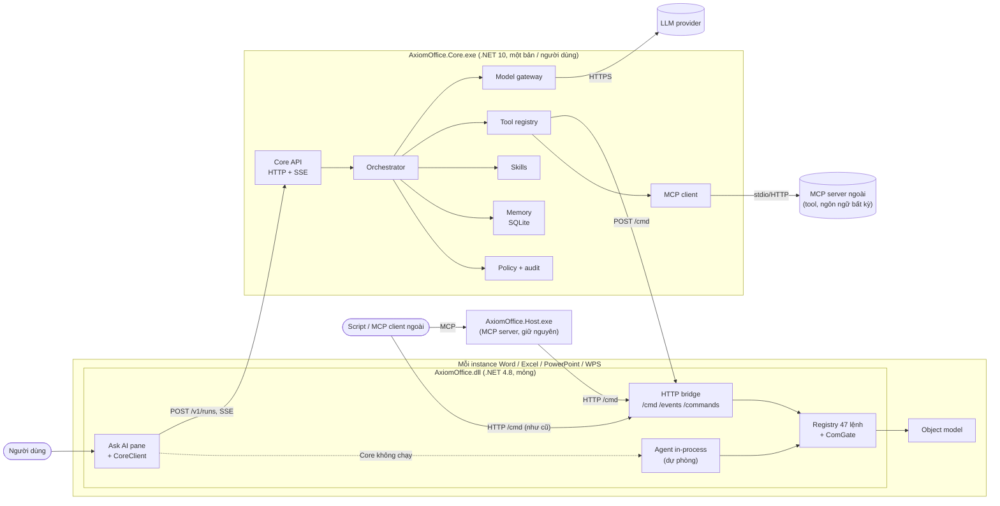
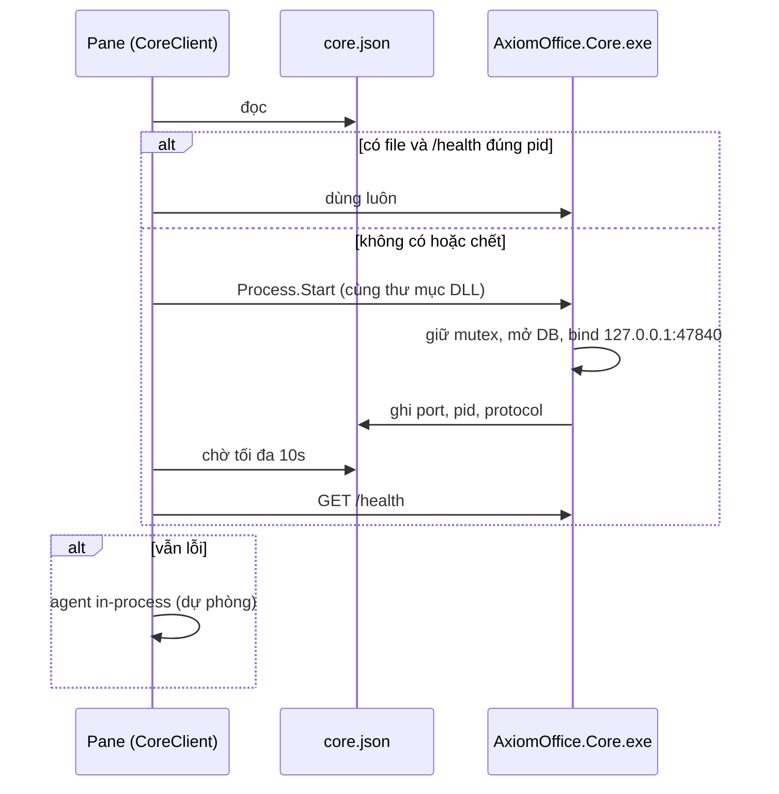
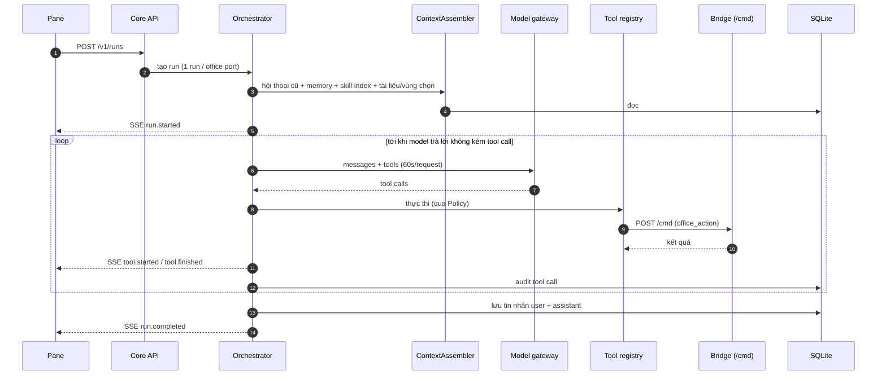

# New_arch.md: Yêu cầu triển khai Agent Core cho Axiom Office

> **Dành cho Claude ở phiên làm việc mới.** Đây là bản yêu cầu triển khai, không phải tài liệu
> giới thiệu. Đọc hết tài liệu này, rồi đọc `ARCHITECTURE.MD`, `README.md`, `CHANGELOG.md` (mục
> `[Unreleased]`) trước khi sửa code. Làm **theo từng giai đoạn** (mục 12); mỗi giai đoạn một
> branch, chạy đủ test, commit, rồi **dừng lại hỏi người dùng trước khi merge** vào `main`.
> Gặp điểm chưa rõ thì xem mục 14 (câu hỏi mở); quyết định nào ảnh hưởng người dùng thì hỏi, còn lại
> chọn phương án hợp lý nhất và ghi rõ trong báo cáo.

## Mục lục

1. [Bối cảnh: hệ thống hiện tại](#1-bối-cảnh-hệ-thống-hiện-tại)
2. [Mục tiêu và phạm vi](#2-mục-tiêu-và-phạm-vi)
3. [Quy tắc bắt buộc](#3-quy-tắc-bắt-buộc)
4. [Kiến trúc đích](#4-kiến-trúc-đích)
5. [Quyết định công nghệ](#5-quyết-định-công-nghệ)
6. [Cấu trúc repo sau khi làm](#6-cấu-trúc-repo-sau-khi-làm)
7. [Hợp đồng giao tiếp](#7-hợp-đồng-giao-tiếp)
8. [Thiết kế các module của Agent Core](#8-thiết-kế-các-module-của-agent-core)
9. [Thay đổi phía add-in](#9-thay-đổi-phía-add-in)
10. [Build, cài đặt, đóng gói](#10-build-cài-đặt-đóng-gói)
11. [Chiến lược kiểm thử](#11-chiến-lược-kiểm-thử)
12. [Các giai đoạn triển khai](#12-các-giai-đoạn-triển-khai)
13. [Rủi ro và cách giảm](#13-rủi-ro-và-cách-giảm)
14. [Câu hỏi mở](#14-câu-hỏi-mở)

---

## 1. Bối cảnh: hệ thống hiện tại

Trạng thái xuất phát: branch `main` tại commit `e8f177e` (tháng 9/2026). Chi tiết đầy đủ trong
`ARCHITECTURE.MD`; tóm tắt những gì cần biết:

| Thành phần | Hiện trạng |
|---|---|
| `src/AxiomOffice/` → `AxiomOffice.dll` | COM add-in in-process, **.NET Framework 4.8, C# 7.3, không NuGet**, x64. Nạp vào Word/Excel/PowerPoint và WPS |
| Ask AI pane | `Ai/AskAiPane.cs` + `Ai/PaneControls.cs` (WinForms, vẽ GDI+ theo `PaneTheme`) |
| Agent hiện tại | `Ai/AiAgent.cs` + `Ai/LlmClient.cs` chạy **trong process của Office**: OpenAI-compatible (`/chat/completions`) và Anthropic (`/messages`), một tool `office_action`, không giới hạn vòng, 60s mỗi request, 300s mỗi lượt, hủy được |
| Allowlist của agent | `Ai/OfficeActionTool.cs`: chỉ lệnh có `ForAgent()` (37/47) |
| HTTP bridge | `Bridge/HttpBridge.cs`: `127.0.0.1`, port 47821–47823 (WPS) / 47831–47833 (Office); `/health`, `/config`, `/session`, `/events` (SSE), `POST /cmd`; token `X-Auth-Token` từ `HKCU\Software\AxiomOffice\Token`; chặn `Origin`; `/cmd` bắt buộc JSON; **pump xử lý tuần tự** |
| Hệ lệnh | Registry `CommandDispatcher.Commands` (47 lệnh `writer.*`, `et.*`, `wpp.*`, chung), khai báo cạnh handler trong `Bridge/CommandDispatcher.{Writer,Spreadsheet,Presentation}.cs`; metadata qua `CommandCatalog` (`ToJson`, `ToMarkdown`, `AgentActions`) |
| COM | Mọi truy cập qua `ComGate`; retry khi app bận |
| Session registry | `%LOCALAPPDATA%\AxiomOffice\sessions\{pid}.json` (app, family, port, document...), heartbeat 25s |
| `AxiomOffice.Host.exe` | .NET 4.8, biên dịch từ toàn bộ source add-in + `src/AxiomOffice.Host`: `mcp` (50 tool MCP: làn live + làn file OOXML), companion, `commands [--json|--markdown]`, `llm-test` |
| Cấu hình LLM | HKCU: `LlmProvider` (`openai`/`anthropic`), `LlmEndpoint`, `LlmModel`, `LlmApiKey` (`dpapi:<base64>`, DPAPI CurrentUser, không entropy) |
| Log | `%LOCALAPPDATA%\AxiomOffice\bridge.log` |
| Build | `scripts\build.ps1` (csc của VS 2022 Build Tools, Restart Manager kiểm tra file bị khóa) |
| Test | `tests/live/test_live_commands.py` (app thật, golden), `tests/mcp-host/test_mcp_host.py` (offline, 157 kiểm tra) |

**Giới hạn khiến phải có kiến trúc mới**: agent nằm trong add-in nên không dùng được thư viện hiện
đại (SQLite, MCP client, SDK), lỗi module là crash Office, mỗi instance app có agent riêng (không
chia sẻ được memory và skill giữa Word/Excel/PowerPoint), và ngữ cảnh mất khi đóng app. Pane hiện
không nhớ hội thoại (mỗi lần Ask là phiên mới).

## 2. Mục tiêu và phạm vi

**Mục tiêu**

| Mã | Mục tiêu | Đo bằng |
|---|---|---|
| N1 | Tách "bộ não" agent ra process riêng **Agent Core** (một bản mỗi người dùng), add-in chỉ còn UI + bridge + lệnh | Pane chạy agent qua Core; add-in không gọi LLM khi Core sẵn sàng |
| N2 | **Hội thoại liên tục**: pane nhớ các lượt trước trong cùng cuộc trò chuyện | "Làm tiếp" hiểu ngữ cảnh lượt trước |
| N3 | **Skills**: thư mục `SKILL.md` + tài nguyên, nạp khi cần | Model dùng đúng skill mẫu; thêm skill không cần build lại |
| N4 | **Memory dài hạn**: theo tài liệu và theo người dùng, xem/xoá được | Thông tin ghi ở phiên trước được dùng ở phiên sau |
| N5 | **Mở rộng bằng MCP**: Core là MCP client, cắm tool ngoài (ngôn ngữ nào cũng được) | Tool MCP ngoài xuất hiện cho agent qua cấu hình |
| N6 | **An toàn**: allowlist, không tự lưu, xác nhận thao tác nguy hiểm, nhật ký audit | Test chứng minh |
| N7 | **Không phá tương thích**: HTTP API, lệnh, 50 tool MCP, `ai.ask` giữ hợp đồng; Core không chạy thì pane vẫn dùng được (agent in-process) | Test cũ vẫn pass |

**Ngoài phạm vi của đợt này** (chỉ để chỗ trong thiết kế, không làm): RAG/vector trên kho tài liệu,
nhiều agent phối hợp, chạy script trong skill, đồng bộ đám mây, đa người dùng, macOS/web Office,
tracked changes, gói NĐ30 đầy đủ (chỉ làm skill mẫu).

## 3. Quy tắc bắt buộc

Các quy tắc này do người dùng đặt ra từ trước, **không được vi phạm**:

1. **Không tự tắt app của người dùng.** Trước khi build hoặc chạy test cần Office, kiểm tra tiến
   trình `WINWORD`, `EXCEL`, `POWERPNT`, `wps`, `et`, `wpp`, `AxiomOffice.Host`, `AxiomOffice.Core`.
   Không dùng `scripts\build.ps1 -Kill` và không `Stop-Process` app của người dùng; nếu DLL đang bị
   khóa thì báo và hỏi. (Đã từng lỡ tắt Excel của người dùng: không lặp lại.) Tiến trình `wps` chạy
   nền có sẵn trên máy: không đụng vào.
2. Build bằng `scripts\build.ps1` (sau khi mở rộng ở mục 10).
3. Interface host gọi vào (COM) phải `[InterfaceType(ComInterfaceType.InterfaceIsIDispatch)]` +
   `[DispId]`; khai báo IUnknown làm host crash.
4. Mọi lời gọi COM bọc try/catch; giữ retry `RPC_E_CALL_REJECTED 0x80010001`, `0x8001010A`,
   `0x800AC472` (và `0x80010002` đang có).
5. Chỉ HKCU, không cần admin, kể cả khi cài .NET SDK (mục 5.2).
6. Không phá tương thích ngược: endpoint, lệnh, tool MCP cũ giữ nguyên hợp đồng. Chỉ **thêm**.
7. Test trên Microsoft Office thật trước (Word 47831, Excel 47832, PowerPoint 47833), rồi WPS
   (47821–47823). Test live tự mở app riêng, không dùng app đang mở của người dùng.
8. Commit **theo đường dẫn cụ thể**, không bao giờ `git add -A` / `git add .`. Commit message tiếng
   Việt, tiền tố `feat:` / `fix:` / `docs:` / `refactor:` / `test:`, kết thúc bằng dòng
   `Co-Authored-By: Claude Opus 5.5 <noreply@anthropic.com>`. Không commit khi đang ở `main`: tạo
   branch trước. Không push (repo không có remote). Merge bằng `git merge --ff-only` khi được đồng ý.
9. Cập nhật `README.md` và `CHANGELOG.md` (`[Unreleased]`) **trong cùng đợt** với thay đổi code;
   cập nhật `ARCHITECTURE.MD` khi kiến trúc đổi. Bảng lệnh README sinh bằng
   `AxiomOffice.Host.exe commands --markdown`.
10. **Không bao giờ in token hay API key** ra màn hình, log, test output hay commit.
11. Script `.ps1` giữ ASCII không BOM. Khi sửa file bằng script Python, đọc/ghi giữ nguyên kiểu
    xuống dòng (working tree có file CRLF do `autocrlf=true`). Viết script vá vào file bằng công cụ
    Write thay vì heredoc (bash wrapper làm hỏng dấu `\`).
12. **Test không được ghi đè cấu hình LLM thật** của người dùng trong HKCU (dùng override ở mục 7.6).

## 4. Kiến trúc đích

### 4.1 Tổng thể



### 4.2 Phân chia trách nhiệm

| Thành phần | Giữ / thêm | Không làm |
|---|---|---|
| **Add-in** | UI pane, bridge, registry lệnh, ComGate, Undo, SSE; khởi động Core; client của Core; agent dự phòng | Không thêm memory, skill, MCP client vào add-in |
| **Agent Core** | Vòng agent, gọi LLM, tool registry, skills, memory, policy, audit, MCP client, lưu hội thoại | Không gọi COM trực tiếp; mọi thao tác tài liệu đi qua `POST /cmd` của bridge |
| **Host.exe** | Giữ nguyên (MCP server 50 tool, companion, `commands`, `llm-test`) | Không gộp vào Core ở đợt này |

### 4.3 Mô hình process

- **Một Core cho mỗi người dùng Windows** (mutex `Local\AxiomOffice.Core`). Nhiều instance app
  (Word + Excel + WPS...) dùng chung một Core.
- Core được **add-in khởi động lười** (lần đầu người dùng bấm Ask, hoặc gọi `ai.ask` khi bật
  route qua Core), không khởi động theo Windows.
- Core **tự thoát** khi không còn run nào và không còn session bridge nào sống (dựa trên thư mục
  `sessions`) trong 10 phút.
- Core crash hoặc không khởi động được → pane dùng agent in-process như hiện tại và hiện một dòng
  trạng thái nhỏ ("Đang dùng chế độ cơ bản"). Không được làm hỏng trải nghiệm đang có.

## 5. Quyết định công nghệ

### 5.1 Stack

| Hạng mục | Chọn | Lý do |
|---|---|---|
| Runtime Core | **.NET 10 (LTS)**, C# mới nhất | .NET 8 hết hỗ trợ 11/2026; .NET 10 LTS tới 11/2028 |
| Phát hành | `dotnet publish -r win-x64 --self-contained -p:PublishSingleFile=true` | Người dùng không phải cài runtime (giữ mục tiêu G3). Chấp nhận exe ~60–80MB. Không dùng NativeAOT ở đợt này (rủi ro reflection/JSON) |
| HTTP server | ASP.NET Core Minimal API + Kestrel, chỉ bind `127.0.0.1` | Có sẵn SSE, DI, logging |
| JSON | `System.Text.Json` với source generator | Hiệu năng, sẵn sàng cho AOT sau này |
| Lưu trữ | SQLite qua `Microsoft.Data.Sqlite`, FTS5 cho tìm kiếm memory | Một file, không server |
| Gọi LLM | Tự viết `IModelProvider` cho OpenAI-compatible và Anthropic (port từ `LlmClient`), `HttpClient` | Giữ đúng hành vi đã kiểm chứng; không khoá vào SDK. Có thể dùng `Microsoft.Extensions.AI` làm abstraction nếu thấy gọn, nhưng phải giữ hành vi ở mục 8.2 |
| MCP client | SDK C# chính thức `ModelContextProtocol` | Chuẩn, không tự viết lại |
| DPAPI | `System.Security.Cryptography.ProtectedData` | Đọc `LlmApiKey` như add-in (CurrentUser, không entropy) |
| Registry | `Microsoft.Win32.Registry` | Đọc cấu hình HKCU chung |
| Test | xUnit (`tests/core/AxiomOffice.Core.Tests`), Python stdlib cho e2e | Giống phong cách test hiện có |

Ghim phiên bản NuGet ở bản stable mới nhất tại thời điểm làm (`Directory.Packages.props`, central
package management), ghi lại trong CHANGELOG.

### 5.2 Toolchain (giai đoạn 0)

Máy hiện **chưa có .NET SDK** (`dotnet` không có trong PATH). Cài .NET 10 SDK **không cần admin**
bằng script chính thức `dotnet-install.ps1` vào `%LOCALAPPDATA%\Microsoft\dotnet`:

```powershell
# HỎI NGƯỜI DÙNG TRƯỚC khi tải và chạy script cài đặt.
Invoke-WebRequest https://dot.net/v1/dotnet-install.ps1 -OutFile $env:TEMP\dotnet-install.ps1
& $env:TEMP\dotnet-install.ps1 -Channel 10.0 -InstallDir "$env:LOCALAPPDATA\Microsoft\dotnet"
```

`build.ps1` tìm `dotnet` theo thứ tự: `$env:DOTNET_ROOT`, `%LOCALAPPDATA%\Microsoft\dotnet\dotnet.exe`,
`dotnet` trong PATH; không thấy thì báo rõ cách cài và **vẫn build được add-in + Host** như cũ
(Core là tuỳ chọn khi build).

## 6. Cấu trúc repo sau khi làm

```
src/
  AxiomOffice/                    (giữ, .NET 4.8) add-in
    Ai/CoreClient.cs              [mới] client HTTP + SSE tới Core, khởi động Core
    Ai/AskAiPane.cs               [sửa] chạy qua Core, hội thoại liên tục, dự phòng in-process
    Bridge/HttpBridge.cs          [sửa] thêm GET /commands
  AxiomOffice.Host/               (giữ, .NET 4.8)
  AxiomOffice.Core/               [mới, .NET 10] AxiomOffice.Core.exe
    AxiomOffice.Core.csproj
    Program.cs                    host, mutex, cấu hình, route
    Api/                          RunEndpoints, ConversationEndpoints, MemoryEndpoints, SkillEndpoints, AdminEndpoints, Auth
    Agent/                        Orchestrator, RunManager, RunEvents, PromptBuilder, ContextAssembler
    Models/                       IModelProvider, OpenAiCompatibleProvider, AnthropicProvider, ModelMessage...
    Tools/                        ITool, ToolRegistry, OfficeActionTool, SkillTools, MemoryTools, McpToolAdapter
    Office/                       BridgeClient (gọi /cmd, /commands, /session), SessionDirectory, CommandCatalogCache
    Skills/                       SkillLoader, SkillManifest, SkillIndex
    Memory/                       CoreDb (SQLite, migration), ConversationStore, MemoryStore, AuditStore
    Policy/                       PolicyEngine, ConfirmationBroker
    Config/                       CoreConfig (HKCU + override), Paths, Secrets (DPAPI)
    Logging/                      CoreLog (core.log)
  Directory.Packages.props        [mới] ghim NuGet cho Core
skills/                           [mới] skill dựng sẵn, chép vào gói cài
  van-ban-hanh-chinh/SKILL.md
  bao-cao-thang/SKILL.md
  bang-diem/SKILL.md
tests/
  core/
    AxiomOffice.Core.Tests/       [mới] xUnit
    fake_llm.py                   [mới] server LLM giả, trả lời theo kịch bản
    test_core_e2e.py              [mới] e2e Core + fake LLM + (tuỳ chọn) Office thật
  live/, mcp-host/                (giữ, bổ sung ca mới)
```

## 7. Hợp đồng giao tiếp

### 7.1 Tìm và khởi động Core

- Core ghi `%LOCALAPPDATA%\AxiomOffice\core.json` khi sẵn sàng (ghi atomic: `.tmp` + replace):

  ```json
  {"pid": 1234, "port": 47840, "version": "1.1.0", "started": "2026-10-01T08:00:00.000Z",
   "protocol": 1, "exe": "C:\\...\\AxiomOffice.Core.exe"}
  ```

  Xoá file khi thoát bình thường.
- Port: giá trị HKCU `CorePort` (DWORD, mặc định **47840**); bận thì thử 47841–47849 và ghi port
  thực vào `core.json`.
- `CoreClient` (add-in) khi cần:
  1. Đọc `core.json` → `GET /health` (timeout 1s), kiểm tra `pid` khớp và `protocol` hỗ trợ.
  2. Không có/không sống → `Process.Start` `AxiomOffice.Core.exe` nằm **cùng thư mục với
     `AxiomOffice.dll`** (tham số `--parent-pid <pid host>` chỉ để log), chờ `core.json` + `/health`
     tối đa 10s.
  3. Thất bại → dùng agent in-process, log lý do, thử lại Core ở lần Ask sau (không quá 1 lần/phút).
- Mutex `Local\AxiomOffice.Core`: process thứ hai thấy mutex bị giữ thì thoát ngay với mã 0.



### 7.2 Bảo mật Core API

Giống bridge: chỉ `127.0.0.1`; mọi endpoint trừ `/health` cần `X-Auth-Token` = `HKCU\Software\AxiomOffice\Token`;
từ chối request có header `Origin` (403); body `POST` bắt buộc `application/json` (415). Không log
header, token, API key, nội dung prompt đầy đủ ở mức mặc định (chỉ độ dài + 200 ký tự đầu, giống
`bridge.log` hiện nay ghi prompt; giữ hành vi hiện tại nhưng không bao giờ log secret).

### 7.3 Core API (v1)

Mọi response JSON dạng `{"ok": true, "result": ...}` hoặc `{"ok": false, "error": "..."}` như bridge.

| Method | Path | Mô tả |
|---|---|---|
| `GET` | `/health` | Không token: `pid`, `port`, `version`, `protocol`, `uptimeSeconds` |
| `POST` | `/v1/runs` | Bắt đầu một lượt agent (body bên dưới) → `{"runId","conversationId"}` |
| `GET` | `/v1/runs/{runId}/events` | SSE tiến trình (mục 7.4). Kết nối lại được: `?after=<seq>` phát lại event từ `seq` |
| `POST` | `/v1/runs/{runId}/cancel` | Hủy (hủy request LLM đang chờ ngay) |
| `GET` | `/v1/runs/{runId}` | Trạng thái + kết quả cuối (`status`, `reply`, `error`, `rounds`, `seconds`, `transcript`) |
| `POST` | `/v1/runs/{runId}/confirm` | Trả lời yêu cầu xác nhận của policy: `{"confirmationId","approved": true|false}` |
| `GET` | `/v1/conversations?documentKey=&limit=` | Danh sách hội thoại gần đây (theo tài liệu) |
| `GET` | `/v1/conversations/{id}` | Tin nhắn (user/assistant + tóm tắt tool) |
| `DELETE` | `/v1/conversations/{id}` | Xoá hội thoại |
| `GET` | `/v1/skills?app=wps|et|wpp` | Danh sách skill (tên, mô tả, nguồn, lỗi nạp nếu có) |
| `POST` | `/v1/skills/reload` | Quét lại thư mục skill |
| `GET` | `/v1/memory?scope=user|document&documentKey=&q=` | Liệt kê/tìm memory |
| `POST` | `/v1/memory` | Người dùng tự thêm memory `{"scope","documentKey?","text"}` |
| `DELETE` | `/v1/memory/{id}` | Xoá một memory; `DELETE /v1/memory?scope=all` xoá hết (UI phải hỏi lại) |
| `GET` | `/v1/audit?runId=&limit=` | Nhật ký thao tác |
| `POST` | `/v1/admin/shutdown` | Thoát êm (dùng bởi build/uninstall) |

Body `POST /v1/runs`:

```json
{
  "prompt": "Làm tiếp phần tổng kết như hôm qua",
  "conversationId": "c_01J...",            // bỏ trống = hội thoại mới
  "office": {"port": 47831, "pid": 5128, "app": "wps", "family": "office"},
  "document": {"name": "bao-cao.docx", "fullName": "C:\\...\\bao-cao.docx"},
  "selection": {"text": "...", "start": 10, "end": 42},   // tuỳ chọn, pane gửi nếu có
  "options": {"maxSeconds": 300}
}
```

- Core kiểm tra `office.port` tồn tại trong thư mục `sessions` và `/health` của bridge trả đúng
  `pid`; sai thì lỗi `office session not found`.
- **Một run đang chạy cho mỗi `office.port`**; run thứ hai tới cùng port → lỗi `busy` (pane đã khóa
  nút gửi khi đang chạy). Các port khác nhau chạy song song được.

### 7.4 Sự kiện SSE của run

Mỗi event có `seq` tăng dần, `runId`, `time`. Tên event và dữ liệu:

| Event | Dữ liệu | Pane hiển thị |
|---|---|---|
| `run.started` | `conversationId`, `model` | Typing bubble |
| `skill.loaded` | `name` | Dòng "Dùng kỹ năng: …" |
| `tool.started` | `callId`, `tool`, `action?`, `paramsPreview` | ToolLine đang chạy |
| `tool.finished` | `callId`, `ok`, `error?`, `ms` | Tick xanh / x đỏ |
| `confirm.required` | `confirmationId`, `action`, `reason`, `paramsPreview` | Thẻ xác nhận Đồng ý / Từ chối |
| `memory.written` | `id`, `scope`, `text` | Dòng nhỏ "Đã ghi nhớ: …" (bấm để xoá) |
| `message.delta` | `text` | (tuỳ chọn, nếu provider stream) |
| `run.completed` | `reply`, `rounds`, `seconds` | Bubble trả lời |
| `run.failed` | `error`, `kind` (`provider`, `config`, `office`, `internal`) | ErrorCard |
| `run.cancelled` | `seconds` | Trạng thái đã dừng |
| `run.timedout` | `seconds` | ErrorCard + Thử lại |
| `ping` | | Không hiển thị (15s) |

Add-in đọc SSE bằng `HttpWebRequest` trên worker thread, tách dòng `event:` / `data:`, đẩy về UI
bằng `BeginInvoke` (như `PostToUi` hiện có). **Không** chặn UI thread.

### 7.5 Bridge: endpoint mới (chỉ thêm)

- `GET /commands` (cần token): trả `CommandCatalog` dạng JSON (cùng schema với
  `AxiomOffice.Host.exe commands --json`: `name`, `kind`, `agent`, `summary`, `params[{name,required,hint}]`)
  kèm `version` DLL. Core dùng để dựng tool `office_action` **đúng với phiên bản DLL đang chạy**
  (cache theo `version`).
- Không đổi `/cmd`, `/session`, `/events`.

### 7.6 Cấu hình của Core

Đọc HKCU `Software\AxiomOffice` (chung với add-in): `Token`, `LlmProvider`, `LlmEndpoint`,
`LlmModel`, `LlmApiKey` (DPAPI), thêm mới:

| Giá trị | Mặc định | Ý nghĩa |
|---|---|---|
| `CorePort` | 47840 | Port Core |
| `CoreEnabled` | 1 | 0 = pane luôn dùng agent in-process |
| `MemoryEnabled` | 1 | 0 = không lưu memory dài hạn (hội thoại vẫn lưu) |
| `SkillDirs` | rỗng | Thêm thư mục skill (phân cách `;`), vd thư mục dùng chung của tổ chức |

**Override cho test** (không đụng HKCU của người dùng): tham số dòng lệnh hoặc biến môi trường
`AXIOM_CORE_DATA_DIR`, `AXIOM_CORE_PORT`, `AXIOM_LLM_PROVIDER`, `AXIOM_LLM_ENDPOINT`, `AXIOM_LLM_MODEL`,
`AXIOM_LLM_API_KEY`, `AXIOM_SKILL_DIRS`, `AXIOM_TOKEN`. Khi có `AXIOM_CORE_DATA_DIR` thì `core.json`,
DB và log nằm trong thư mục đó (test không làm bẩn `%LOCALAPPDATA%`).

### 7.7 Tương thích `ai.ask`

Lệnh bridge `ai.ask` giữ **nguyên hình dạng response** (`ok`, `reply`/`error`, `transcript`,
`seconds`, `rounds`). Giai đoạn 1: vẫn chạy agent in-process. Giai đoạn 4 (tuỳ chọn, hỏi người
dùng): chuyển sang Core khi Core sẵn sàng, dịch kết quả về cùng hình dạng.

## 8. Thiết kế các module của Agent Core

### 8.1 Orchestrator và vòng đời run



- Trạng thái run: `queued` → `running` → `completed` | `failed` | `cancelled` | `timedout`.
- Giữ hành vi đã kiểm chứng của `LlmClient`: không giới hạn số vòng; trần 300s mỗi run (cấu hình
  được qua `options.maxSeconds`, tối đa 900s); 60s mỗi request; hủy cắt request đang chờ ngay;
  provider không hỗ trợ tools (lỗi chứa "tool") thì tắt tools và chạy như chat.
- Run chạy trên background task của Core; pane ngắt SSE không làm hủy run (có thể kết nối lại bằng
  `?after=`). Run xong được giữ trong bộ nhớ 30 phút cho `GET /v1/runs/{id}`.

### 8.2 Model gateway

- `IModelProvider.CompleteAsync(ModelRequest, CancellationToken) → ModelResponse` (text, tool calls,
  usage, stop reason). Hai provider: `OpenAiCompatibleProvider` (`{endpoint}/chat/completions`,
  `Authorization: Bearer`), `AnthropicProvider` (`{endpoint}/messages`, `x-api-key`,
  `anthropic-version: 2023-06-01`). Quy tắc nối endpoint giống `LlmClient.BuildUrl` (không nối lặp
  nếu endpoint đã có hậu tố).
- Anthropic: bật prompt caching cho phần system + định nghĩa tool + skill index (phần ổn định) để
  giảm chi phí hội thoại nhiều lượt.
- Ghi `usage` (token vào/ra) vào bảng `runs`.
- Streaming (`message.delta`) là tuỳ chọn; làm sau khi phần không stream ổn định.
- Lỗi phân loại: `config` (thiếu endpoint/model/key), `provider` (HTTP lỗi, kèm status + 300 ký tự
  body), `timeout`, `cancelled`.

### 8.3 Tool registry

Tool mà model thấy trong một run:

| Tool | Nguồn | Mô tả |
|---|---|---|
| `office_action` | Bridge `/commands` | Như hiện tại: mô tả liệt kê chữ ký các lệnh `agent=true` của `kind` đang mở; **chỉ** cho gọi các lệnh đó (allowlist, cùng thông báo lỗi như `OfficeActionTool` hiện tại) |
| `load_skill` | Skills | `{name}` → nội dung `SKILL.md` + danh sách file đính kèm |
| `read_skill_file` | Skills | `{name, path}` → nội dung text (≤ 64KB) hoặc đường dẫn tuyệt đối cho file nhị phân (template .docx) để dùng với `writer.open` |
| `remember` | Memory (giai đoạn 3) | `{scope: "user"|"document", text}` |
| `recall` | Memory (giai đoạn 3) | `{query, scope?}` → top 8 memory liên quan |
| `mcp__<server>__<tool>` | MCP client (giai đoạn 4) | Tool của MCP server ngoài được bật trong cấu hình |

`ITool { Name; Description; JsonSchema; Task<ToolResult> InvokeAsync(JsonElement args, RunContext ctx, CancellationToken ct); }`.
Kết quả tool trả về model dạng JSON `{"ok":...}` như hiện tại; lỗi tool **không** làm hỏng run.

### 8.4 Skills

**Định dạng** (tương thích định dạng Agent Skills: thư mục + `SKILL.md` có YAML frontmatter):

```
skills/van-ban-hanh-chinh/
  SKILL.md
  templates/cong-van.docx      (tuỳ chọn)
  examples/mau-1.md            (tuỳ chọn)
```

```markdown
---
name: van-ban-hanh-chinh
description: Soạn công văn, quyết định, tờ trình đúng thể thức văn bản hành chính (quốc hiệu, số ký hiệu, nơi nhận...). Dùng khi người dùng muốn soạn văn bản hành chính.
apps: [wps]              # wps | et | wpp; bỏ trống = mọi app
version: 1
---
# Hướng dẫn
1. Đọc tài liệu hiện có bằng writer.getText...
...
```

**Quy tắc**

- Nguồn (thứ tự ưu tiên khi trùng tên, nguồn sau ghi đè nguồn trước): skill dựng sẵn (`skills\`
  cạnh exe) → `SkillDirs` của tổ chức → `%LOCALAPPDATA%\AxiomOffice\skills` của người dùng.
- **Nạp tiến dần**: system prompt chỉ có danh sách `name: description` của các skill hợp với app
  đang mở (tối đa 50 skill, mô tả cắt 300 ký tự). Model gọi `load_skill` để lấy nội dung đầy đủ.
- `name` chỉ gồm `a-z0-9-`, ≤ 64 ký tự; `description` bắt buộc; lỗi frontmatter → bỏ qua skill đó,
  ghi lỗi (hiện ở `GET /v1/skills`), không làm hỏng Core.
- `read_skill_file` chỉ đọc file **bên trong** thư mục skill (chặn `..`, symlink ra ngoài).
- **Không chạy script** trong skill ở đợt này.
- Quét lại khi gọi `/v1/skills/reload` hoặc khi thư mục đổi (FileSystemWatcher, debounce 2s).

**Skill mẫu cần làm (giai đoạn 2)**: `van-ban-hanh-chinh` (Word), `bang-diem` (Excel: bảng điểm có
cột trung bình, xếp loại, định dạng), `bao-cao-thang` (PowerPoint: dàn 5–7 slide). Mỗi skill có
ca test e2e (mục 11).

### 8.5 Memory

**Vị trí**: `%LOCALAPPDATA%\AxiomOffice\core\core.db` (SQLite, WAL). Migration đánh số
(`PRAGMA user_version`).

**Schema**

```sql
CREATE TABLE conversations (
  id TEXT PRIMARY KEY, created_at TEXT, updated_at TEXT,
  app TEXT, family TEXT, document_key TEXT, document_name TEXT, title TEXT, summary TEXT);
CREATE TABLE messages (
  id INTEGER PRIMARY KEY, conversation_id TEXT REFERENCES conversations(id) ON DELETE CASCADE,
  seq INTEGER, role TEXT,              -- user | assistant | tool_summary
  content TEXT, created_at TEXT);
CREATE TABLE runs (
  id TEXT PRIMARY KEY, conversation_id TEXT, status TEXT, started_at TEXT, finished_at TEXT,
  model TEXT, rounds INTEGER, input_tokens INTEGER, output_tokens INTEGER, error TEXT);
CREATE TABLE tool_calls (             -- audit
  id INTEGER PRIMARY KEY, run_id TEXT, seq INTEGER, tool TEXT, action TEXT,
  params_json TEXT, ok INTEGER, error TEXT, ms INTEGER, created_at TEXT);
CREATE TABLE memories (
  id INTEGER PRIMARY KEY, scope TEXT,  -- user | document
  document_key TEXT, text TEXT, source TEXT,   -- user | agent
  created_at TEXT, updated_at TEXT, deleted_at TEXT);
CREATE VIRTUAL TABLE memories_fts USING fts5(text, content='memories', content_rowid='id');
```

- `document_key`: đường dẫn đầy đủ, chuẩn hoá chữ thường, `\`; tài liệu chưa lưu (không có đường
  dẫn) → không có memory tài liệu, hội thoại gắn `document_key = null`.
- **Hội thoại (giai đoạn 1)**: lưu tin nhắn user và câu trả lời cuối của assistant; kết quả tool
  lưu dạng **tóm tắt ngắn** (`tool_summary`: action + ok/lỗi), không lưu toàn bộ JSON kết quả. Khi
  dựng ngữ cảnh: lấy các tin gần nhất trong ngân sách ~8.000 token (ước lượng ký tự/4); vượt thì
  dùng `conversations.summary` (tóm tắt bằng LLM khi hội thoại vượt ngân sách, cập nhật cuối run).
- **Memory dài hạn (giai đoạn 3)**: agent ghi qua tool `remember` (mỗi lần ghi phát event
  `memory.written` để người dùng thấy và xoá được), người dùng ghi qua API/UI. Ngữ cảnh mỗi run gồm:
  toàn bộ memory `document` của tài liệu hiện tại (tối đa 20), memory `user` liên quan nhất theo
  FTS5 với prompt (tối đa 8). Xoá mềm (`deleted_at`), dọn cứng sau 30 ngày.
- **Không bao giờ** lưu API key, token; không lưu nội dung file đầy đủ vào memory.
- `uninstall.ps1 -Purge` xoá cả `core\` (hỏi xác nhận trong script như hiện tại xử lý `-Purge`).

### 8.6 Policy, xác nhận, audit

- **Allowlist**: chỉ lệnh `agent=true` (như hiện tại).
- **Không tự lưu**: giữ chỉ dẫn trong system prompt (`save`/`saveAs`/`exportPdf` chỉ khi người dùng
  yêu cầu). Thêm kiểm tra mềm: nếu model gọi các lệnh này mà prompt của lượt không chứa ý lưu/xuất
  (từ khoá tiếng Việt + Anh: "lưu", "save", "xuất", "export", "pdf") thì phát `confirm.required`.
- **Xác nhận** (`ConfirmationBroker`): lệnh nằm trong danh sách "cần xác nhận" (mặc định: `*.saveAs`
  ghi đè file đã tồn tại, `writer.replaceAll` khi tài liệu > 20.000 ký tự, `wpp.deleteSlide`) →
  phát `confirm.required`, chờ `POST /v1/runs/{id}/confirm` tối đa 120s; hết giờ = từ chối. Model
  nhận `{"ok":false,"error":"user declined"}` khi bị từ chối.
- **Audit**: mọi tool call ghi vào `tool_calls` (params rút gọn ≤ 2KB, không ghi nội dung file).

### 8.7 MCP client (giai đoạn 4)

- Cấu hình `%LOCALAPPDATA%\AxiomOffice\mcp.json` theo định dạng quen thuộc
  `{"mcpServers": {"name": {"command": "...", "args": [...], "env": {...}}}}` (stdio) hoặc
  `{"url": "http://..."}` (Streamable HTTP).
- Khởi động server lười khi run đầu tiên cần; tool đặt tên `mcp__<server>__<tool>`; **mặc định mọi
  tool MCP ngoài cần xác nhận** trừ khi cấu hình `"trusted": true`.
- Lỗi một server không làm hỏng run (tool của nó bị ẩn, log lỗi).

### 8.8 Prompt

`PromptBuilder` dựng system prompt theo thứ tự ổn định (để cache được):

1. Vai trò + quy tắc chung (giữ nội dung system prompt hiện tại trong `Ai/AiAgent.cs`, gồm quy tắc
   không tự lưu, viết theo ngôn ngữ người dùng, không bịa kết quả tool, trả lời 1–2 câu).
2. Danh sách skill (`name: description`).
3. Memory người dùng liên quan, memory tài liệu.
4. Ngữ cảnh tài liệu: tên file, app, vùng chọn (nếu có, cắt 2.000 ký tự).
5. Tóm tắt hội thoại cũ (nếu có), rồi các tin nhắn gần nhất.

### 8.9 Log

`%LOCALAPPDATA%\AxiomOffice\core.log`, cùng định dạng `bridge.log` (thời gian, mức, `[pid N]`),
xoay file khi > 10MB (giữ 3 file). Ghi: khởi động/thoát, mỗi run (prompt 200 ký tự đầu, số vòng,
thời gian, trạng thái), mỗi tool call (action, ok, ms), lỗi provider (không kèm header).

## 9. Thay đổi phía add-in

Vẫn **.NET 4.8, C# 7.3, không NuGet**.

1. `Ai/CoreClient.cs`: tìm/khởi động Core (7.1), `StartRun`, đọc SSE (7.4), `Cancel`, `Confirm`,
   `ListConversations`. Mọi lỗi mạng → exception rõ ràng để pane chuyển sang dự phòng.
2. `Ai/AskAiPane.cs`:
   - `StartRun` thử Core trước, lỗi thì `AiAgent.Run` in-process (giữ nguyên code hiện tại làm dự
     phòng).
   - Giữ `conversationId` theo **tài liệu đang active** (map `document fullName → conversationId`
     trong pane); thêm nút/link **"Cuộc trò chuyện mới"** ở header.
   - Hiện các event mới: `skill.loaded`, `memory.written`, thẻ xác nhận (`confirm.required`) với
     hai nút Đồng ý / Từ chối (dùng `PaneTheme`, theo phong cách `ErrorCard`).
   - Dòng trạng thái nhỏ khi đang ở chế độ dự phòng.
3. `Bridge/HttpBridge.cs`: thêm `GET /commands` (7.5).
4. Ribbon/Settings: trong `SettingsForm` thêm ô "Dùng Agent Core" (`CoreEnabled`) và
   "Ghi nhớ dài hạn" (`MemoryEnabled`); giai đoạn 3 thêm nút "Quản lý ghi nhớ…" mở form liệt kê/xoá
   memory qua Core API.
5. Không đổi: registry lệnh, `ComGate`, `/cmd`, SSE `/events`, MCP của Host.exe.

## 10. Build, cài đặt, đóng gói

- `scripts\build.ps1`:
  - Thêm `AxiomOffice.Core.exe` vào danh sách file kiểm tra khóa bằng Restart Manager. Nếu Core đang
    chạy: gọi `POST /v1/admin/shutdown` (token đọc từ HKCU, **không in ra**) và chờ tối đa 5s; nếu
    vẫn khóa thì báo như với DLL.
  - Sau khi build add-in + Host: `dotnet publish src\AxiomOffice.Core -c Release -r win-x64
    --self-contained -p:PublishSingleFile=true -o <stage>` rồi chép `AxiomOffice.Core.exe` vào
    `src\AxiomOffice\bin\Release` cùng DLL. Không có `dotnet` → cảnh báo vàng, bỏ qua Core.
  - Chép `skills\` vào `bin\Release\skills\`.
- `scripts\install.ps1`: tạo `CorePort`, `CoreEnabled`, `MemoryEnabled` nếu chưa có; in dòng trạng
  thái Core; không thêm đăng ký COM mới.
- `scripts\uninstall.ps1`: dừng Core (shutdown API) trước khi gỡ; `-Purge` xoá `core\`, `core.json`,
  `core.log`, `mcp.json`.
- `scripts\package.ps1`: thêm `AxiomOffice.Core.exe`, thư mục `skills\`; cập nhật
  `HUONG-DAN-CAI-DAT.txt` và `THIRD-PARTY-NOTICES.md` (liệt kê gói NuGet + giấy phép).
- Version: Core cùng version với DLL (đặt trong `Directory.Build.props` hoặc đồng bộ thủ công, kiểm
  tra trong test: `/health` của Core và bridge cùng `version`).

## 11. Chiến lược kiểm thử

| Lớp | Công cụ | Nội dung |
|---|---|---|
| Unit | xUnit `tests/core/AxiomOffice.Core.Tests` | SkillLoader (frontmatter hợp lệ/lỗi, ưu tiên nguồn, chặn `..`), PromptBuilder (thứ tự ổn định), ContextAssembler (ngân sách token), MemoryStore (FTS, xoá mềm), PolicyEngine, parse SSE, provider (qua `HttpMessageHandler` giả): OpenAI/Anthropic tool calls, fallback không tools, timeout, hủy |
| E2E không Office | `tests/core/test_core_e2e.py` + `tests/core/fake_llm.py` | Chạy Core với `AXIOM_*` override (thư mục dữ liệu tạm, port tạm, token tạm, endpoint = fake LLM). Fake LLM trả lời theo **kịch bản** (JSON: chuỗi tool call + câu trả lời) theo chuẩn OpenAI-compatible. Bridge giả (Python HTTP server) ghi lại `/cmd` nhận được. Kiểm tra: SSE đủ event đúng thứ tự, allowlist, confirm, cancel, timeout, hội thoại nhiều lượt, `load_skill`, `remember`/`recall`, audit |
| E2E với Office thật | `test_core_e2e.py --office` | Như `test_live_commands.py`: tự mở Word/Excel/PowerPoint riêng, dừng nếu port đã có app người dùng; pane không cần mở: gọi thẳng Core API với `office.port` thật và fake LLM có kịch bản dùng lệnh thật; kiểm tra tài liệu đổi đúng |
| Hồi quy | Test hiện có | `tests/live/test_live_commands.py` (+ `--compare` golden), `tests/mcp-host/test_mcp_host.py` (157 kiểm tra), unit test `tools/*-mcp` |
| LLM thật (thủ công/tuỳ chọn) | `test_core_e2e.py --real-llm` | Dùng cấu hình HKCU của người dùng (chỉ đọc), 3 skill mẫu, báo cáo số vòng và thời gian. Không chạy mặc định (tốn token) |

Yêu cầu chung: test không đọc/in token hay key ra output; dọn thư mục tạm; không để Core của test
chạy tiếp (gọi shutdown, rồi kill **đúng pid do test tạo** nếu cần).

## 12. Các giai đoạn triển khai

Mỗi giai đoạn: branch riêng (`feat/core-phase-N-...`), commit nhỏ theo đường dẫn, cập nhật
README + CHANGELOG + `ARCHITECTURE.MD` khi cần, chạy test, báo cáo kết quả (con số pass/fail thật),
**hỏi trước khi merge**.

### Giai đoạn 0: Toolchain và khung

- [ ] Hỏi người dùng rồi cài .NET 10 SDK vào `%LOCALAPPDATA%\Microsoft\dotnet` (5.2).
- [ ] Tạo `src/AxiomOffice.Core` (Minimal API, `/health`, mutex, `core.json`, `core.log`,
      `/v1/admin/shutdown`, cấu hình HKCU + override `AXIOM_*`, Auth + chặn Origin).
- [ ] `Directory.Packages.props`, `tests/core/AxiomOffice.Core.Tests` (xUnit) chạy được.
- [ ] Bridge `GET /commands` (7.5) + ca test trong `test_live_commands.py`.
- [ ] `build.ps1` / `package.ps1` / `install.ps1` / `uninstall.ps1` theo mục 10.
- **Xong khi**: `build.ps1` ra 3 file (DLL, Host, Core); Core chạy/thoát êm, không chạy 2 bản;
  `/health` đúng; test cũ pass (golden khớp).

### Giai đoạn 1: Agent chạy trong Core + hội thoại liên tục

- [ ] Model gateway (port hành vi `LlmClient`, mục 8.2), Tool registry với `office_action` từ
      `/commands` (allowlist), Orchestrator + RunManager + SSE (7.3, 7.4, 8.1).
- [ ] SQLite: `conversations`, `messages`, `runs`, `tool_calls`; ContextAssembler (ngân sách, tóm tắt).
- [ ] Add-in: `CoreClient`, pane chạy qua Core, dự phòng in-process, "Cuộc trò chuyện mới", map hội
      thoại theo tài liệu.
- [ ] `fake_llm.py`, `test_core_e2e.py` (không Office + `--office`).
- **Xong khi**: trên Word/Excel/PowerPoint thật, pane chạy 3 yêu cầu mẫu qua Core (giống các prompt
  trong `test_live_commands.py --ai`); lượt 2 "làm tiếp" dùng được ngữ cảnh lượt 1; tắt Core giữa
  chừng → pane báo lỗi rõ và lần sau dùng dự phòng; Dừng hủy ngay; test cũ + test mới pass.

### Giai đoạn 2: Skills

- [ ] SkillLoader, SkillIndex, `load_skill`, `read_skill_file`, `/v1/skills`, reload + watcher.
- [ ] 3 skill mẫu (8.4) + template nếu cần; `skills\` vào build và gói.
- [ ] Pane hiện `skill.loaded`.
- **Xong khi**: e2e với fake LLM chứng minh luồng `load_skill`; với LLM thật (thủ công, có báo cáo)
  model tự chọn đúng skill cho 3 yêu cầu mẫu; skill lỗi frontmatter không làm hỏng Core.

### Giai đoạn 3: Memory dài hạn

- [ ] Bảng `memories` + FTS5, tool `remember`/`recall`, ngữ cảnh memory (8.5), API memory.
- [ ] Pane: event `memory.written` (xoá được ngay), form "Quản lý ghi nhớ…", cài đặt `MemoryEnabled`.
- **Xong khi**: memory ghi ở phiên này được dùng ở phiên sau (kể cả sau khi Core khởi động lại);
  tắt `MemoryEnabled` thì không ghi; xoá trong UI là mất khỏi ngữ cảnh; `-Purge` xoá sạch.

### Giai đoạn 4: Mở rộng và an toàn

- [ ] PolicyEngine + ConfirmationBroker + thẻ xác nhận trong pane (8.6).
- [ ] MCP client (8.7), `mcp.json`, tool `mcp__*` cần xác nhận mặc định.
- [ ] (Hỏi người dùng) `ai.ask` chuyển sang Core khi sẵn sàng (7.7).
- [ ] Cập nhật `ARCHITECTURE.MD` (HLD + LLD) cho kiến trúc mới.
- **Xong khi**: e2e cho confirm (đồng ý / từ chối / hết giờ), MCP server mẫu (một server Python
  stdlib nhỏ trong `tests/core/`) được gọi qua agent; audit đầy đủ.

## 13. Rủi ro và cách giảm

| Rủi ro | Cách giảm |
|---|---|
| Exe Core lớn (~60–80MB) làm gói cài nặng | Chấp nhận ở đợt này; ghi lại để cân nhắc framework-dependent hoặc NativeAOT sau |
| Phần mềm diệt virus chặn exe single-file chưa ký | Ghi vào Troubleshooting; ký số khi có certificate (nợ đã biết) |
| Bridge pump tuần tự: Core gọi `/cmd` trong lúc có `ai.ask` in-process chạy | Pane khóa gửi khi đang chạy; một run mỗi port; không đổi pump ở đợt này |
| Core chết giữa run | Pane nhận lỗi SSE → ErrorCard "Agent Core dừng đột ngột" + Thử lại; tài liệu vẫn nguyên (mỗi lệnh độc lập, Undo được) |
| Hai phiên bản DLL/Core lệch | `protocol` trong `/health`; Core đọc lệnh qua `/commands` theo DLL đang chạy |
| Memory ghi sai/nhạy cảm | Luôn hiện `memory.written`, xoá được; `MemoryEnabled=0`; không lưu nội dung file |
| Chi phí token tăng do hội thoại dài | Ngân sách ngữ cảnh + tóm tắt + prompt caching |

## 14. Câu hỏi mở

Hỏi người dùng khi tới giai đoạn liên quan (đề xuất mặc định trong ngoặc):

1. Cài .NET 10 SDK vào máy (giai đoạn 0)? (Có, cài user-level.)
2. Port Core mặc định 47840 có đụng gì trong môi trường của bạn không? (Giữ 47840.)
3. Memory dài hạn bật mặc định hay để người dùng tự bật? (Bật, nhưng luôn hiện "Đã ghi nhớ" và xoá
   được.)
4. Có thư mục skill dùng chung của tổ chức không (`SkillDirs`)? (Chưa, để trống.)
5. Ngoài 3 skill mẫu, ưu tiên nghiệp vụ nào tiếp theo? (Hỏi.)
6. `ai.ask` có chuyển sang Core ở giai đoạn 4 không? (Có, giữ nguyên hình dạng response.)
7. Có muốn Core đồng thời là MCP server (cho Claude Desktop dùng skill + memory) không? (Để sau đợt
   này.)
